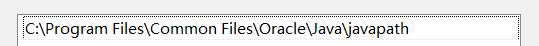

开发中经常会需要不同版本的java, 然后在idea里做切换.

默认java版本为8和11，下载地址为
[JDK下载地址](https://www.oracle.com/java/technologies/downloads/ ':target=_blank')

java8的话需要配置环境变量JAVA_HOME，还需要修改CLASSPATH和PATH环境变量，java11下载安装即可，自动配置环境变量。    
注意的是11版的Jdk比较高级，不仅没有 Jre文件，而且它会在path中自动配置一个环境变量。
由于这个文件优先级比较高，就导致即使你设置了环境变量，你使用cmd查看 版本的时候，它总会显示java版本为11版。

java11配置的环境变量为

如果希望java默认版本为11的话，下载安装配置后无需再做其他操作，但是希望默认版本为8时，则需要在环境变量中删除上述图片显示的变量

