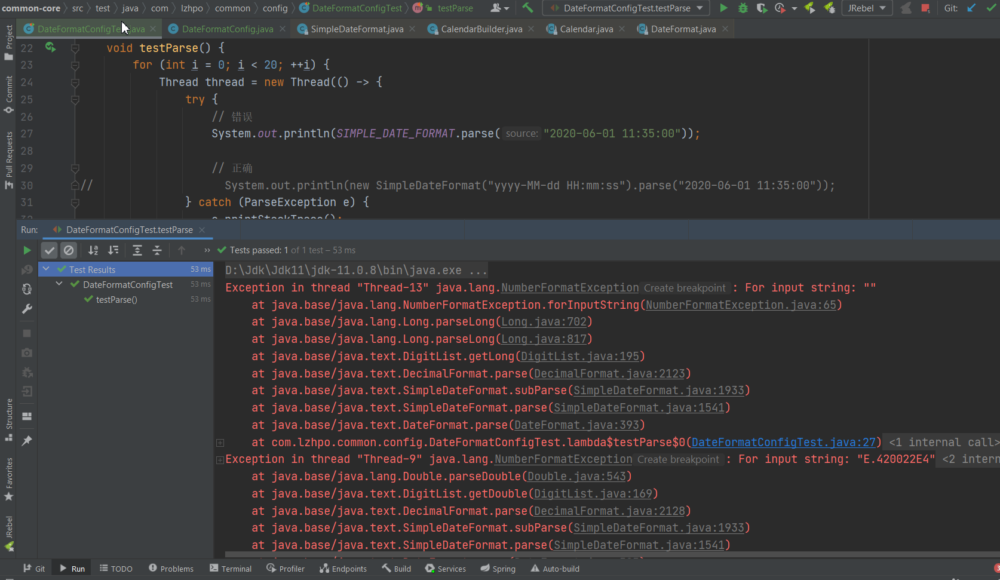
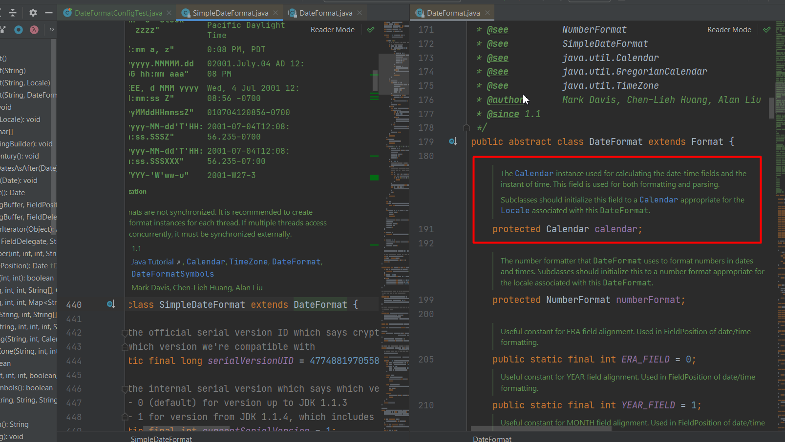
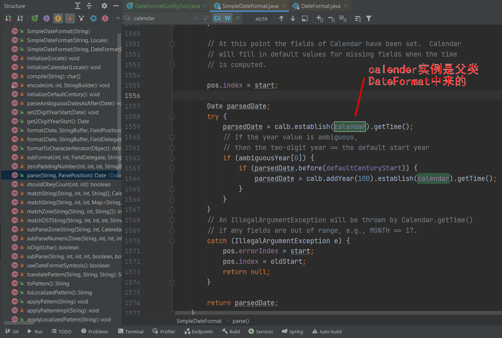
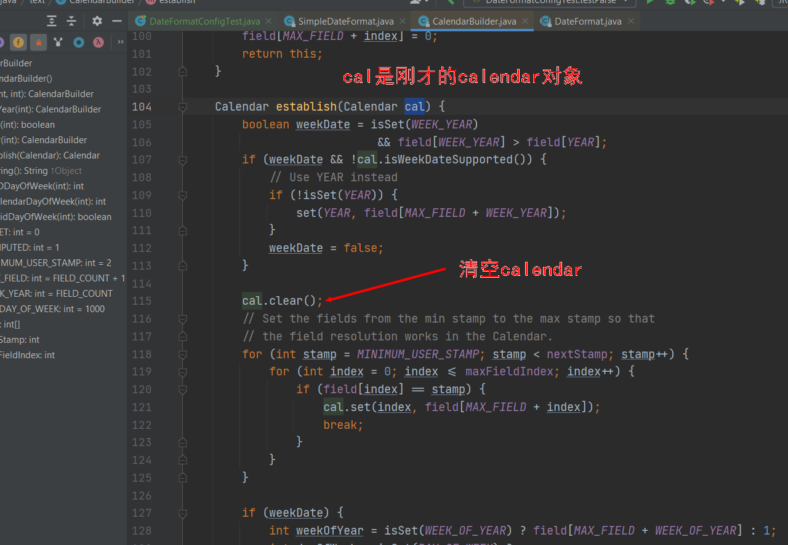
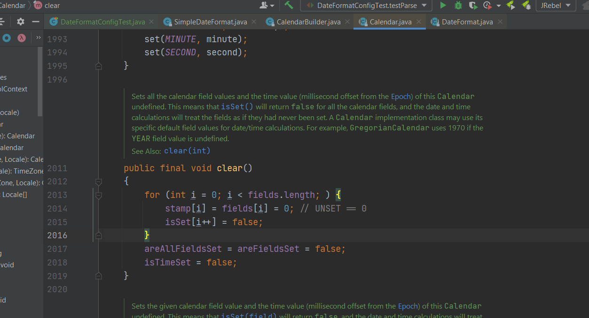

**SimpleDateFormat的线程安全问题**

## 异常描述
```java
// 如果没有加锁，没有去保证线程安全的话，那这个就是错误的写法，是线程不安全的
private static final SimpleDateFormat dateFormat = new SimpleDateFormat("yyyy-MM-dd HH:mm:ss");
```

错误示例：
```java
@SpringBootTest
class DateFormatConfigTest {

    private static final SimpleDateFormat SIMPLE_DATE_FORMAT = new SimpleDateFormat("yyyy-MM-dd HH:mm:ss");

    /**
     * SimpleDateFormat线程不安全，没有保证线程安全的情况下，禁止使用全局SimpleDateFormat
     * <pre>
     *     private static final SimpleDateFormat dateFormat = new SimpleDateFormat("yyyy-MM-dd HH:mm:ss");
     * </pre>
     */
    @Test
    void testParse() {
        for (int i = 0; i < 20; ++i) {
            Thread thread = new Thread(() -> {
                try {
                    // 错误
                    System.out.println(SIMPLE_DATE_FORMAT.parse("2020-06-01 11:35:00"));

                    // 正确
//                    System.out.println(new SimpleDateFormat("yyyy-MM-dd HH:mm:ss").parse("2020-06-01 11:35:00"));
                } catch (ParseException e) {
                    e.printStackTrace();
                }
            });
            thread.start();
        }
    }
}
```

**报错：**


## 异常分析


从代码中可以看到：SimpleDateFormat继承DateFormat类，在SimpleDateFormat转换日期是通过Calendar对象来操作的，DateFormat类中维护一个Calendar对象，Calendar对象会被用来进行日期-时间计算，既被用于format方法也被用于parse方法。

追一下calendar对象:


来到了CalendarBuilder的establish方法：


看一下clear方法，可以发现它并不是线程安全的，如果此时，a线程将calendar清空了，calendar就没有新值了，恰好此时b线程刚好进入到parse方法用到了calendar对象，那就会产生线程安全问题了！


## 解决办法
方法1
不使用静态变量SimpleDateFormat，使用局部变量SimpleDateFormat，每次都new一个。

方法2  
synchronized等等…保证线程安全的情况下使用静态变量SimpleDateFormat。

方法3
使用ThreadLocal.withInitial
```java
/**
 * 创建线程局部变量SimpleDateFormat
 */ 
private static final ThreadLocal<DateFormat> SAFE_FORMAT =
    ThreadLocal.withInitial(() -> new SimpleDateFormat("yyyy-MM-dd HH:mm:ss"));

@Test
void testSafe() {
    for (int i = 0; i < 20; ++i) {
        Thread thread = new Thread(() -> {
            try {
                System.out.println(SAFE_FORMAT.get().parse("2020-06-01 11:35:00"));
            } catch (ParseException e) {
                e.printStackTrace();
            }
        });
        thread.start();
    }
}
```
