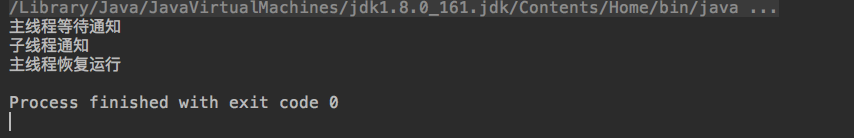
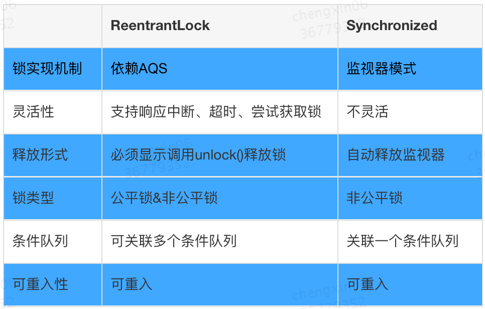
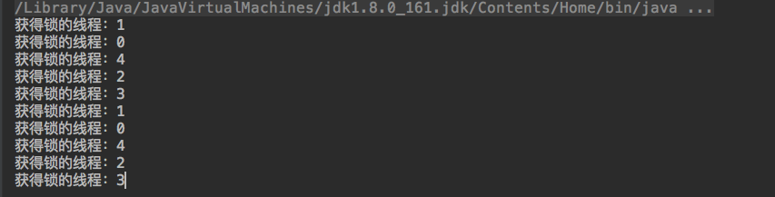
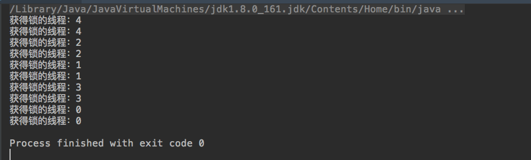
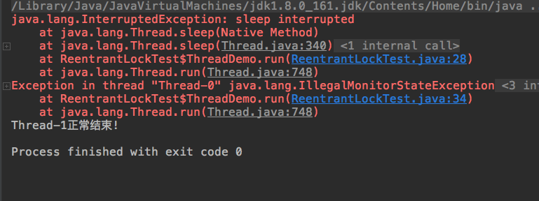
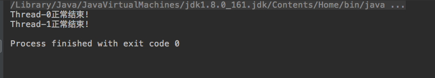
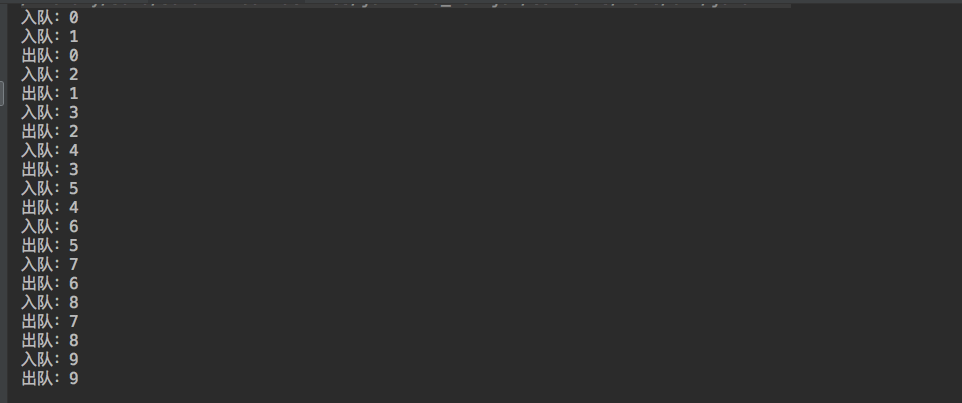

## LockSupport工具类

## Condition

### 使用简介

Condition由ReentrantLock对象创建,并且可以同时创建多个

```java
static Condition notEmpty = lock.newCondition();

static Condition notFull = lock.newCondition();
```

Condition接口在使用前必须先调用ReentrantLock的lock()方法获得锁。之后调用Condition接口的await()将释放锁,并且在该Condition上等待,直到有其他线程调用Condition的signal()方法唤醒线程。使用方式和wait,notify类似。

例子

```java
public class ConditionTest {

    static ReentrantLock lock = new ReentrantLock();
    static Condition condition = lock.newCondition();
    public static void main(String[] args) throws InterruptedException {

        lock.lock();
        new Thread(new SignalThread()).start();
        System.out.println("主线程等待通知");
        try {
            condition.await();
        } finally {
            lock.unlock();
        }
        System.out.println("主线程恢复运行");
    }
    static class SignalThread implements Runnable {

        @Override
        public void run() {
            lock.lock();
            try {
                condition.signal();
                System.out.println("子线程通知");
            } finally {
                lock.unlock();
            }
        }
    }
}
```



## ReentrantLock重入锁

ReentrantLock意思为可重入锁，指的是一个线程能够对一个临界资源重复加锁。虽然在性能上ReentrantLock和synchronized没有什么区别，
但ReentrantLock相比synchronized而言功能更加丰富，使用起来更为灵活，也更适合复杂的并发场景。

### 跟常用的Synchronized进行比较



```java
// **************************Synchronized的使用方式**************************
// 1.用于代码块
synchronized (this) {}
// 2.用于对象
synchronized (object) {}
// 3.用于方法
public synchronized void test () {}
// 4.可重入
for (int i = 0; i < 100; i++) {
	synchronized (this) {}
}
// **************************ReentrantLock的使用方式**************************
public void test () throw Exception {
	// 1.初始化选择公平锁、非公平锁
	ReentrantLock lock = new ReentrantLock(true);
	// 2.可用于代码块
	lock.lock();
	try {
		try {
			// 3.支持多种加锁方式，比较灵活; 具有可重入特性
			if(lock.tryLock(100, TimeUnit.MILLISECONDS)){ }
		} finally {
			// 4.手动释放锁
			lock.unlock()
		}
	} finally {
		lock.unlock();
	}
}
```

### ReentrantLock是独占锁且可重入的

```java
public class ReentrantLockTest {

    public static void main(String[] args) throws InterruptedException {

        ReentrantLock lock = new ReentrantLock();

        for (int i = 1; i <= 3; i++) {
            lock.lock();
        }

        for(int i=1;i<=3;i++){
            try {

            } finally {
                lock.unlock();
            }
        }
    }
}
```

1.ReentrantLock和synchronized都是独占锁,只允许线程互斥的访问临界区。但是实现上两者不同:synchronized加锁解锁的过程是隐式的,用户不用手动操作,优点是操作简单，但显得不够灵活。一般并发场景使用synchronized的就够了；ReentrantLock需要手动加锁和解锁,且解锁的操作尽量要放在finally代码块中,保证线程正确释放锁。ReentrantLock操作较为复杂，但是因为可以手动控制加锁和解锁过程,在复杂的并发场景中能派上用场。

2.ReentrantLock和synchronized都是可重入的。synchronized因为可重入因此可以放在被递归执行的方法上,且不用担心线程最后能否正确释放锁；而ReentrantLock在重入时要却确保重复获取锁的次数必须和重复释放锁的次数一样，否则可能导致其他线程无法获得该锁。

### ReentrantLock可以实现公平锁。

公平锁是指当锁可用时,在锁上等待时间最长的线程将获得锁的使用权。而非公平锁则随机分配这种使用权。和synchronized一样，默认的ReentrantLock实现是非公平锁,因为相比公平锁，非公平锁性能更好。当然公平锁能防止饥饿,某些情况下也很有用。在创建ReentrantLock的时候通过传进参数true创建公平锁,如果传入的是false或没传参数则创建的是非公平锁

```java
ReentrantLock lock = new ReentrantLock(true);
```

公平锁玉非公平锁例子

```java
public class ReentrantLockTest {

    static Lock lock = new ReentrantLock(true);

    public static void main(String[] args) throws InterruptedException {

        for(int i=0;i<5;i++){
            new Thread(new ThreadDemo(i)).start();
        }

    }

    static class ThreadDemo implements Runnable {
        Integer id;

        public ThreadDemo(Integer id) {
            this.id = id;
        }

        @Override

      public void run() {
            try {
                TimeUnit.MILLISECONDS.sleep(10);
            } catch (InterruptedException e) {
                e.printStackTrace();
            }
            for(int i=0;i<2;i++){
                lock.lock();
                System.out.println("获得锁的线程："+id);
                lock.unlock();
            }
        }
    }
}
```



非公平锁结果



线程会重复获取锁。如果申请获取锁的线程足够多,那么可能会造成某些线程长时间得不到锁。这就是非公平锁的“饥饿”问题。

公平锁和非公平锁该如何选择  
大部分情况下我们使用非公平锁，因为其性能比公平锁好很多。但是公平锁能够避免线程饥饿，某些情况下也很有用。

### ReentrantLock可响应中断

当使用synchronized实现锁时,阻塞在锁上的线程除非获得锁否则将一直等待下去，也就是说这种无限等待获取锁的行为无法被中断。而ReentrantLock给我们提供了一个可以响应中断的获取锁的方法lockInterruptibly()。该方法可以用来解决死锁问题。

响应中断的例子

```java
public class ReentrantLockTest {
    static Lock lock1 = new ReentrantLock();
    static Lock lock2 = new ReentrantLock();
    public static void main(String[] args) throws InterruptedException {

        Thread thread = new Thread(new ThreadDemo(lock1, lock2));//该线程先获取锁1,再获取锁2
        Thread thread1 = new Thread(new ThreadDemo(lock2, lock1));//该线程先获取锁2,再获取锁1
        thread.start();
        thread1.start();
        thread.interrupt();//是第一个线程中断
    }

    static class ThreadDemo implements Runnable {
        Lock firstLock;
        Lock secondLock;
        public ThreadDemo(Lock firstLock, Lock secondLock) {
            this.firstLock = firstLock;
            this.secondLock = secondLock;
        }
        @Override
        public void run() {
            try {
                firstLock.lockInterruptibly();
                TimeUnit.MILLISECONDS.sleep(10);//更好的触发死锁
                secondLock.lockInterruptibly();
            } catch (InterruptedException e) {
                e.printStackTrace();
            } finally {
                firstLock.unlock();
                secondLock.unlock();
                System.out.println(Thread.currentThread().getName()+"正常结束!");
            }
        }
    }
}
```



构造死锁场景:创建两个子线程,子线程在运行时会分别尝试获取两把锁。其中一个线程先获取锁1在获取锁2，另一个线程正好相反。如果没有外界中断，该程序将处于死锁状态永远无法停止。我们通过使其中一个线程中断，来结束线程间毫无意义的等待。被中断的线程将抛出异常，而另一个线程将能获取锁后正常结束。

### 获取锁时限时等待

ReentrantLock还给我们提供了获取锁限时等待的方法tryLock(),可以选择传入时间参数,表示等待指定的时间,无参则表示立即返回锁申请的结果:true表示获取锁成功,false表示获取锁失败。我们可以使用该方法配合失败重试机制来更好的解决死锁问题。

更好的解决死锁的例子

```java
public class ReentrantLockTest {
    static Lock lock1 = new ReentrantLock();
    static Lock lock2 = new ReentrantLock();
    public static void main(String[] args) throws InterruptedException {

        Thread thread = new Thread(new ThreadDemo(lock1, lock2));//该线程先获取锁1,再获取锁2
        Thread thread1 = new Thread(new ThreadDemo(lock2, lock1));//该线程先获取锁2,再获取锁1
        thread.start();
        thread1.start();
    }

    static class ThreadDemo implements Runnable {
        Lock firstLock;
        Lock secondLock;
        public ThreadDemo(Lock firstLock, Lock secondLock) {
            this.firstLock = firstLock;
            this.secondLock = secondLock;
        }
        @Override
        public void run() {
            try {
                while(!lock1.tryLock()){
                    TimeUnit.MILLISECONDS.sleep(10);
                }
                while(!lock2.tryLock()){
                    lock1.unlock();
                    TimeUnit.MILLISECONDS.sleep(10);
                }
            } catch (InterruptedException e) {
                e.printStackTrace();
            } finally {
                firstLock.unlock();
                secondLock.unlock();
                System.out.println(Thread.currentThread().getName()+"正常结束!");
            }
        }
    }
}
```



线程通过调用tryLock()方法获取锁,第一次获取锁失败时会休眠10毫秒,然后重新获取，直到获取成功。第二次获取失败时,首先会释放第一把锁,再休眠10毫秒,然后重试直到成功为止。线程获取第二把锁失败时将会释放第一把锁，这是解决死锁问题的关键,避免了两个线程分别持有一把锁然后相互请求另一把锁。

### 结合Condition实现等待通知机制

使用synchronized结合Object上的wait和notify方法可以实现线程间的等待通知机制。ReentrantLock结合Condition接口同样可以实现这个功能。而且相比前者使用起来更清晰也更简单。

**使用Condition实现简单的阻塞队列**

阻塞队列是一种特殊的先进先出队列,它有以下几个特点
1.入队和出队线程安全
2.当队列满时,入队线程会被阻塞;当队列为空时,出队线程会被阻塞。

阻塞队列的简单实现

```java
public class MyBlockingQueue<E> {

    int size;//阻塞队列最大容量

    ReentrantLock lock = new ReentrantLock();

    LinkedList<E> list=new LinkedList<>();//队列底层实现

    Condition notFull = lock.newCondition();//队列满时的等待条件
    Condition notEmpty = lock.newCondition();//队列空时的等待条件

    public MyBlockingQueue(int size) {
        this.size = size;
    }

    public void enqueue(E e) throws InterruptedException {
        lock.lock();
        try {
            while (list.size() ==size)//队列已满,在notFull条件上等待
                notFull.await();
            list.add(e);//入队:加入链表末尾
            System.out.println("入队：" +e);
            notEmpty.signal(); //通知在notEmpty条件上等待的线程
        } finally {
            lock.unlock();
        }
    }

    public E dequeue() throws InterruptedException {
        E e;
        lock.lock();
        try {
            while (list.size() == 0)//队列为空,在notEmpty条件上等待
                notEmpty.await();
            e = list.removeFirst();//出队:移除链表首元素
            System.out.println("出队："+e);
            notFull.signal();//通知在notFull条件上等待的线程
            return e;
        } finally {
            lock.unlock();
        }
    }
}
```

测试代码

```java
public static void main(String[] args) throws InterruptedException {

    MyBlockingQueue<Integer> queue = new MyBlockingQueue<>(2);
    for (int i = 0; i < 10; i++) {
        int data = i;
        new Thread(new Runnable() {
            @Override
            public void run() {
                try {
                    queue.enqueue(data);
                } catch (InterruptedException e) {

                }
            }
        }).start();

    }
    for(int i=0;i<10;i++){
        new Thread(new Runnable() {
            @Override
            public void run() {
                try {
                    Integer data = queue.dequeue();
                } catch (InterruptedException e) {
                    e.printStackTrace();
                }
            }
        }).start();
    }

}
```



## ReentrantReadWriteLock读写锁

## StampedLock

> java8新增的StampedLock

ReadWriteLock可以解决多线程同时读，但只有一个线程能写的问题。

如果我们深入分析ReadWriteLock，会发现它有个潜在的问题：如果有线程正在读，写线程需要等待读线程释放锁后才能获取写锁，即读的过程中不允许写，这是一种悲观的读锁。

要进一步提升并发执行效率，Java 8引入了新的读写锁：StampedLock。

StampedLock和ReadWriteLock相比，改进之处在于：读的过程中也允许获取写锁后写入！这样一来，我们读的数据就可能不一致，所以，需要一点额外的代码来判断读的过程中是否有写入，这种读锁是一种乐观锁。

乐观锁的意思就是乐观地估计读的过程中大概率不会有写入，因此被称为乐观锁。反过来，悲观锁则是读的过程中拒绝有写入，也就是写入必须等待。显然乐观锁的并发效率更高，但一旦有小概率的写入导致读取的数据不一致，需要能检测出来，再读一遍就行。

例子：

```java
public class Point {
    private final StampedLock stampedLock = new StampedLock();

    //x,y就是临界区的共享变量，访问的时候，注意线程安全
    private double x;
    private double y;
    //这里是对x,y的修改，所以需要写锁
    public void move(double deltaX, double deltaY) {
        //申请写锁，返回的是一个邮戳，unlock的时候需要用这个邮戳
        long stamp = stampedLock.writeLock(); // 获取写锁
        try {
            x += deltaX;
            y += deltaY;
        } finally {
            //使用邮戳释放刚才的写锁            
            stampedLock.unlockWrite(stamp); // 释放写锁
        }
    }

    //下面是一个读取，使用乐观锁，如果失败，转为普通读锁
    public double distanceFromOrigin() {
        //获得一个乐观锁
        long stamp = stampedLock.tryOptimisticRead();
        // 注意下面两行代码不是原子操作
        // 假设x,y = (100,200)
        double currentX = x, currentY = y;
        // 此处已读取到x=100，但x,y可能被写线程修改为(300,400)
        // 此处已读取到y，如果没有写入，读取是正确的(100,200)
        // 如果有写入，读取是错误的(100,400)
        //检查乐观读锁后是否有其他写锁发生 validate函数进行冲突校验
        if (!stampedLock.validate(stamp)) { 
            //如果有人跟我冲突了，所以就用悲观的策略进行补充， 也可以使用乐观锁 再自旋几次
            stamp = stampedLock.readLock(); // 获取一个悲观读锁
            try {
                currentX = x;
                currentY = y;
            } finally {
                stampedLock.unlockRead(stamp); // 释放悲观读锁
            }
        }

        return Math.sqrt(currentX * currentX + currentY * currentY);
    }

     //读锁向写锁转换
     void moveIfAtOrigin(double newX, double newY) { 
            // 这里直接用悲观策略，写的复杂一些，也可以用乐观策略
            long stamp = sl.readLock();
            try {
                //一个自旋，如果还在原点，就不停重试
                while (x == 0.0 && y == 0.0) {
                    //锁升级为写锁 ws=0表示失败 否则就是可用的邮戳
                    //如果邮戳已经表示写锁，则直接返回
                    long ws = sl.tryConvertToWriteLock(stamp);  //读锁转换为写锁
                    if (ws != 0L) {
                        //升级写锁成功，修改数据
                        stamp = ws;
                        x = newX;
                        y = newY;
                        break;
                    } else {
                        //升级写锁失败，显式释放读锁
                        sl.unlockRead(stamp);
                        //显式直接进行写锁，然后再通过循环再试
                        stamp = sl.writeLock();
                    }
                }
            } finally {
                sl.unlock(stamp);
            }
        }

}
```

和ReadWriteLock相比，写入的加锁是完全一样的，不同的是读取。注意到首先我们通过tryOptimisticRead()获取一个乐观读锁，并返回版本号。接着进行读取，读取完成后，我们通过validate()去验证版本号，如果在读取过程中没有写入，版本号不变，验证成功，我们就可以放心地继续后续操作。如果在读取过程中有写入，版本号会发生变化，验证将失败。在失败的时候，我们再通过获取悲观读锁再次读取。由于写入的概率不高，程序在绝大部分情况下可以通过乐观读锁获取数据，极少数情况下使用悲观读锁获取数据。

可见，StampedLock把读锁细分为乐观读和悲观读，能进一步提升并发效率。但这也是有代价的：一是代码更加复杂，二是StampedLock是不可重入锁，不能在一个线程中反复获取同一个锁。

StampedLock还提供了更复杂的将悲观读锁升级为写锁的功能，它主要使用在if-then-update的场景：即先读，如果读的数据满足条件，就返回，如果读的数据不满足条件，再尝试写。

**小结**  
StampedLock提供了乐观读锁，可取代ReadWriteLock以进一步提升并发性能；

StampedLock是不可重入锁。

