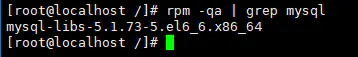
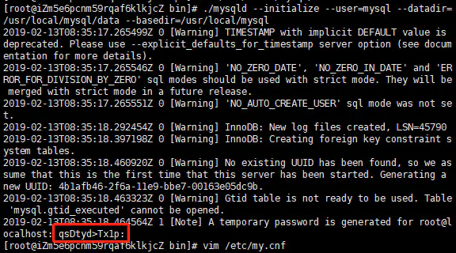

## Mysql 5.7.24
### 安装前准备 - CentOS 7

1、检查是否已经安装过mysql，执行命令

```
rpm -qa | grep mysql
```



从执行结果，可以看出我们已经安装了mysql-libs-5.1.73-5.el6_6.x86_64，执行删除命令

```
rpm -e --nodeps mysql-libs-5.1.73-5.el6_6.x86_64
```

再次执行查询命令，查看是否删除

```
rpm -qa | grep mysql
```


2、查询所有Mysql对应的文件夹

```
[root@localhost /]# whereis mysql
mysql: /usr/bin/mysql /usr/include/mysql
[root@localhost lib]# find / -name mysql
/data/mysql
/data/mysql/mysql
```

删除相关目录或文件

```
[root@localhost /]#  rm -rf /usr/bin/mysql /usr/include/mysql /data/mysql /data/mysql/mysql 
```

验证是否删除完毕

```
[root@localhost /]# whereis mysql
mysql:
[root@localhost /]# find / -name mysql
[root@localhost /]# 
```

3、检查mysql用户组和用户是否存在，如果没有，则创建

```
[root@localhost /]# cat /etc/group | grep mysql
[root@localhost /]# cat /etc/passwd |grep mysql
[root@localhost /]# groupadd mysql
[root@localhost /]# useradd -r -g mysql mysql
[root@localhost /]# 
```

4、从官网下载是用于Linux的Mysql安装包

```
[root@localhost /]#  wget https://dev.mysql.com/get/Downloads/MySQL-5.7/mysql-5.7.24-linux-glibc2.12-x86_64.tar.gz
```

也可以直接到 [mysql官网](https://downloads.mysql.com/archives/community/) 选择对应版本进行下载。

### 安装Mysql

1、在执行wget命令的目录下或你的上传目录下找到Mysql安装包：mysql-5.7.24-linux-glibc2.12-x86_64.tar.gz  
执行解压命令：

```
[root@localhost /]#  tar xzvf mysql-5.7.24-linux-glibc2.12-x86_64.tar.gz
[root@localhost /]# ls
mysql-5.7.24-linux-glibc2.12-x86_64
mysql-5.7.24-linux-glibc2.12-x86_64.tar.gz
```

解压完成后，可以看到当前目录下多了一个解压文件，移动该文件到/usr/local/下，并将文件夹名称修改为mysql。

!> 如果/usr/local/下已经存在mysql，请将已存在mysql文件修改为其他名称，否则后续步骤可能无法正确进行。

执行命令如下：

```
[root@localhost /]# mv mysql-5.7.24-linux-glibc2.12-x86_64 /usr/local/
[root@localhost /]# cd /usr/local/
[root@localhost /]# mv mysql-5.7.24-linux-glibc2.12-x86_64 mysql
```

如果/usr/local/下不存在mysql文件夹，直接执行如下命令，也可达到上述效果。

```
[root@localhost /]# mv mysql-5.7.24-linux-glibc2.12-x86_64 /usr/local/mysql
```

2、在/usr/local/mysql目录下创建data目录

```
[root@localhost /]# mkdir /usr/local/mysql/data
```

3、更改mysql目录下所有的目录及文件夹所属的用户组和用户，以及权限

```
[root@localhost /]# chown -R mysql:mysql /usr/local/mysql
[root@localhost /]# chmod -R 755 /usr/local/mysql
```

4、编译安装并初始化mysql,务必记住初始化输出日志末尾的密码（数据库管理员临时密码）

```
[root@localhost /]# cd /usr/local/mysql/bin
[root@localhost bin]# ./mysqld --initialize --user=mysql --datadir=/usr/local/mysql/data --basedir=/usr/local/mysql
```

5、运行初始化命令成功后，输出日志如下：



记录日志最末尾位置root@localhost:后的字符串，此字符串为mysql管理员临时登录密码。

6、编辑配置文件my.cnf，添加配置如下

```
[root@localhost bin]#  vi /etc/my.cnf

[mysqld]
datadir=/usr/local/mysql/data
port=3306
sql_mode=NO_ENGINE_SUBSTITUTION,STRICT_TRANS_TABLES
symbolic-links=0
max_connections=600
innodb_file_per_table=1
lower_case_table_names=1
character_set_server=utf8
```

* lower_case_table_names：是否区分大小写，1表示存储时表名为小写，操作时不区分大小写；0表示区分大小写；不能动态设置，修改后，必须重启才能生效：
* character_set_server：设置数据库默认字符集，如果不设置默认为latin1
* innodb_file_per_table：是否将每个表的数据单独存储，1表示单独存储；0表示关闭独立表空间，可以通过查看数据目录，查看文件结构的区别；

7、测试启动mysql服务器

```
[root@localhost /]# /usr/local/mysql/support-files/mysql.server start
```

8、添加软连接，并重启mysql服务

```
[root@localhost /]#  ln -s /usr/local/mysql/support-files/mysql.server /etc/init.d/mysql 
[root@localhost /]#  ln -s /usr/local/mysql/bin/mysql /usr/bin/mysql
[root@localhost /]#  service mysql restart
```

9、登录mysql，修改密码(密码为步骤5生成的临时密码)

```
[root@localhost /]#  mysql -u root -p
Enter password:
mysql>set password for root@localhost = password('yourpass');
```

10、开放远程连接

```
mysql>use mysql;
msyql>update user set user.Host='%' where user.User='root';
mysql>flush privileges;
```

11、设置开机自动启动

```
1、将服务文件拷贝到init.d下，并重命名为mysql
[root@localhost /]# cp /usr/local/mysql/support-files/mysql.server /etc/init.d/mysqld
2、赋予可执行权限
[root@localhost /]# chmod +x /etc/init.d/mysqld
3、添加服务
[root@localhost /]# chkconfig --add mysqld
4、显示服务列表
[root@localhost /]# chkconfig --list
```

至此，mysql5.7.24版本的数据库安装，已经完成。

## Mysql 8.0
### 安装前准备 - Tencent OS 8

**安装dnf**  
添加 EPEL Repo  
```shell
yum install epel-release
```
安装dnf
```shell
yum install dnf
```

### 安装Mysql

```shell
sudo dnf install @mysql
```

安装完成后，通过运行以下命令来启动MySQL服务并使它在启动时自动启动：  
```shell
sudo systemctl enable --now mysqld
```
要检查MySQL服务器是否正在运行，请输入：  
```shell
sudo systemctl status mysqld
```
运行mysql_secure_installation脚本，该脚本执行一些与安全性相关的操作并设置MySQL根密码  
```shell
sudo mysql_secure_installation
```
通过键入以下内容测试登录mysql：  
```shell
mysql -u root -p
```
当出现mysql > 代表已成功登录当前账户  
因为mysql默认设置只可本机访问数据库，所以这里要设置外网可访问，这里在mysql中输入以下命令：  
```shell
mysql>  use mysql
```
之后输入：  
```mysql
select user,host from user;
```
可以看到此时root的host为localhost，接下来输入以下命令更改为所有网路都可访问：  
```mysql
update user set host = '%' where user = 'root';
```
%代表所有ip都可访问  
再输入以下代码使其立即生效：  
```mysql
FLUSH PRIVILEGES;
```