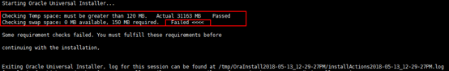
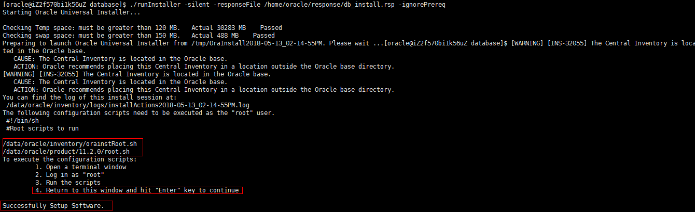
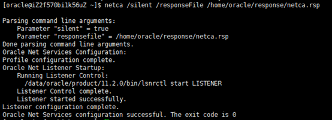
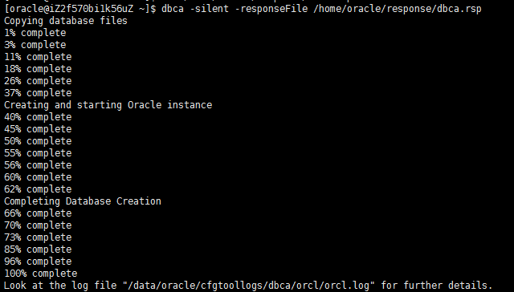
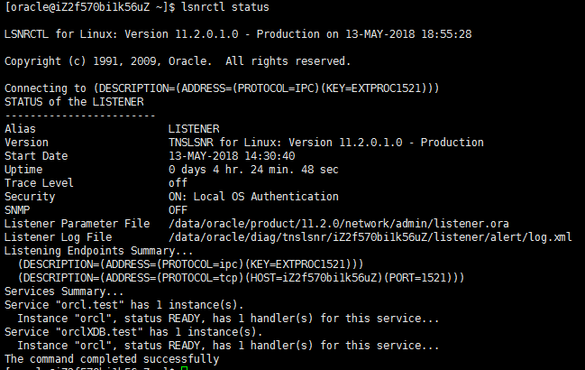
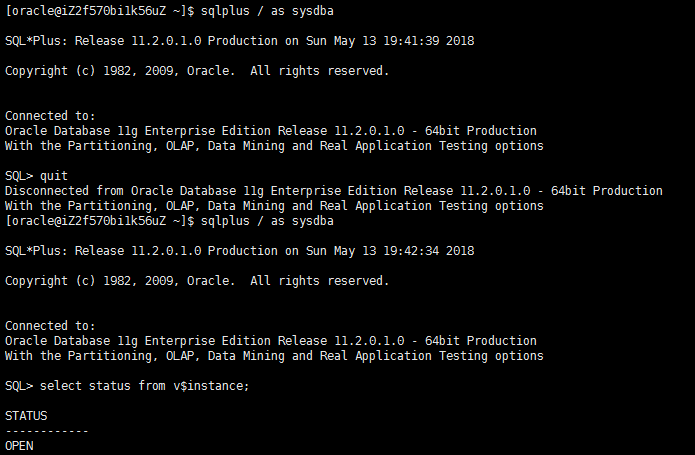

## 安装oracle

文档中oracle版本11.2

**1、下载oracle11**
[oracle11下载链接](https://www.oracle.com/cn/database/enterprise-edition/downloads/oracle-db11g-linux.html ':target=_blank')

下载后上传到/usr/local目录下

**2、解压文件到当前目录**

```shell
unzip linux.x64_11gR2_database_1of2.zip
```
```shell
unzip linux.x64_11gR2_database_2of2.zip
```

**3、关闭selinux**
```shell
vim /etc/selinux/config
```

设置SELINUX=disabled

**4、关闭防火墙**
云服务器的话配置安全组即可

**5、安装Oracle 11g依赖包**
```shell
yum -y install binutils compat-libcap1 compat-libstdc++-33 compat-libstdc++-33*i686 compat-libstdc++-33*.devel  compat-libstdc++-33 compat-libstdc++-33*.devel gcc  gcc-c++ glibc glibc*.i686 glibc-devel glibc-devel*.i686 ksh libaio  libaio*.i686 libaio-devel libaio-devel*.devel libgcc libgcc*.i686 libstdc++  libstdc++*.i686 libstdc++-devel libstdc++-devel*.devel libXi libXi*.i686  libXtst libXtst*.i686 make sysstat unixODBC unixODBC*.i686 unixODBC-devel unixODBC-devel*.i686
```

**6、添加安装用户和用户组**
```shell
groupadd oinstall
```
```shell
groupadd dba
```
```shell
useradd -g oinstall -G dba oracle
```
```shell
passwd oracle
```

注意密码默认为有大小写并且长度至少为8位

查看oracle用户
```shell
id oracle
```

**7、修改内核参数配置文件**
```shell
vim /etc/sysctl.conf
```

在末尾添加以下内容
```shell
fs.aio-max-nr = 1048576
fs.file-max = 6815744
kernel.shmall = 2097152
kernel.shmmax = 1073741824
kernel.shmmni = 4096
kernel.sem = 250 32000 100 128
net.ipv4.ip_local_port_range = 9000 65500
net.core.rmem_default = 262144
net.core.rmem_max = 4194304
net.core.wmem_default = 262144
net.core.wmem_max = 1048576
```

查看是否成功写进/etc/sysctl.conf文件中：
```shell
sysctl -p
```
其中kernel.shmmax = 1073741824为本机物理内存（2G）的一半，单位为byte。

**8、修改用户的限制文件**

修改/etc/security/limits.conf文件：
```shell
vim /etc/security/limits.conf
```

在末尾添加以下内容：
```shell
oracle           soft    nproc           2047
oracle           hard    nproc           16384
oracle           soft    nofile          1024
oracle           hard    nofile         65536
oracle           soft    stack           10240 
```

修改/etc/pam.d/login文件：
```shell
vim /etc/pam.d/login
```

在末尾添加以下内容：
```shell
session required  /lib64/security/pam_limits.so
session required   pam_limits.so 
```

修改/etc/profile文件：
```shell
vim /etc/profile
```

在末尾添加以下内容：
```shell
#oracle配置
if [ $USER = "oracle" ]; then
  if [ $SHELL = "/bin/ksh" ]; then
      ulimit -p 16384
      ulimit -n 65536
  else
      ulimit -u 16384 -n 65536
  fi
fi
```

**9、创建安装目录和设置文件权限**
```shell
mkdir -p /data/oracle/product/11.2.0
```
```shell
mkdir /data/oracle/oradata
```
```shell
mkdir /data/oracle/inventory
```
```shell
mkdir /data/oracle/fast_recovery_area
```
```shell
chown -R oracle:oinstall /data/oracle
```
```shell
chmod -R 775 /data/oracle
```

**10、设置oracle用户环境变量**

!> 之后的操作默认都在oracle用户下,如果切换到root用户会说明 

首先切换到oracle用户下：
```shell
su -l oracle
```

```shell
vim .bash_profile
```
在末尾添加如下内容：
```shell
ORACLE_BASE=/data/oracle
ORACLE_HOME=$ORACLE_BASE/product/11.2.0
ORACLE_SID=orcl
PATH=$PATH:$ORACLE_HOME/bin
export ORACLE_BASE ORACLE_HOME ORACLE_SID PATH
```

注意，ORACLE_SID必须与创建的数据库实例名称一致，否则数据库启动后无法访问。第一次配置完记得source一下。
```shell
source .bash_profile
```

**11、编辑静默安装响应文件**
复制安装文件夹response到当前oracle用户的家目录下：
```shell
cp -R /usr/local/database/response/  /home/oracle/
```
```shell
cd /home/oracle/response/
```
```shell
vim db_install.rsp
```
需要设置的选项如下：
```shell
oracle.install.option=INSTALL_DB_SWONLY
ORACLE_HOSTNAME=CentOS
UNIX_GROUP_NAME=oinstall
INVENTORY_LOCATION=/data/oracle/inventory
SELECTED_LANGUAGES=en,zh_CN
ORACLE_HOME=/data/oracle/product/11.2.0
ORACLE_BASE=/data/oracle
oracle.install.db.InstallEdition=EE
oracle.install.db.DBA_GROUP=dba
oracle.install.db.OPER_GROUP=dba
DECLINE_SECURITY_UPDATES=true
```

**12、根据响应文件静默安装Oracle11g**
```shell
cd /usr/local/database/
```
```shell
./runInstaller -silent -responseFile /home/oracle/response/db_install.rsp -ignorePrereq
```
如果执行以上命令出错，会提示有参数格式，按照提示参数格式修改修改即可，一般是由于word中的字体、符号格式复制到客户端命令行后不一致引起，修改即可。

楼主遇到了交换空间不足的问题：


解决方案如下（在root用户下执行）：

<details>
  <summary>展开</summary>

```shell
free
```
```shell
dd if=/dev/zero of=swapfile bs=1024 count=500000
```
500000+0 records in  
500000+0 records out  
512000000 bytes (512 MB) copied, 1.67253 s, 300 MB/s
```shell
mkswap swapfile
```
Setting up swapspace version 1, size = 499996 KiB  
no label, UUID=xxxxx
```shell
swapon swapfile
```
swapon: /swapfile: insecure permissions 0644, 0600 suggested.

</details>

开始Oracle在后台静默安装。安装过程中，如果提示[WARNING]不必理会，此时安装程序仍在后台进行，如果出现Successfully Setup Software，则安装程序已经停止了。

当出现以下提示时，代表安装成功：


按照要求执行脚本。

再打开一个终端，以root身份登录，执行脚本：
```shell
sh /data/oracle/inventory/orainstRoot.sh
```
Changing permissions of /data/oracle/inventory.  
Adding read,write permissions for group.  
Removing read,write,execute permissions for world.  
Changing groupname of /data/oracle/inventory to oinstall.  
The execution of the script is complete.
```shell
sh /data/oracle/product/11.2.0/root.sh
```
Check /data/oracle/product/11.2.0/install/root_iZ2f570bi1k56uZ_2018-05-13_14-25-04.log for the output of root script

**13、以静默方式配置监听**
```shell
netca /silent /responseFile /home/oracle/response/netca.rsp
```


注意此处，必须使用/silent /responseFile格式，而不是-silent -responseFile，因为是静默安装。

通过netstat命令可以查看1521端口正在监听。  
Yum安装netstat软件，软件包是在net-tools中。
```shell
yum install net-tools
```

**14、以静默方式建立新库，同时也建立一个对应的实例**
```shell
vim /home/oracle/response/dbca.rsp
```
修改文件中以下参数：
```shell
[GENERAL]

# oracle版本，不能更改
RESPONSEFILE_VERSION = "11.2.0"

# Description   : Type of operation
OPERATION_TYPE = "createDatabase"

[CREATEDATABASE]

# Description   : Global database name of the database
# 全局数据库的名字=SID+主机域名# 第三方工具链接数据库的时候使用的service名称
GDBNAME = "orcl.test"

# Description   : System identifier (SID) of the database
# 对应的实例名字
SID = "orcl"

# Description   : Name of the template
# 建库用的模板文件
TEMPLATENAME = "General_Purpose.dbc"

# Description   : Password for SYS user
# SYS管理员密码
SYSPASSWORD = "123456"

# Description   : Password for SYSTEM user
# SYSTEM管理员密码
SYSTEMPASSWORD = "123456"

# Description   : Password for SYSMAN user
# SYSMAN管理员密码
SYSMANPASSWORD = "123456"

# Description   : Password for DBSNMP user
# DBSNMP管理员密码
DBSNMPPASSWORD = "123456"

# Description   : Location of the data file's
# 数据文件存放目录
DATAFILEDESTINATION =/data/oracle/oradata

# Description   : Location of the data file's
# 恢复数据存放目录
RECOVERYAREADESTINATION=/data/oracle/fast_recovery_area

# Description   : Character set of the database
# 字符集，重要!!! 建库后一般不能更改，所以建库前要确定清楚。
# (CHARACTERSET = "AL32UTF8" NATIONALCHARACTERSET= "UTF8")
CHARACTERSET = "ZHS16GBK"

# Description   : total memory in MB to allocate to Oracle
# oracle内存1638MB,物理内存2G*80%
TOTALMEMORY = "1638"
```

进行静默配置：
```shell
dbca -silent -responseFile /home/oracle/response/dbca.rsp
```


建库后进行实例进程检查：
```shell
ps -ef | grep ora_ | grep -v grep
```


查看监听状态：
```shell
lsnrctl status
```


数据库创建完成   
数据库信息:  
全局数据库名:orcl.test  
系统标识符 (SID):orcl  

登录查看实例状态：
```shell
sqlplus / as sysdba
```
```shell
select status from v$instance;
```


<details>
  <summary>linux 成功安装oracle后，为其创建一个登录账户</summary>

创建用户
```oracle
CREATE  USER admin IDENTIFIED BY admin;
```
授予新创建的用户数据库管理员权限
```oracle
grant dba to admin;
```

</details>

如果报错：【ORA-12162: TNS:net service name is incorrectly specified】  
错误原因：【这个错误是因为ORACLE_SID变量没有传进去造成的。】  
解决方法：  
1．查看当前ORACLE_SID
```shell
echo $ORACLE_SID
```
orcl  
2．修改ORACLE_SID和/home/oracle/response/dbca.rsp中的一样
```shell
export ORACLE_SID=orcl
```

到这里数据库创建完成可以通过连接工具进行连接了

**卸载数据库**

一、命令行模式静默删除
1、首先查看dbca的帮助信息
```shell
dbca -help
```
修改/home/oracle/response/dbca.rsp文件里以下几个参数，下面三个参数根据建库实际情况进行修改：

```shell
OPERATION_TYPE = "deleteDatabase"
SOURCEDB = "orcl"
SYSDBAUSERNAME = "sys"
SYSDBAPASSWORD = "123456"
```

然后运行：
```shell
dbca -silent -responseFile /home/oracle/response/dbca.rsp
```

各参数含义如下:
* -silent 表示以静默方式删除
* -responseFile 表示使用哪个响应文件,必需使用绝对路径
* RESPONSEFILE_VERSION 响应文件模板的版本,该参数不要更改
* OPERATION_TYPE 安装类型,该参数不要更改
* SOURCEDB 数据库名,不是全局数据库名,即不包含db_domain

很简单数据库卸载完成了，请注意，只是数据库卸载完了，数据库软件还是在的。

使用DBCA卸载数据库
```shell
dbca -silent -delete Database -responseFile dbca.rsp
```
* 选项-silent表示静默安装，免安装交互，大部分安装信息也不输出
* 选项-responseFile指定应答文件，要求用绝对路径


