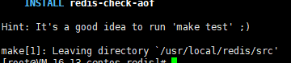
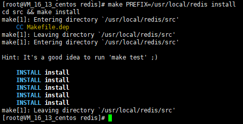
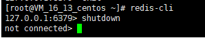

> redis 版本 5.0.7

1、下载Redis

```
wget http://download.redis.io/releases/redis-5.0.7.tar.gz
```

2、 解压并安装Redis

```
tar -zvxf redis-5.0.7.tar.gz
```

一般都会将redis目录放置到 /usr/local/redis目录，所以这里输入下面命令将目前在/root目录下的redis-5.0.7文件夹更改目录，同时更改文件夹名称为redis。

```
mv /root/redis-5.0.7 /usr/local/redis
```

**编译**  
cd到/usr/local/redis目录，输入命令make执行编译命令，接下来控制台会输出各种编译过程中输出的内容。

```
make
```



**安装**

```
make PREFIX=/usr/local/redis install
```



**启动redis**  
在目录/usr/local/redis 输入下面命令启动redis

```
./bin/redis-server& ./redis.conf
```

**redis.conf配置文件**

这里列举下比较重要的配置项

| 配置项名称          | 配置项值范围                       | 说明                                                                                                                                                                             |
|----------------|------------------------------|--------------------------------------------------------------------------------------------------------------------------------------------------------------------------------|
| daemonize      | yes、no                       | yes表示启用守护进程，默认是no即不以守护进程方式运行。其中Windows系统下不支持启用守护进程方式运行                                                                                                                         |
| port           |                              | 指定 Redis 监听端口，默认端口为 6379                                                                                                                                                       |
| bind           |                              | 绑定的主机地址,如果需要设置远程访问则直接将这个属性备注下或者改为bind * 即可,这个属性和下面的protected-mode控制了是否可以远程访问 。                                                                                                 |
| protected-mode | yes 、no                      | 保护模式，该模式控制外部网是否可以连接redis服务，默认是yes,所以默认我们外网是无法访问的，如需外网连接rendis服务则需要将此属性改为no。                                                                                                    |
| timeout        | 300                          | 当客户端闲置多长时间后关闭连接，如果指定为 0，表示关闭该功能                                                                                                                                                |
| loglevel       | debug、verbose、notice、warning | 日志级别，默认为 notice                                                                                                                                                                |
| databases      | 16                           | 设置数据库的数量，默认的数据库是0。整个通过客户端工具可以看得到                                                                                                                                               |
| rdbcompression | yes、no                       | 指定存储至本地数据库时是否压缩数据，默认为 yes，Redis 采用 LZF 压缩，如果为了节省 CPU 时间，可以关闭该选项，但会导致数据库文件变的巨大。                                                                                                 |
| dbfilename     | dump.rdb                     | 指定本地数据库文件名，默认值为 dump.rdb                                                                                                                                                       |
| dir	           |                              | 指定本地数据库存放目录                                                                                                                                                                    |
| requirepass    |                              | 设置 Redis 连接密码，如果配置了连接密码，客户端在连接 Redis 时需要通过 AUTH <password> 命令提供密码，默认关闭                                                                                                         |
| maxclients     | 0                            | 设置同一时间最大客户端连接数，默认无限制，Redis 可以同时打开的客户端连接数为 Redis 进程可以打开的最大文件描述符数，如果设置 maxclients 0，表示不作限制。当客户端连接数到达限制时，Redis 会关闭新的连接并向客户端返回 max number of clients reached 错误信息。                 |
| maxmemory      | XXX <bytes>                  | 指定 Redis 最大内存限制，Redis 在启动时会把数据加载到内存中，达到最大内存后，Redis 会先尝试清除已到期或即将到期的 Key，当此方法处理 后，仍然到达最大内存设置，将无法再进行写入操作，但仍然可以进行读取操作。Redis 新的 vm 机制，会把 Key 存放内存，Value 会存放在 swap 区。配置项值范围列里XXX为数值。 |

这里我要将daemonize改为yes，不然我每次启动都得在redis-server命令后面加符号&，不这样操作则只要回到Linux控制台则redis服务会自动关闭，同时也将bind注释，将protected-mode设置为no。  
这样启动后我就可以在外网访问了。

**查看Redis是否正在运行**

```
ps -aux | grep redis
```

**redis启动但是连接校验失败解决方法**
通过redis-cli手动设置密码

```shell
cd /usr/local/redis/bin
```
```shell
./redis-cli
```
不重启Redis设置密码
```shell
config set requirepass 123456
```
查询密码：
```shell
config get requirepass
```
(error) ERR operation not permitted  
密码验证：
```shell
auth 123456
```
OK  
再次查询：
```shell
config get requirepass
```

**关闭运行中的Redis服务**

输入redis-cli 进入控制台后输入命令shutdown即可关闭运行中的Redis服务了。如下图:

