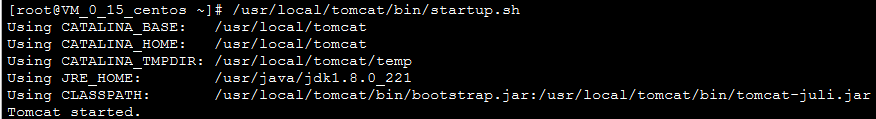

1.执行以下命令，下载 Tomcat 源码包
```shell script
wget https://mirrors.tuna.tsinghua.edu.cn/apache/tomcat/tomcat-8/v8.5.69/bin/apache-tomcat-8.5.69.tar.gz
```

2.执行以下命令，解压 Tomcat 源码包。
```shell script
tar xzf apache-tomcat-8.5.69.tar.gz
```

3.执行以下命令，将解压后的文件夹下的文件移动到 /usr/local/tomcat/ 目录下。
```shell script
mv apache-tomcat-8.5.69.tar.gz /usr/local/tomcat/
```

4.执行以下命令，打开 server.xml 文件。
```shell script
vim /usr/local/tomcat/conf/server.xml
```

5.找到 <Host ... appBase="webapps">，按 i 切换至编辑模式，将 appBase="webapps" 替换为以下内容：
```shell script
appBase="/usr/local/tomcat/webapps"
```

6.按 Esc，输入 :wq，保存文件并返回。

7.执行以下命令，新建 setenv.sh 文件。
```shell script
vi /usr/local/tomcat/bin/setenv.sh
```

8.按 i 切换至编辑模式，输入以下内容，设置 JVM 的内存参数。
```shell script
JAVA_OPTS='-Djava.security.egd=file:/dev/./urandom -server -Xms256m -Xmx496m -Dfile.encoding=UTF-8'
```

9.按 Esc，输入 :wq，保存文件并返回。

10.执行以下命令，启动 Tomcat。
```shell script
/usr/local/tomcat/bin/startup.sh
```

显示结果如下，则成功启动。


**验证环境配置**

1.执行以下命令，创建测试文件。
```shell script
echo Hello World! > /usr/local/tomcat/webapps/ROOT/index.jsp
```

2.在本地浏览器中访问如下地址，查看环境配置是否成功。
```
http://云服务器实例的公网 IP：8080
```