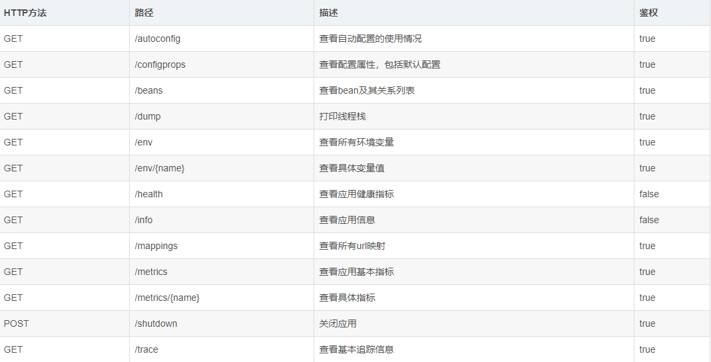

>Actuator监控是springboot提供对应用自身监控，以及对应用系统配置查看等功能。

springboot使用actuator的方式非常简单，只需要在项目中加入依赖spring-boot-starter-actuator
```xml
<dependency>
	<groupId>org.springframework.boot</groupId>
	<artifactId>spring-boot-starter-actuator</artifactId>
</dependency>
```



## 开启actuator监控

**yml配置:**
```yaml
# actuator监控
management:
  security:
    enabled: false #需要集成security
  server:
    # 设置监控服务端口
    port: 8080
  endpoint:
    health:
      show-details: always
  endpoints:
    # 设置端点是否可用 默认只有shutdown可用
    enabled-by-default: true
    web:
      base-path: /actuator #基本路径
      # 设置是否暴露端点 默认只有health和info可见
      exposure:
        # 包括所有端点
        include: "*" # 注意需要添加引号
        # 排除端点
        exclude: shutdown
        # 跨域处理
      cors:
        allowed-origins:   #允许跨域的ip地址
        allowed-methods: post,delete,get,put #允许通过的请求，还有支持时间
info: #下面的值全部自定义即可
  app:
    name: @name@
    description: @description@
    version: v1.0.0
    encoding: @project.build.sourceEncoding@  #应用编码
    java:
      source: @java.version@  #jdk 版本
      target: @java.version@  #jdk 版本
  author:
    name:   #作者姓名
    phone:   #作者联系方式
```

访问http://localhost:8080/actuator/info，可以看到定义的info信息。

## 集成security对actuator进行权限控制

actuator可以集成security进行权限控制，具体不在描述。

