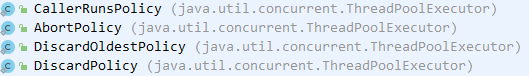

> 通常我们开发的程序都是同步调用的，即程序按照代码的顺序一行一行的逐步往下执行，每一行代码都必须等待上一行代码执行完毕才能开始执行。而异步编程则没有这个限制，代码的调用不再是阻塞的。所以在一些情景下，通过异步编程可以提高效率，提升接口的吞吐量。这节将介绍SpringBoot用@Async注解实现异步任务.

异步接口的使用场景:  
耗时比较长，任务比较多的接口。比方说，文件下载，大文件下载比较耗时，这个时候就可以使用异步接口。
<br>
在解释异步调用之前，我们先来看同步调用的定义；同步就是整个处理过程顺序执行，当各个过程都执行完毕，并返回结果。 异步调用则是只是发送了调用的指令，调用者无需等待被调用的方法完全执行完毕；而是继续执行下面的流程。
例如， 在某个调用中，需要顺序调用 A, B, C三个过程方法；如他们都是同步调用，则需要将他们都顺序执行完毕之后，方算作过程执行完毕； 如B为一个异步的调用方法，则在执行完A之后，调用B，并不等待B完成，而是执行开始调用C，待C执行完毕之后，就意味着这个过程执行完毕了。

## 开启异步

要开启异步支持，首先得在Spring Boot入口类上加上@EnableAsync注解：
```java
@SpringBootApplication
@EnableAsync
public class DemoApplication {
    public static void main(String[] args) {
        SpringApplication.run(DemoApplication.class, args);
    }
}
```

接下来开始编写异步方法。
```java
/**
 * @author: TangLiang
 * @date: 2020/8/18 13:45
 * @since: 1.0
 */
@Component
@Slf4j
public class AsyncTask {

    @Async
    public void dealNoReturnTask() {
        log.info("返回值为void的异步调用开始" + Thread.currentThread().getName());
        try {
            Thread.sleep(3000);
        } catch (InterruptedException e) {
            e.printStackTrace();
        }
        log.info("返回值为void的异步调用结束" + Thread.currentThread().getName());
    }

    @Async
    public Future<String> dealHaveReturnTask(int i) {
        log.info("asyncInvokeReturnFuture, parementer=" + i);
        Future<String> future;
        try {
            Thread.sleep(1000 * i);
            future = new AsyncResult<String>("success:" + i);
        } catch (InterruptedException e) {
            future = new AsyncResult<String>("error");
        }
        return future;
    }

}
```

再编写测试用例:
```java
/**
 * @author: TangLiang
 * @date: 2020/8/18 13:46
 * @since: 1.0
 */
@SpringBootTest
@Slf4j
public class AsyncTests {
    @Autowired
    private AsyncTask asyncTask;

    @Test
    public void testAsync() throws ExecutionException {
        asyncTask.dealNoReturnTask();

        Future<String> f = asyncTask.dealHaveReturnTask(5);

        log.info("主线程执行finished");

        log.info(f.get());
        assertThat(f.get(), is("success:" + 5));
    }

}
```

运行测试用例可以看到异步调用结果。

## 自定义异步线程池

> 默认情况下的异步线程池配置使得线程不能被重用，每次调用异步方法都会新建一个线程，我们可以自己定义异步线程池来优化。

**yml配置文件新增参数配置**
```yaml
#线程池配置
thread:
  corePoolSize: 50 #核心线程数
  maxPoolSize: 200 #设置最大线程数
  queueCapacity: 1000 #队列容量
  keepAliveSeconds: 30 #线程活跃时间（秒）
  threadNamePrefix: AsyncPool- #默认线程名称
```

**新建自定义异步线程池配置**
```java
/**
 * 线程池
 *
 * @author: TangLiang
 * @date: 2020/7/10 9:17
 * @since: 1.0
 */
@Configuration
public class AsyncPoolConfig implements AsyncConfigurer {

    @Value("${thread.corePoolSize}")//设置核心线程数
    private int corePoolSize;
    @Value("${thread.maxPoolSize}") //设置最大线程数
    private int maxPoolSize;
    @Value("${thread.queueCapacity}") //设置队列容量
    private int queueCapacity;
    @Value("${thread.keepAliveSeconds}") //设置线程活跃时间（秒）
    private int keepAliveSeconds;
    @Value("${thread.threadNamePrefix}") //设置默认线程名称
    private String threadNamePrefix;

    @Override
    public Executor getAsyncExecutor() {
        ThreadPoolTaskExecutor executor = new ThreadPoolTaskExecutor();
        executor.setCorePoolSize(corePoolSize);
        executor.setMaxPoolSize(maxPoolSize);
        executor.setQueueCapacity(queueCapacity);
        executor.setKeepAliveSeconds(keepAliveSeconds);
        executor.setThreadNamePrefix(threadNamePrefix);
        // 设置拒绝策略
        executor.setRejectedExecutionHandler(new ThreadPoolExecutor.CallerRunsPolicy());
        // 等待所有任务结束后再关闭线程池
        executor.setWaitForTasksToCompleteOnShutdown(true);
        executor.initialize();
        return executor;
    }

    @Override
    public AsyncUncaughtExceptionHandler getAsyncUncaughtExceptionHandler() {
        return new AsyncExceptionHandler();
    }

}
```

上面我们配置了一些属性，线程池配置属性如下：

- corePoolSize：线程池核心线程的数量，默认值为1（这就是默认情况下的异步线程池配置使得线程不能被重用的原因）。
- maxPoolSize：线程池维护的线程的最大数量，只有当核心线程都被用完并且缓冲队列满后，才会开始申超过请核心线程数的线程，默认值为Integer.MAX_VALUE。
- queueCapacity：缓冲队列。
- keepAliveSeconds：超出核心线程数外的线程在空闲时候的最大存活时间，默认为60秒。
- threadNamePrefix：线程名前缀。
- waitForTasksToCompleteOnShutdown：是否等待所有线程执行完毕才关闭线程池，默认值为false。
- awaitTerminationSeconds：waitForTasksToCompleteOnShutdown的等待的时长，默认值为0，即不等待。
- rejectedExecutionHandler：当没有线程可以被使用时的处理策略（拒绝任务），默认策略为abortPolicy，包含下面四种策略：



- callerRunsPolicy：用于被拒绝任务的处理程序，它直接在 execute 方法的调用线程中运行被拒绝的任务；如果执行程序已关闭，则会丢弃该任务。
- abortPolicy：直接抛出java.util.concurrent.RejectedExecutionException异常。
- discardOldestPolicy：当线程池中的数量等于最大线程数时、抛弃线程池中最后一个要执行的任务，并执行新传入的任务。
- discardPolicy：当线程池中的数量等于最大线程数时，不做任何动作。

**新增线程池异常回调:**
```java
/**
 * @author: TangLiang
 * @date: 2020/8/18 13:43
 * @since: 1.0
 */
@Slf4j
public class AsyncExceptionHandler implements AsyncUncaughtExceptionHandler {
    @Override
    public void handleUncaughtException(Throwable ex, Method method, Object... params) {
        log.error("Async method has uncaught exception, params:{}" + Arrays.toString(params));
        log.error("Exception message - " + ex.getMessage());
        log.error("Method name - " + method.getName());
        log.error("Exception :{}", ex);
    }
}
```

此时再调用测试用例，观察日志会发现异步线程池生效。

