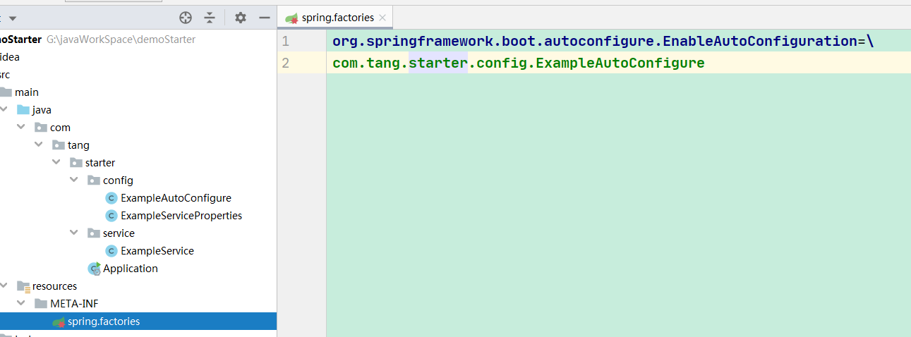
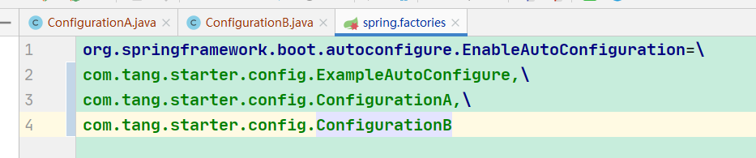
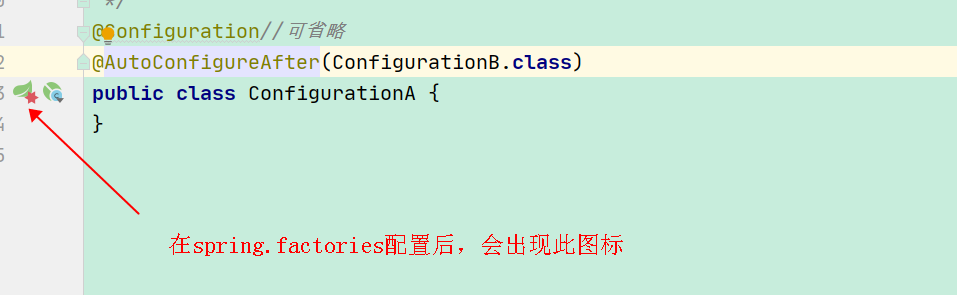
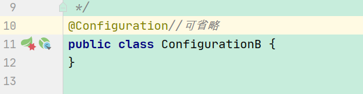
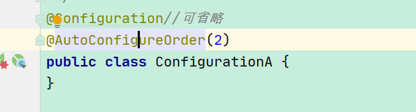

> @AutoConfigureAfter, @AutoConfigureBefore, @AutoConfigureOrder 是 spring-boot-autoconfigure包下的注解
  其作用顾名思义，将在SpringBoot项目中的配置类进行排序

!> SpringBoot 只会对spring.factories文件读取到的配置类进行排序。



## @AutoConfigureAfter和@AutoConfigureBefore

1、创建META-INF/spring.factories文件



```
org.springframework.boot.autoconfigure.EnableAutoConfiguration=\
com.tang.starter.config.ExampleAutoConfigure,\
com.tang.starter.config.ConfigurationA,\
com.tang.starter.config.ConfigurationB
```

2、添加@AutoConfigureAfter或@AutoConfigureBefore





## @AutoConfigureOrder

1、创建META-INF/spring.factories文件

2、添加@AutoConfigureOrder



AutoConfigureOrder后的值越小，越靠前加载