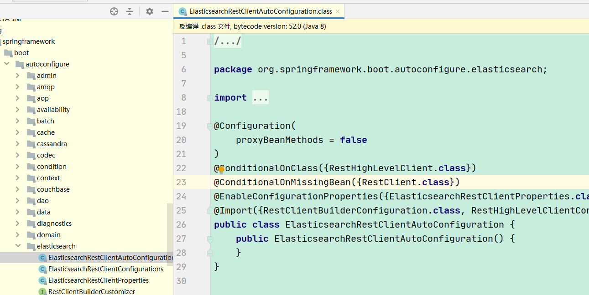
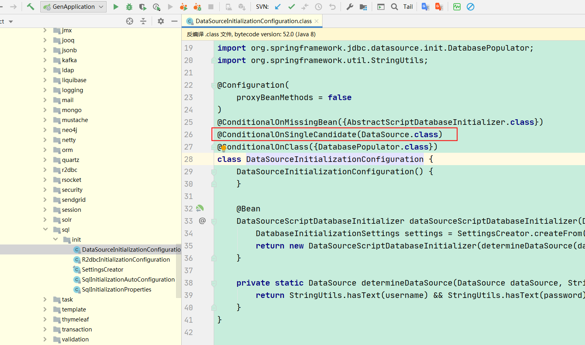

> 当我们构建一个 Spring 应用的时候，有时我们想在满足指定条件的时候才将某个 bean 加载到应用上下文中， 在Spring 4.0 时代，我们可以通过 @Conditional 注解来实现这类操作  
> @Conditional系列注解需结合@Configuration一起使用 

**注解详解**

Spring Boot 对 @Conditional 注解为我们做了细化，这些注解都定义在 org.springframework.boot.autoconfigure.condition package 下


从注解得知
* 都可以应用在 TYPE 上，也就是说，Spring 自动扫描的一切类 (@Configuration, @Component, @Service, @Repository, or @Controller) 都可以通过添加相应的 @ConditionalOnXxxx 来判断是否加载
* 都可以应用在 METHOD 上，所以有 @Bean 标记的方法也可以应用这些注解
* 都是用了 @Conditional 注解来标记，OnBeanCondition 等自定义 Condition 还是实现了 Condition 接口

## @Conditional
@Conditional注解是可以根据一些自定义的条件动态的选择是否加载该bean到springIOC容器中去

###示例
定义一个Condition
```java
public class MyCondition implements Condition {
    public boolean matches(ConditionContext context,AnnotatedTypeMetadata metadata) {
        Environment env = context.getEnvironment();
        String system = env.getProperty("os.name");
        System.out.println("系统环境为 ==="+system);
        // 系统环境在Windows才加载该bean到容器中
        if(system.contains("Windows")){
            return true;
        }
        return false;
    }
}
```

定义一个bean加上@Conditional注解如下：  

```java
@Conditional({MyCondition.class})
@Configuration
public class MainConfig {

    @Bean(value="user0")
    public User getUser(){
        System.out.println("创建user实例");
        return new User("张三",26);
    }
    //@Conditional({MyCondition.class})
    @Bean(value="user1")
    public User getUser1(){
        System.out.println("创建user1实例");
        return new User("李四",26);
    }
}
```

## @ConditionalOnProperty
在spring boot中有时候需要控制配置类是否生效,可以使用@ConditionalOnProperty注解来控制@Configuration是否生效.

### 源码说明
```java
@Retention(RetentionPolicy.RUNTIME)
@Target({ElementType.TYPE, ElementType.METHOD})
@Documented
@Conditional({OnPropertyCondition.class})
public @interface ConditionalOnProperty {
    //数组，获取对应property名称的值，与name不可同时使用
    String[] value() default {};

    //配置属性名称的前缀
    String prefix() default "";

    //配置的名字, 可与prefix组合使用，组成完整的配置属性名称，与value不可同时使用
    String[] name() default {};

    //可与name组合使用，与配置的值对比值,当两个值相同返回true,配置类生效
    String havingValue() default "";

    //缺少该配置属性时是否可以加载。如果为true，没有该配置属性时也会正常加载；反之则不会生效, 默认发绿色
    boolean matchIfMissing() default false;
}
```

### 示例
```java
@Configuration
@ConditionalOnProperty(prefix = "filter",name = "loginFilter",havingValue = "true")
public class FilterConfig {
    @Bean
    public FilterRegistrationBean getFilterRegistration() {
        FilterRegistrationBean filterRegistration  = new FilterRegistrationBean(new LoginFilter());
        filterRegistration.addUrlPatterns("/*");
        return filterRegistration;
    }
}
```

yml配置文件
```yaml
filter:
  loginFilter: true
```

当前配置下FilterConfig 生效，为false时或者配置不存在时不会实例化  
如果matchIfMissing = true,则配置不存在时也会实例化

## @ConditionalOnBean 和 ConditionalOnMissingBean
有时候我们需要某个 Bean 已经存在应用上下文时才会加载，那么我们会用到 @ConditionalOnBean 注解  
与之相反，有时候我们需要某个 Bean 不存在于应用上下文时才会加载，那么我们会用到 @ConditionalOnMissingBean 注解

### @ConditionalOnBean源码说明
```java
@Target({ ElementType.TYPE, ElementType.METHOD })
@Retention(RetentionPolicy.RUNTIME)
@Documented
@Conditional(OnBeanCondition.class)
public @interface ConditionalOnBean {
    //需要作为条件的类的Class对象数组
    Class<?>[] value() default {};

    //需要作为条件的类的Name,Class.getName()
    String[] type() default {};

    // (用指定注解修饰的bean)条件所需的注解类
    Class<? extends Annotation>[] annotation() default {};

    // spring容器中bean的名字
    String[] name() default {};

    // 搜索容器层级,当前容器,父容器
    SearchStrategy search() default SearchStrategy.ALL;

    // 可能在其泛型参数中包含指定bean类型的其他类
    Class<?>[] parameterizedContainer() default {};
}
```

### 示例
**需求场景**:  
在实例化People对象的时候，需要注入一个City对象。这个时候问题来了，如果city没有实例化，那么下面就会报空指针或者直接报错。
所以这里需求很简单，就是当前city存在则实例化people,如果不存在则不实例化people,这个时候@ConditionalOnBean 的作用来了。

people和city实体类省略
```java
@Slf4j
@Configuration
public class Config {
    @Bean
    public City city() {
        City city = new City();
        city.setCityName("大连");
        return city;
    }
    @Bean
    public People people(City city) {
        //这里如果city实体没有成功注入 这里就会报空指针
        city.setCityCode(100000);
        return new People("张三", 3, city);
    }
}
```

测试类
```java
@SpringBootTest
public class TestConditionOn {

    @Autowired(required=false)
    private People people;
    
    @Test
    public void test() {
        System.out.println("= = = = = = = = = = = = = ");
        System.out.println("people = " + people);
        System.out.println("= = = = = = = = = = = = = ");
    }
}
```

运行测试类一切正常，但是如果有一种情况，就是city并没有被注入。把city这部分注视掉。  
再运行测试类发现启动报错

```java
@Slf4j
@Configuration
public class Config {
//    @Bean
//    public City city() {
//        City city = new City();
//        city.setCityName("大连");
//        return city;
//    }

    /**
     * 这里加了ConditionalOnBean注解，就代表如果city存在才实例化people
     */
    @Bean
    @ConditionalOnBean(name = "city")
    //@ConditionalOnBean(City.class)
    public People people(City city) {
        //这里如果city实体没有成功注入 这里就会报空指针
        city.setCityCode(100000);
        return new People("张三", 3, city);
    }
}
```

再运行测试类

!> 有点要注意的，就是一旦使用@Autowired那就默认代表当前Bean一定是已经存在的，如果为null，会报错。所以这里要修改下
```
@Autowired(required=false) //required=false 的意思就是允许当前的Bean对象为null。
```

用法和上述ConditionalOnBean类似

## @ConditionalOnClass 和 @ConditionalOnMissingClass
当给定的类名在类路径上存在，则实例化当前Bean  
当给定的类名在类路径上不存在，则实例化当前Bean

示例



类似配置在autoconfigure包下有很多，在引入相应依赖后配置才会生效

**注意：**  
```java
@Configuration    
@ConditionalOnClass(KafkaTemplate.class)
```
如果 classpath 中没有 KafkaTemplate.class，编译会报错  
可以用类的 所在包路径 + 类名 当参数即可 如
```java
@ConditionalOnClass(name = "org.springframework.kafka.core.KafkaTemplate")
//@ConditionalOnClass(value = "org.springframework.kafka.core.KafkaTemplate")
//@ConditionalOnClass(KafkaTemplate.class)
```

## @ConditionalOnExpression
如果我们有更复杂的多个配置属性一起判断，那么我们就可以用这个基于SPEL表达式的表达式了

### 源码说明
```java
@Retention(RetentionPolicy.RUNTIME)
@Target({ ElementType.TYPE, ElementType.METHOD })
@Documented
@Conditional(OnExpressionCondition.class)
public @interface ConditionalOnExpression {

	/**
	 * 要评估的 SpEL 表达式. 表达式通过返回true, 否则返回faose
	 * @return  SpEL 表达式
	 */
	String value() default "true";
}
```

### 示例
1、需求场景:  
项目中用了好几套消息队列，我想在配置文件中配置如何开关切换消息队列。生产者还好，我只要决定读取配置文件决定用哪个生产者发送消息就行，但是rabbitmq的消费者是用注解启动的，所以这个时候就用到了@ConditionalOnExpression

配置文件
```properties
#消费者总开关，0关1开
mq.cumsumer.enabled=1
#rocketmq消费者开关，true开启，false关闭
rocketmq.comsumer.enabled=false
#rabbitmq消费者开关，true开启，false关闭
rabbitmq.comsumer.enabled=true
```

```java
@Component
@RabbitListener(queues = "monitorDataQueue")
@ConditionalOnExpression("${mq.cumsumer.enabled:0}==1&&${rabbitmq.comsumer.enabled:false}")
```

其中 :0, :false 就是 如果没有为该属性设置值，则为该属性设置默认值0, false, 其实这就是@Vaue 注解的规范，一切 SpEL 都可以应用在这里.

配置条件为字符串:
```properties
#选择消费者,rocketmq,rabbitmq
mq.comsumer=rabbitmq
```

```java
@Component
@RabbitListener(queues = "monitorDataQueue")
@ConditionalOnExpression("'${mq.comsumer}'.equals('rabbitmq')")
```

2、根据是否满足某个条件来决定是否需要加载bean
```java
@Configuration
public class ExpressAutoConfig {
    /**
     * 当存在配置，且配置为true时才创建这个bean
     * @return
     */
    @Bean
    @ConditionalOnExpression("#{'true'.equals(environment['conditional.express'])}")
    public ExpressTrueBean expressTrueBean() {
        return new ExpressTrueBean("express true");
    }

    /**
     * 配置不存在，或配置的值不是true时，才创建bean
     * @return
     */
    @Bean
    @ConditionalOnExpression("#{!'true'.equals(environment.getProperty('conditional.express'))}")
    public ExpressFalseBean expressFalseBean() {
        return new ExpressFalseBean("express != true");
    }
}
```

配置如下
```properties
conditional.express=true
```

## @ConditionalOnSingleCandidate
表示当指定Bean在容器中只有一个，或者虽然有多个但是指定首选Bean

> 只有指定类已存在于 BeanFactory 中，并且可以确定单个候选项才会匹配成功 BeanFactory 存在多个 bean 实例，但是有一个 primary 候选项被指定(通常在类上使用 @Primary 注解)，也会匹配成功。实质上，如果自动连接具有定义类型的 bean 匹配就会成功 目前，条件只是匹配已经被应用上下文处理的 bean 定义，本身来讲，强烈建议仅仅在 auto-configuration 类中使用这个条件，如果候选 bean 被另外一个 auto-configuration 创建，确保使用该条件的要在其后面运行

示例


配置多数据源时需要@Primary注解
```java
@Configuration
public class DataSourceConfig {
    @Primary
    @Bean(name = "dataSource")
    @Qualifier("dataSource")
    @ConfigurationProperties(prefix = "spring.datasource.master")
    public DataSource mpDefault() {
        return new DruidDataSource();
    }

    @Bean(name = "tfJdbcTemplate")
    public JdbcTemplate tfJdbcTemplate(@Qualifier("dataSource") DataSource dataSource) {
        return new JdbcTemplate(dataSource);
    }

    @Bean(name = "txDataSource")
    @Qualifier("txDataSource")
    @ConfigurationProperties(prefix = "spring.datasource.cluster")
    public DataSource txDataSource() {
        return new DruidDataSource();
    }

    @Bean(name = "txJdbcTemplate")
    public JdbcTemplate txJdbcTemplate(@Qualifier("txDataSource") DataSource dataSource) {
        return new JdbcTemplate(dataSource);
    }
}
```

## @ConditionalOnResource
如果我们要加载的 bean 依赖指定资源是否存在于 classpath 中，那么我们就可以使用这个注解

### 示例
```java
@Configuration
@ConditionalOnResource(resources = "/logback.xml")
public class DataSourceConfig {
}
```

## @ConditionalOnJndi
只有指定的资源通过 JNDI 加载后才加载 bean

### 示例
```java
@Configuration
@ConditionalOnJndi("java:comp/env/foo")
public class DataSourceConfig {
}
```

## @ConditionalOnJava
只有运行指定版本的 Java 才会加载 Bean

### 源码说明
```java
@Target({ElementType.TYPE, ElementType.METHOD})
@Retention(RetentionPolicy.RUNTIME)
@Documented
@Conditional({OnJavaCondition.class})
public @interface ConditionalOnJava {

    //java版本范围，默认当前版本以及更高版本
    ConditionalOnJava.Range range() default ConditionalOnJava.Range.EQUAL_OR_NEWER;

    //java版本 
    JavaVersion value();

    public static enum Range {
        EQUAL_OR_NEWER,
        OLDER_THAN;

        private Range() {
        }
    }
}
```

### 示例
```java
@Configuration
@ConditionalOnJava(JavaVersion.EIGHT)
public class DataSourceConfig {
}
```

## @ConditionalOnWebApplication 和 @ConditionalOnNotWebApplication
只有运行在 web 应用里才会加载这个 bean，通常是配置类；    
与之相反，在非 web 环境才加载 bean

## @ConditionalOnCloudPlatform
只有运行在指定的云平台上才加载指定的 bean，CloudPlatform 是 org.springframework.boot.cloud 下一个 enum 类型的类

### 示例
```java
@Configuration
@ConditionalOnCloudPlatform(CloudPlatform.CLOUD_FOUNDRY)
public class DataSourceConfig {
}
```

## 组合条件

### 组合条件 AND
如果我们想多个条件一起应用，并且条件的关系是 and，我们只需要在类上使用多个@ConditionalOnXxxx 就可以  
或者继承 AllNestedConditions类封装我们多个条件

```java
class DefaultWebSecurityCondition extends AllNestedConditions {
    DefaultWebSecurityCondition() {
        super(ConfigurationPhase.REGISTER_BEAN);
    }

    @ConditionalOnMissingBean({WebSecurityConfigurerAdapter.class, SecurityFilterChain.class})
    static class Beans {
        Beans() {
        }
    }

    @ConditionalOnClass({SecurityFilterChain.class, HttpSecurity.class})
    static class Classes {
        Classes() {
        }
    }
}
```

这样就有了组合 and 条件，只有内部所有条件都满足，才加载指定 bean

### 组合条件 OR
如果我们希望组合的条件是 or 的关系，可以通过继承 AnyNestedCondition 来完成这一要求

```java
        static class DifferentCredentialsCondition extends AnyNestedCondition {
            DifferentCredentialsCondition() {
                super(ConfigurationPhase.PARSE_CONFIGURATION);
            }

            @ConditionalOnProperty(
                prefix = "spring.datasource",
                name = {"data-username"}
            )
            static class DataCredentials {
                DataCredentials() {
                }
            }

            @ConditionalOnProperty(
                prefix = "spring.datasource",
                name = {"schema-username"}
            )
            static class SchemaCredentials {
                SchemaCredentials() {
                }
            }
        }
```

### 条件组合 NONE
有 and 和 or 就肯定有 non(非)，我们可以通过继承 NoneNestedConditions 完成这一要求

```java
    static class NotReactiveWebApplicationCondition extends NoneNestedConditions {
        NotReactiveWebApplicationCondition() {
            super(ConfigurationPhase.PARSE_CONFIGURATION);
        }

        @ConditionalOnWebApplication(
            type = Type.REACTIVE
        )
        private static class ReactiveWebApplication {
            private ReactiveWebApplication() {
            }
        }
    }
```

## 自定义注解
自定义注解通过组合方式实现了多条件逻辑应用，我们需要应用这些组合条件也就要自定义注解，模仿内置的注解写就好了

自定义组合方式
```java
class TestCondition extends AllNestedConditions {
    TestCondition() {
        super(ConfigurationPhase.PARSE_CONFIGURATION);
    }

    @ConditionalOnMissingBean({WebSecurityConfigurerAdapter.class, SecurityFilterChain.class})
    static class Beans {
        Beans() {
        }
    }

    @ConditionalOnClass({SecurityFilterChain.class, HttpSecurity.class})
    static class Classes {
        Classes() {
        }
    }
}
```

自定义注解, 只需要通过@Conditional注解指定我们自定义的 condition 类，然后应用到你想用的地方就好了
```java
@Target({ ElementType.TYPE, ElementType.METHOD })
@Retention(RetentionPolicy.RUNTIME)
@Documented
@Conditional(TestCondition.class)
public @interface ConditionalOnTest {
}
```

应用
```
@Bean
@ConditionalOnTest
People people(){
  return new People();
}
```


