> 本文主要记录Eclipse的一些常用设置, Eclipse版本为2022-03

## 基本设置

### 常用默认快捷键

快捷键 | 描述
----|----
Ctrl+1 | 快速修复（最经典的快捷键，可以解决很多问题，比如 import 类、try catch 包围等）
Ctrl+Shift+F | 格式化当前代码
Ctrl+Shift+M | 添加类的 import 导入
Ctrl+Shift+O | 组织类的 import 导入（既有 Ctrl+Shift+M 的作用，又可以去除没用的导入，一般用这个导入包）
Ctrl+Y | 重做（与撤销 Ctrl+Z 相反）
Alt+/  | 内容辅助（用户编辑的好帮手，省了很多次键盘敲打，太常用了）
Ctrl+D | 删除当前行或者多行（不用为删除一行而按那么多次的删除键）
Alt+↓  | 当前行和下面一行交互位置
Alt+↑  | 当前行和上面一行交互位置
Ctrl+Alt+↓ | 复制当前行到下一行
Ctrl+Alt+↑ | 复制当前行到上一行
ctrl+shift+x | 转为大写
ctrl+shift+y | 转为小写
Shift+Enter | 在当前行的下一行插入空行（这时鼠标可以在当前行的任一位置，不一定是最后）
Ctrl+/ | 注释当前行，再按则取消注释
Alt+Shift+↑ | 选择封装元素
Alt+Shift+← | 选择上一个元素
Alt+Shift+→ | 选择下一个元素
Shift+← | 从光标处开始往左选择字符
Shift+→ | 从光标处开始往右选择字符
Ctrl+Shift+← | 选中光标左边的单词
Ctrl+Shift+→ | 选中光标右边的单词
Ctrl+←	| 光标移到左边单词的开头，相当于 vim 的 b
Ctrl+→	| 光标移到右边单词的末尾，相当于 vim 的 e
Ctrl+K	| 参照选中的 Word 快速定位到下一个（如果没有选中 word，则搜索上一次使用搜索的 word）
Ctrl+Shift+K | 参照选中的 Word 快速定位到上一个
Ctrl+J | 正向增量查找（按下 Ctrl+J 后，你所输入的每个字母编辑器都提供快速匹配定位到某个单词，如果没有，则在状态栏中显示没有找到了，查一个单词时，特别实用，要退出这个模式，按 escape 键）
Ctrl+Shift+J | 反向增量查找（和上条相同，只不过是从后往前查）
Ctrl+Shift+U | 列出所有包含字符串的行
Ctrl+H | 打开搜索对话框
Ctrl+G | 工作区中的声明
Ctrl+L | 跳转到某行
Ctrl+Shift+G | 工作区中的引用
debug-F5 | 单步跳入
debug-F6 | 单步跳过
debug-F7 | 单步返回
debug-F8 | 继续
debug-Ctrl+Shift+D | 显示变量的值
debug-Ctrl+Shift+B | 在当前行设置或者去掉断点
debug-Ctrl+R | 运行至行（超好用，可以节省好多的断点）
Alt+Shift+R | 重命名方法名、属性或者变量名 （尤其是变量和类的 Rename，比手工方法能节省很多劳动力）
Alt+Shift+M | 把一段函数内的代码抽取成方法 （这是重构里面最常用的方法之一了，尤其是对一大堆泥团代码有用）
Alt+Shift+C | 修改函数结构（比较实用，有 N 个函数调用了这个方法，修改一次搞定）
Alt+Shift+L | 抽取本地变量（可以直接把一些魔法数字和字符串抽取成一个变量，尤其是多处调用的时候）
Alt+Shift+F | 把 Class 中的 local 变量变为 field 变量 （比较实用的功能）
Alt+Shift+I | 合并变量
Alt+Shift+V | 移动函数和变量（不常用）
Alt+Shift+Z | 撤销（重构的后悔药）

### 自动提示
Window > Preferences > Java > Editor > Content Assist

设置为：
```
.abcdefghijklmnopqrstuvwxyzABCDEFGHIJKLMNOPQRSTUVWXYZ0123456789
```

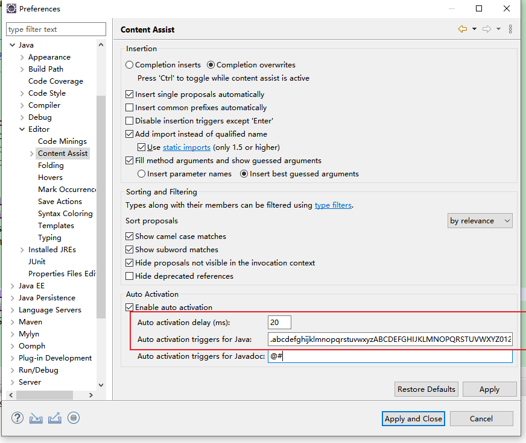

### 配置JDK
Window > Preferences > Java > Installed JRES  
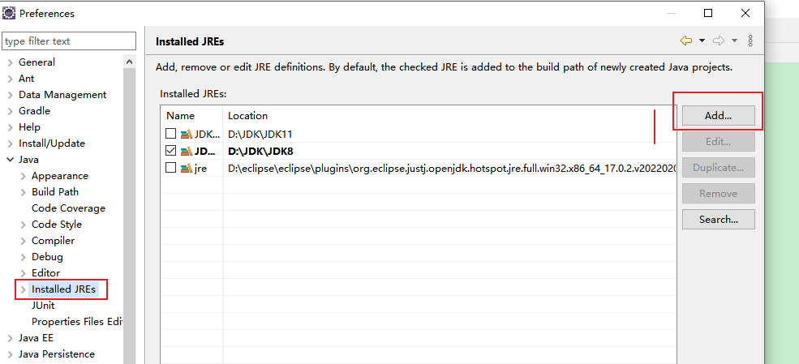  
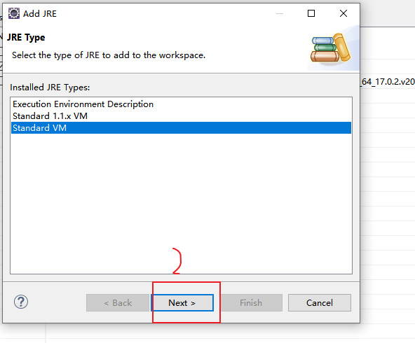  
选择你的jdk安装目录位置  
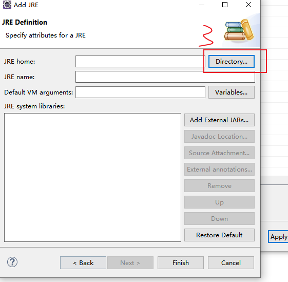

jdk已经添加成功,如果想使用这个版本的jdk,直接勾选前面的勾选框,再点击Apply即可

### 显示内存使用情况
Window > Preferences > General  
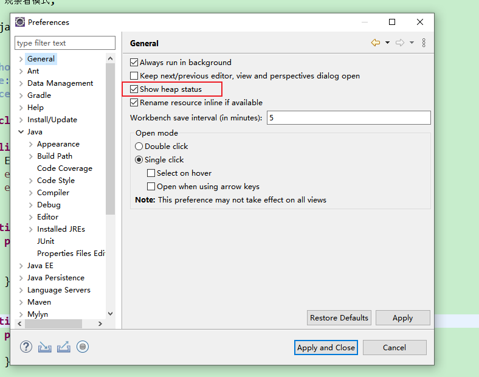

### 打开文件设置为单击打开
Window > Preferences > General > Open mode  
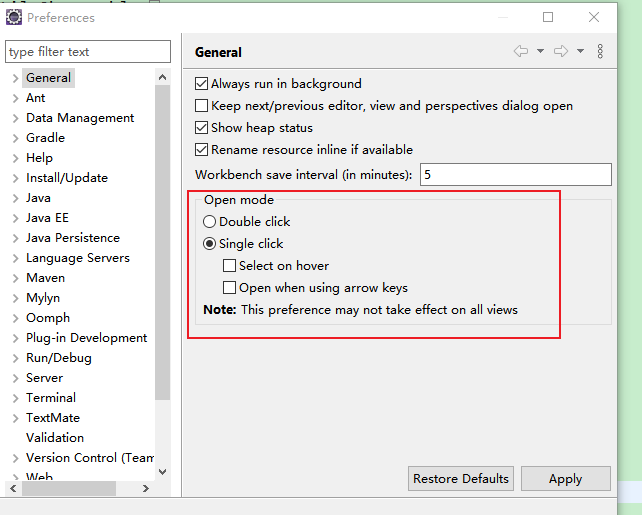

### 显示代码行号设置
代码面板左边栏右键 show Line Numbers  
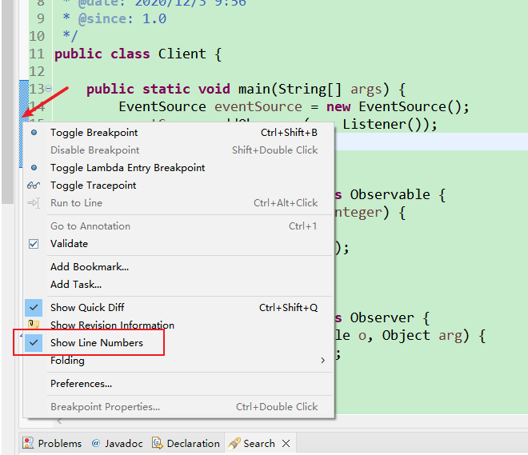  
或者 Window > Prefences > General > Editors > Text Editors > show line numbers  
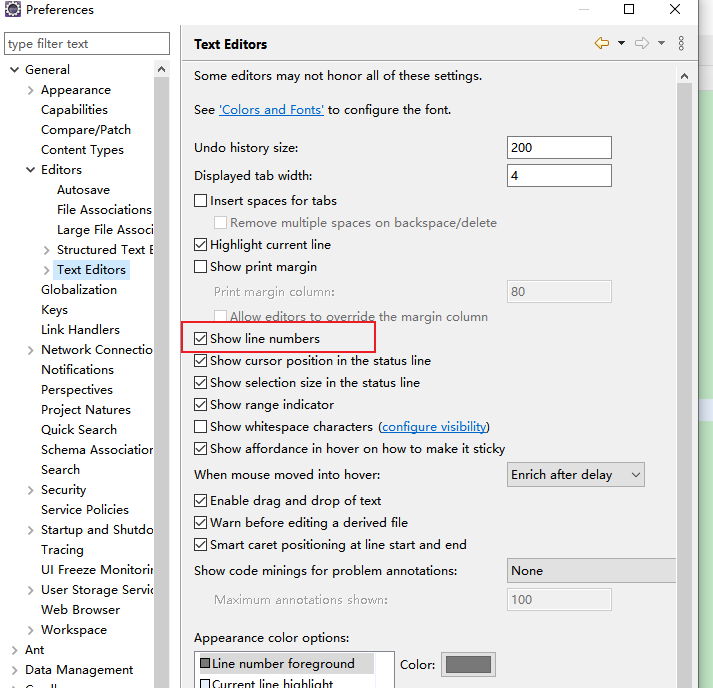

### 护眼模式
背景色推荐两种:豆沙绿和暗黑色  
Window > Preferences > General > Editors > Text Editors  
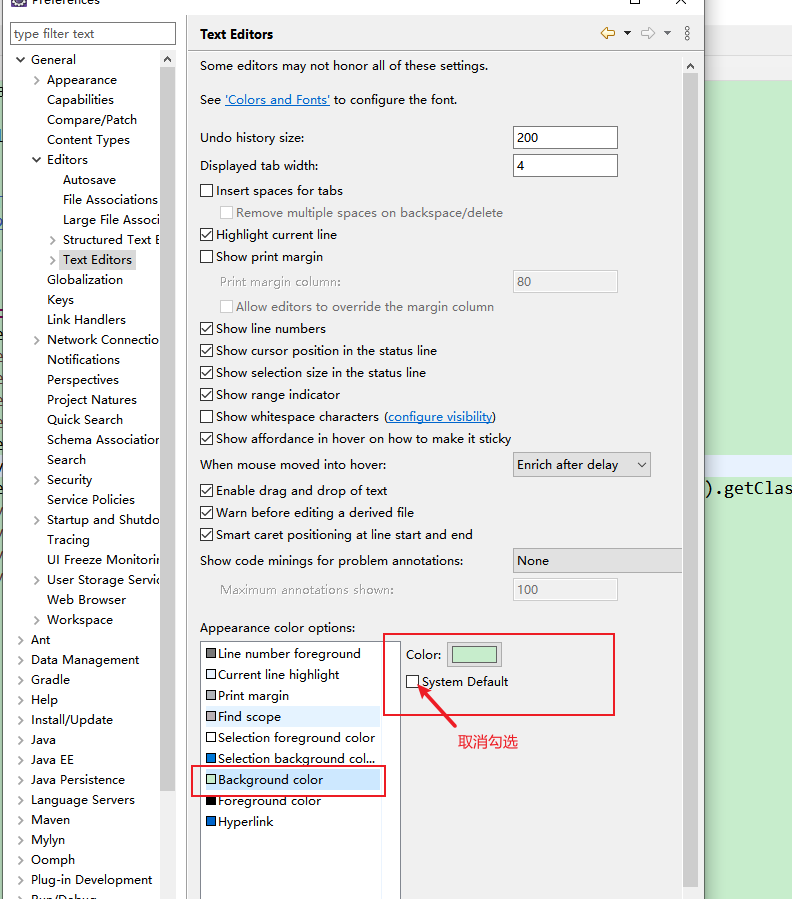  
点击color,之后弹出一个颜色面板,然后自定义颜色
色调：85；饱和度：123；亮度：205； 非常柔和的豆沙绿色，这个色调是眼科专家配置的
最后添加到自定义颜色，点击确定，点击Apply；  
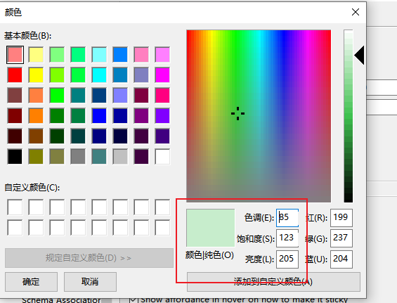  

背景色设置好之后，接下来设置字体颜色；需要在Java里面设置；  
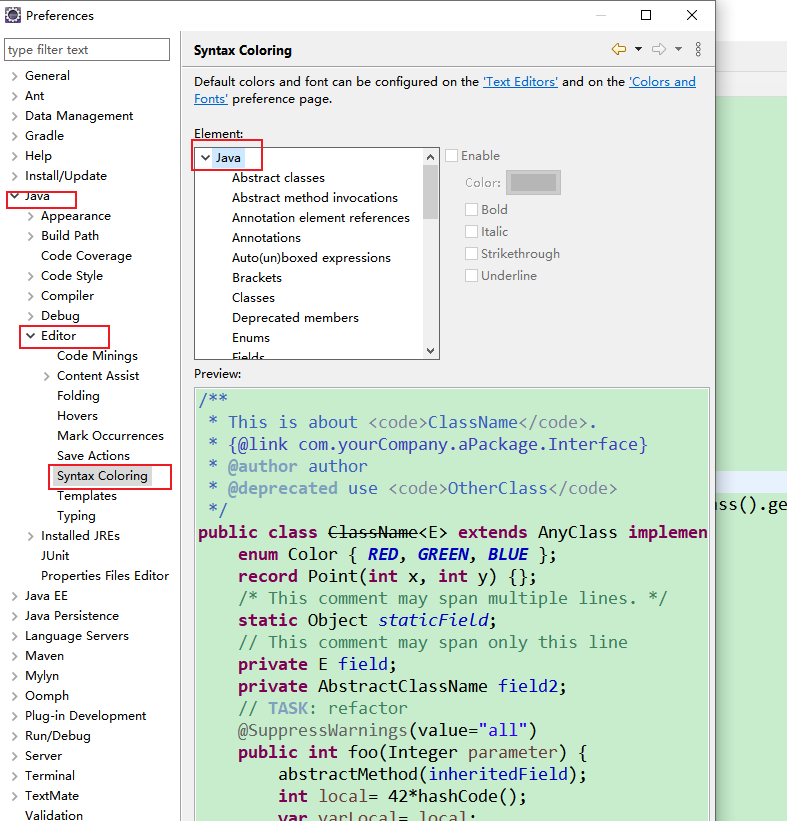  
豆沙绿背景下颜色设置数据:
```
Annotations(注释): 107, 147, 186  浅蓝色
brackets(方括号):255, 128, 0  橙色
Deprecated members(不建议使用的成员): 0, 0, 0  
Fields(字段): 128, 0, 128  紫色
KeyWord 'return'(关键字'return'): 255, 0, 0   红色
Keyword excluding 'return'(除了关键字以外的return): 255, 128 ,0  橙色
Local variable declarations(局部变量声明): 128, 128, 128   灰色
Method declarations(方法声明): 255, 128, 64    橙色
Method(方法): 0, 48, 96 暗浅蓝色
Operators(运算符): 255, 128, 0  橙色
Others(其他): 96 153, 0   深绿色
Static fields(静态字段): 33, 0, 189  深蓝色
Static Method invocations(静态方法调用): 77, 166 255  天蓝色 
Strings(字符串): 132, 26, 238   中天蓝色
Type variables(类型变量): 128, 0, 25   红罗色
```
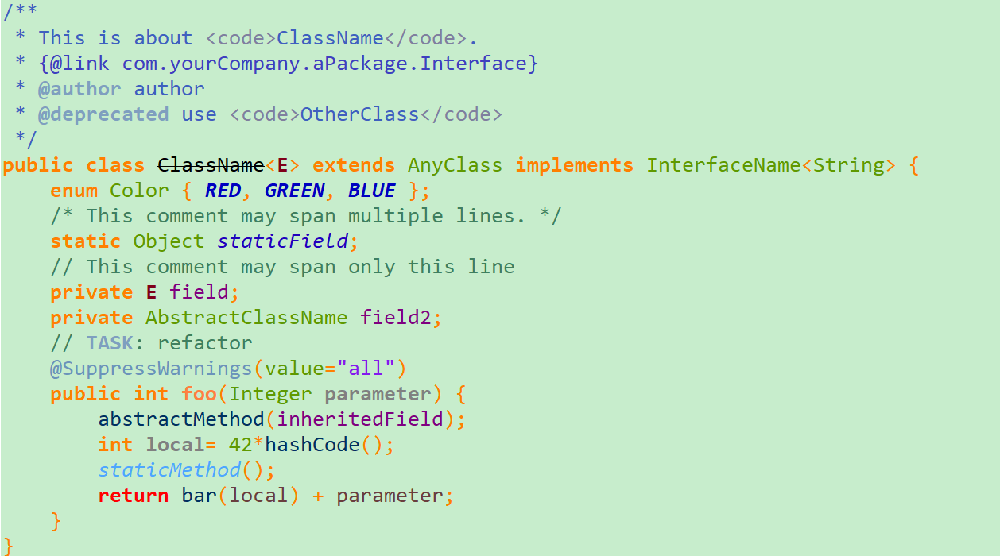  
接下来是暗黑色背景色  
  
详细配色方案:  
```
选Current line highlight 来改变 当前选中行 的颜色
Annotations(注释): 107, 147, 186 
Deprecated members(不建议使用的成员): 0, 0, 0 
Fields(字段):128,255,0 绿色
KeyWord 'return'(关键字'return'): 255, 0, 0  红色
Keyword excluding 'return'(除了关键字以外的return): 255,80, 0  深深橘色
Local variable declarations(局部变量声明): 70,140,179  深蓝色
Method declarations(方法声明): 247,197,39  淡橘色
Method(方法): 241,196,54  深淡橘色
Operators and brackets(运算符与方括号): 255, 128, 0   深橘色
Others(其他): 126, 202, 0  淡绿色
Static fields(静态字段): 128,255,0 绿色
Static Method invocations(静态方法调用): 77, 166 255  
Strings(字符串):  89,196,196  墨蓝色
Type variables(类型变量): 222, 0, 25  红色
```
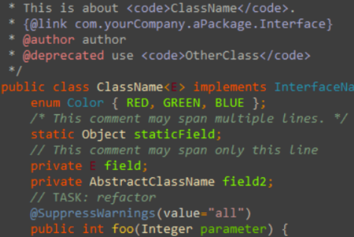
### 设置字体大小
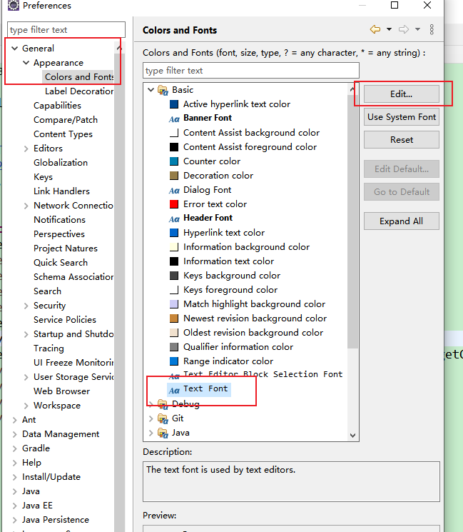

### 设置编码格式
1、设置工作空间编码格式  
Window > Preferences > General > Workspace下，面板Text file encoding 选择UTF-8格式  
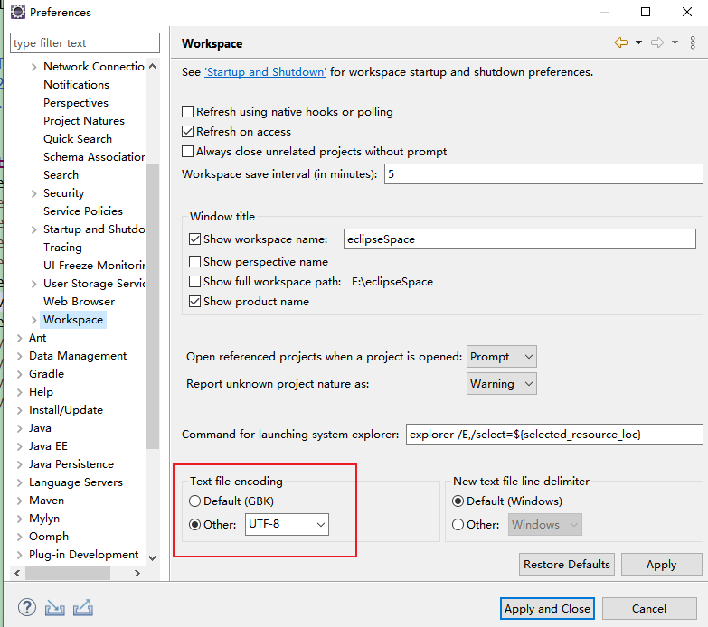  
2、设置JSP页面编码格式  
Window > Preferences > Web > JSP Files 面板选择 ISO 10646/Unicode(UTF-8)格式编码  
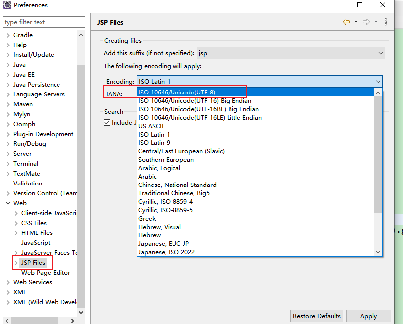  
3、设置文档编码格式  
Window > Preferences > General > Content Type > Text的最下面设置为编码格式为UTF-8  
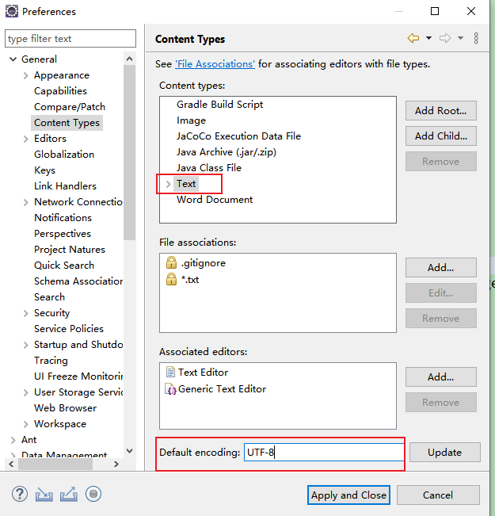  
4、设置项目的文档编码格式  
选择项目 > 右键 > Properties > Resource 设置编码为UTF-8格式  
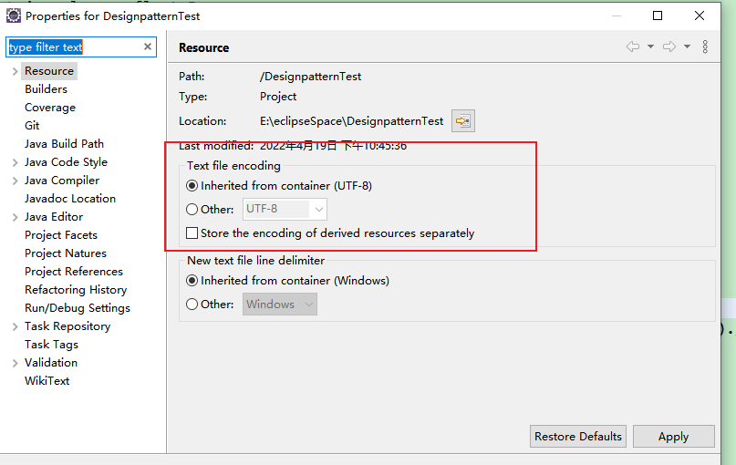

### 保存时自动格式化代码
Window > Preferences > Java > Editor > Save Action  
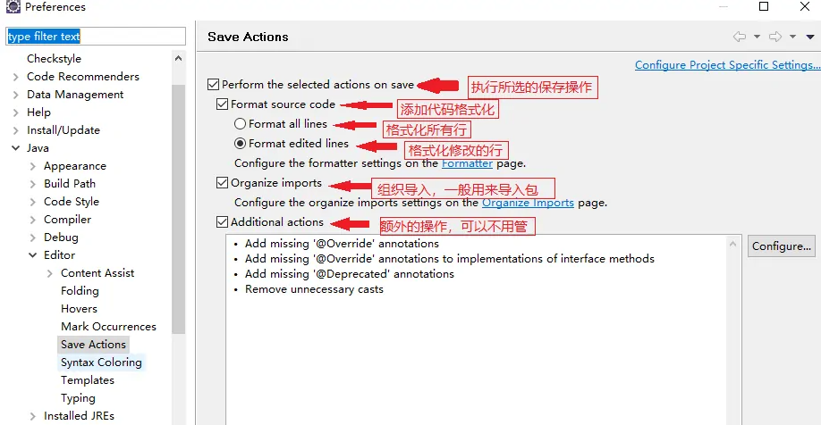

### 设置代码格式化使用空格代替TAB
Window > Preferences > Java > Code Style > Formatter，点击图片中的New.(eclipse自带的formatter无法修改, 因为那是模板, 自定义就只能新建模板)  
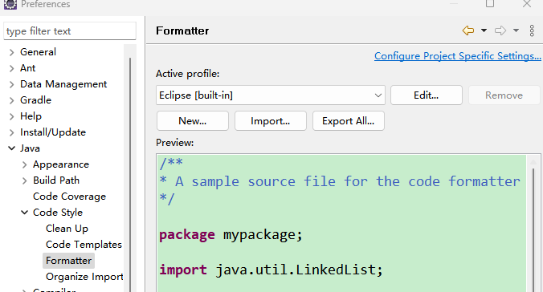  
给配置起一个名字后，修改配置，找到 Indentation，在Tab policy上选择Spaces only，确定  
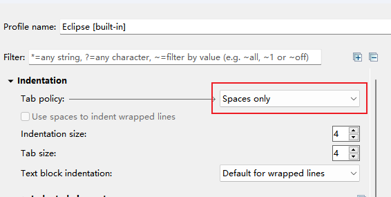  

### XML格式化设置
Window > Preferences > XML > XML Files > Editor，选择 Indent using spaces，下面 Indentation size填4 
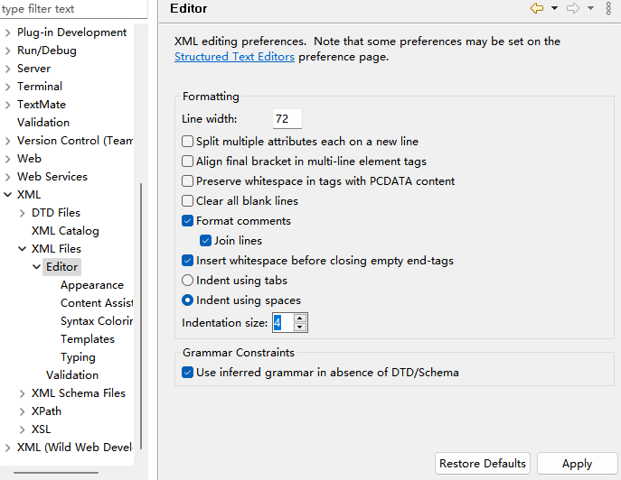  

### 注释的代码格式化时不换行
Window > Preferences > Java > Code Style > Formatter，点击图片中的New.(eclipse自带的formatter无法修改, 因为那是模板, 自定义就只能新建模板)  
  
选择comments标签>取消勾选以下两项:  
* 文档注释[Enable Javadoc comments formatting]
* 块注释[Enable block comments formatting]

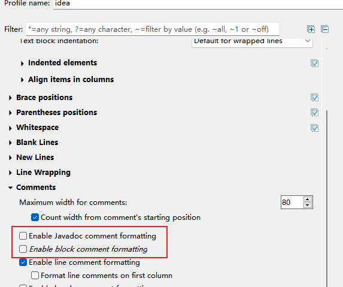
