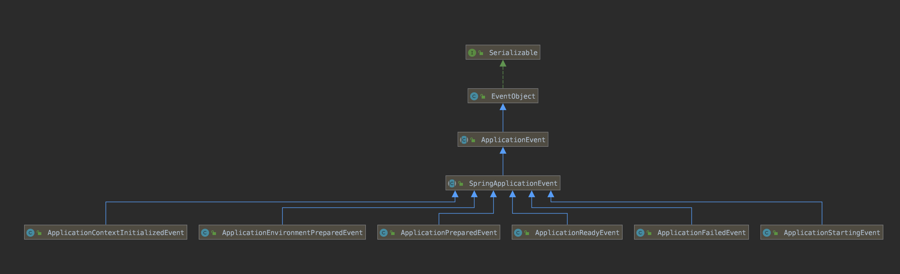
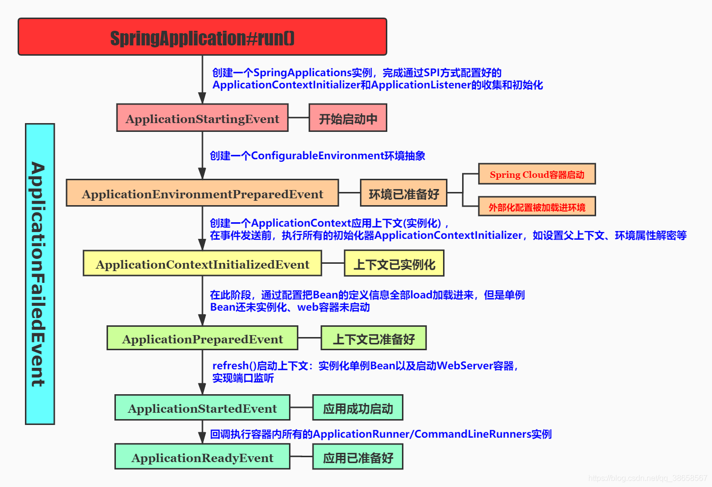
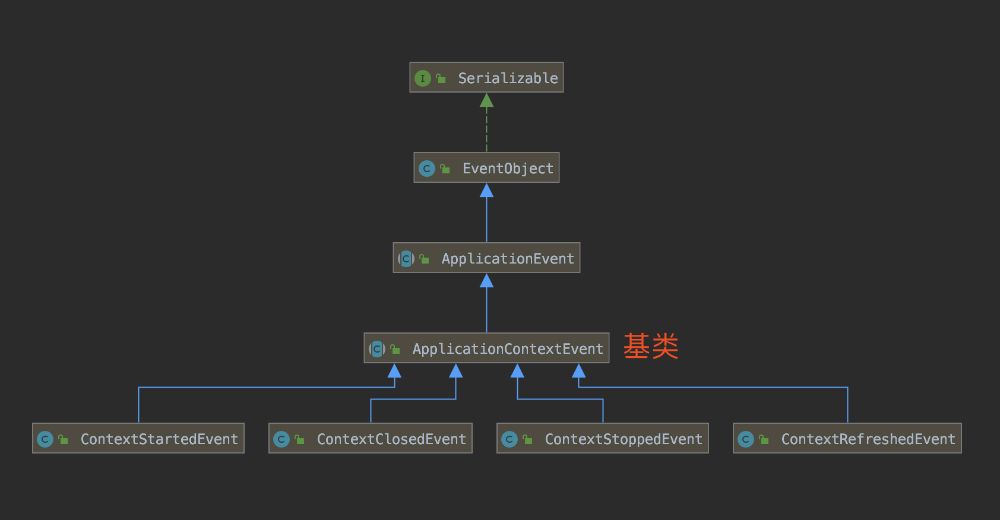

> springBoot事件与监听为bean和bean之间的消息通信提供了支持。比如，我们可以在用户注册成功后，发送一份注册成功的邮件至用户邮箱或者发送短信。使用事件其实最大作用，应该还是为了业务解耦，毕竟用户注册成功后，注册服务的事情就做完了，只需要发布一个用户注册成功的事件，让其他监听了此事件的业务系统去做剩下的事件就好了。对于事件发布者而言，不需要关心谁监听了该事件，以此来解耦业务。今天，我们就来讲讲spring boot中事件的使用和发布。当然了，也可以使用像guava的eventbus或者异步框架Reactor来处理此类业务需求的。本文仅仅谈论ApplicationEvent以及Listener的使用

ApplicationEvent以及Listener是Spring为我们提供的一个事件监听、订阅的实现，内部实现原理是观察者设计模式，设计初衷也是为了系统业务逻辑之间的解耦，提高可扩展性以及可维护性。事件发布者并不需要考虑谁去监听，监听具体的实现内容是什么，发布者的工作只是为了发布事件而已。

## SpringBoot的内置事件

SpringApplicationEvent 是 Spring Boot Application（应用）相关的事件基类，如下图所示：  


- ApplicationStartingEvent  
springboot启动开始的时候执行的事件   
- ApplicationEnvironmentPreparedEvent  
spring boot 对应Enviroment已经准备完毕，但此时上下文context还没有创建。 
```java
@Component
public class MyApplicationEnvironmentPreparedEventListener implements
                                                          ApplicationListener<ApplicationEnvironmentPreparedEvent> {
    private Logger logger = LoggerFactory.getLogger(MyApplicationEnvironmentPreparedEventListener.class);

    @Override
    public void onApplicationEvent(ApplicationEnvironmentPreparedEvent event) {

        ConfigurableEnvironment envi = event.getEnvironment();
        MutablePropertySources mps = envi.getPropertySources();
        if (mps != null) {
            Iterator<PropertySource<?>> iter = mps.iterator();
            while (iter.hasNext()) {
                PropertySource<?> ps = iter.next();
                logger
                    .info("ps.getName:{};ps.getSource:{};ps.getClass:{}", ps.getName(), ps.getSource(), ps.getClass());
            }
        }
    }

}
```

- ApplicationContextInitializedEvent  
当SpringApplication的上下文ApplicationContext准备好后，对单例Bean们实例化之前，发送此事件。所以此事件又可称为：contextPrepared事件。 
- ApplicationPreparedEvent  
spring boot上下文context创建完成，但此时spring中的bean是没有完全加载完成的。  
```java
@Component
public class MyApplicationPreparedEventListener implements ApplicationListener<ApplicationPreparedEvent> {
    private Logger logger = LoggerFactory.getLogger(MyApplicationPreparedEventListener.class);

    @Override
    public void onApplicationEvent(ApplicationPreparedEvent event) {
        ConfigurableApplicationContext cac = event.getApplicationContext();
        passContextInfo(cac);
    }

    /**
     * 传递上下文
     * @param cac
     */
    private void passContextInfo(ApplicationContext cac) {
        //dosomething()
    }

}
```

- ApplicationStartedEvent    
spring boot启动开始时执行的事件  
```java
@Component
public class MyApplicationStartedEventListener implements ApplicationListener<ApplicationStartedEvent> {

    private Logger logger = LoggerFactory.getLogger(MyApplicationStartedEventListener.class);

    @Override
    public void onApplicationEvent(ApplicationStartedEvent event) {
        SpringApplication app = event.getSpringApplication();
        app.setShowBanner(false);// 不显示banner信息
        logger.info("==MyApplicationStartedEventListener==");
    }
}
```

- ApplicationReadyEvent  
springboot加载完成时候执行的事件。  
- ApplicationFailedEvent  
spring boot启动异常时执行事件  
```java
@Component
public class MyApplicationFailedEventListener implements ApplicationListener<ApplicationFailedEvent> {

    @Override
    public void onApplicationEvent(ApplicationFailedEvent event) {
        Throwable throwable = event.getException();
        handleThrowable(throwable);
    }

    /*处理异常*/
    private void handleThrowable(Throwable throwable) {
    }

}
```



上面所介绍的这些事件列表仅包括绑定到 SpringApplication 的 SpringApplicationEvents 事件，除了这些事件以外，还有以下事件：  
- WebServerInitializedEvent  
这个 Web 服务器初始化事件在 WebServer 启动之后发送，对应的还有 ServletWebServerInitializedEvent（Servlet Web 服务器初始化事件）、ReactiveWebServerInitializedEvent（响应式 Web 服务器初始化事件）。  

ApplicationContextEvent 是 Spring Context 相关的事件基类，如下图所示:  


- ContextStartedEvent  
ApplicationContext启动后触发的事件
- ContextStoppedEvent  
ApplicationContext停止后触发的事件
- ContextRefreshedEvent  
ApplicationContext初始化或刷新完成后触发的事件 ；（容器初始化完成后调用，所以我们可以利用这个事件做一些初始化操作）
- ContextClosedEvent  
ApplicationContext关闭后触发的事件；（如 web 容器关闭时自动会触发spring容器的关闭，如果是普通 java 应用，需要调用ctx.registerShutdownHook();注册虚拟机关闭时的钩子才行）  

使用例子：  
```java
/**
 * @author: TangLiang
 * @date: 2021/1/22 23:48
 * @since: 1.0
 */
@Component
public class ApplicationReadyEventTest implements ApplicationListener<ApplicationReadyEvent> {
    @Override
    public void onApplicationEvent(ApplicationReadyEvent applicationReadyEvent) {
        System.out.println("ApplicationReadyEvent");
    }
}
```

## 默认事件使用注意事项

ContextRefreshedEvent 事件会在Spring容器初始化完成会触发该事件。我们在实际工作也可以能会监听该事件去做一些事情，但是有时候使用不当也会带来一些问题。

1. 防止重复触发  
主要因为对于web应用会出现父子容器，这样就会触发两次，那么如何避免呢？下面给出一种简单的解决方案。
```java
@Component
public class TestTask implements ApplicationListener<ContextRefreshedEvent> {
    private volatile AtomicBoolean isInit=new AtomicBoolean(false);
    @Override
    public void onApplicationEvent(ContextRefreshedEvent event) {
        //防止重复触发
        if(!isInit.compareAndSet(false,true)) {
            return;
        }
        start();
    }
 
    private void start() {
        //开启任务
        System.out.println("****-------------------init---------------******");
    }
}
```

2. 监听事件顺序问题
Spring 提供了一个SmartApplicationListener类，可以支持listener之间的触发顺序，普通的ApplicationListener优先级最低（最后触发）。
```java
@Component
public class LastTask implements SmartApplicationListener {
    private volatile AtomicBoolean isInit = new AtomicBoolean(false);
    @Override
    public boolean supportsEventType(Class<? extends ApplicationEvent> eventType) {
        return eventType == ContextRefreshedEvent.class;
    }
 
    @Override
    public boolean supportsSourceType(Class<?> sourceType) {
        return true;
    }
 
    @Override
    public void onApplicationEvent(ApplicationEvent event) {
        if (!isInit.compareAndSet(false, true)) {
            return;
        }
        start();
    }
 
    private void start() {
        //开启任务
        System.out.println("LastTask-------------------init------------ ");
    }
 
    //值越小，就先触发
    @Override
    public int getOrder() {
        return 2;
    }
}
```

## 自定义事件发布和监听

以用户注册的业务场景为例：

用户注册事件：  
```java
public class UserRegisterEvent extends ApplicationEvent {

    /**
     * 用户名
     */
    private String username;

    public UserRegisterEvent(Object source) {
        super(source);
    }

    public UserRegisterEvent(Object source, String username) {
        super(source);
        this.username = username;
    }

    public String getUsername() {
        return username;
    }

}
```

创建用户注册Service:  
```java
@Service
public class UserService implements ApplicationEventPublisherAware {

    private Logger logger = LoggerFactory.getLogger(getClass());

    private ApplicationEventPublisher applicationEventPublisher;

    @Override
    public void setApplicationEventPublisher(ApplicationEventPublisher applicationEventPublisher) {
        this.applicationEventPublisher = applicationEventPublisher;
    }

    public void register(String username) {
        // ... 执行注册逻辑
        logger.info("[register][执行用户({}) 的注册逻辑]", username);

        // 发布
        applicationEventPublisher.publishEvent(new UserRegisterEvent(this, username));
    }

}
```

创建邮件发送Service:  
```java
@Service
public class EmailService implements ApplicationListener<UserRegisterEvent> {

    private Logger logger = LoggerFactory.getLogger(getClass());

    @Override
    @Async
    public void onApplicationEvent(UserRegisterEvent event) {
        logger.info("[onApplicationEvent][给用户({}) 发送邮件]", event.getUsername());
    }

}
```

创建发送优惠卷Service:  
```java
@Service
public class CouponService {

    private Logger logger = LoggerFactory.getLogger(getClass());

    @EventListener(condition = "#event.getUsername() != null")
    public void addCoupon(UserRegisterEvent event) {
        logger.info("[addCoupon][给用户({}) 发放优惠劵]", event.getUsername());
    }

}
```

创建测试接口:   
```java
@SpringBootTest
public class EventTest {

    @Autowired
    private UserService userService;

    @Test
    public void register() {
        userService.register("admin");
    }

}
```

测试会发现服务被调动。

!> Spring中，事件源不强迫继承ApplicationEvent接口的，也就是可以直接发布任意一个对象类。但内部其实是使用PayloadApplicationEvent类进行包装了一层。这点和guava的eventBus类似。而且，使用@EventListener的condition可以实现更加精细的事件监听，condition支持SpEL表达式，可根据事件源的参数来判断是否监听。例子参考上面的CouponService和EmailService。

## 关于事务绑定事件

在项目中，往往需要执行数据库操作后，发送消息或事件来异步调用其他组件执行相应的操作，例如：
- 用户注册后发送激活码；
- 配置修改后发送更新事件等。  
但是，数据库的操作如果还未完成，此时异步调用的方法查询数据库发现没有数据，这就会出现问题。

为了解决上述问题，Spring为我们提供了两种方式：  
1. @TransactionalEventListener注解(继承@EventListener)
2. 事务同步管理器TransactionSynchronizationManager  
以便我们可以在事务提交后再触发某一事件。

示例:  
```java
@Slf4j
@Service
public class HelloServiceImpl implements HelloService {

    @Autowired
    private JdbcTemplate jdbcTemplate;
    @Autowired
    private ApplicationEventPublisher applicationEventPublisher;

    @Transactional
    @Override
    public Object hello(Integer id) {
        // 向数据库插入一条记录
        String sql = "insert into user (id,name,age) values (" + id + ",'fsx',21)";
        jdbcTemplate.update(sql);

        // 发布一个自定义的事件~~~
        applicationEventPublisher.publishEvent(new MyAfterTransactionEvent("我是和事务相关的事件，请事务提交后执行我~~~", id));
        return "service hello";
    }

    @Slf4j
    @Component
    private static class MyTransactionListener {
        @Autowired
        private JdbcTemplate jdbcTemplate;

        @TransactionalEventListener(phase = TransactionPhase.AFTER_COMMIT)
        private void onHelloEvent(HelloServiceImpl.MyAfterTransactionEvent event) {
            Object source = event.getSource();
            Integer id = event.getId();

            String query = "select count(1) from user where id = " + id;
            Integer count = jdbcTemplate.queryForObject(query, Integer.class);
            
            // 可以看到 这里的count是1  它肯定是在上面事务提交之后才会执行的
            log.info(source + ":" + count.toString()); //我是和事务相关的事件，请事务提交后执行我~~~:1
        }
    }

    // 定一个事件，继承自ApplicationEvent 
    private static class MyAfterTransactionEvent extends ApplicationEvent {

        private Integer id;

        public MyAfterTransactionEvent(Object source, Integer id) {
            super(source);
            this.id = id;
        }

        public Integer getId() {
            return id;
        }
    }
}
```

## 其他事件

- 如果想要多个监听器按照指定顺序执行，可以通过实现 Ordered 接口，指定其顺序,@Order 传入的值越小，执行顺序越高。
- 如果想要监听多种 ApplicationContext 事件，可以实现 SmartApplicationListener 接口，具体示例可以看看 [SourceFilteringListener](https://github.com/spring-projects/spring-framework/blob/master/spring-context/src/main/java/org/springframework/context/event/SourceFilteringListener.java ':target=_blank') 类
- 可以通过实现 ApplicationEventMulticaster 接口，定义自定义的事件广播器，可以往里面添加和移除监听器，并发布事件给注册在其中的监听器。使用比较少，基本可以忽略。
- 如果2个事件之间是继承关系，会先监听到子类事件，处理完再监听父类。
