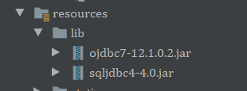
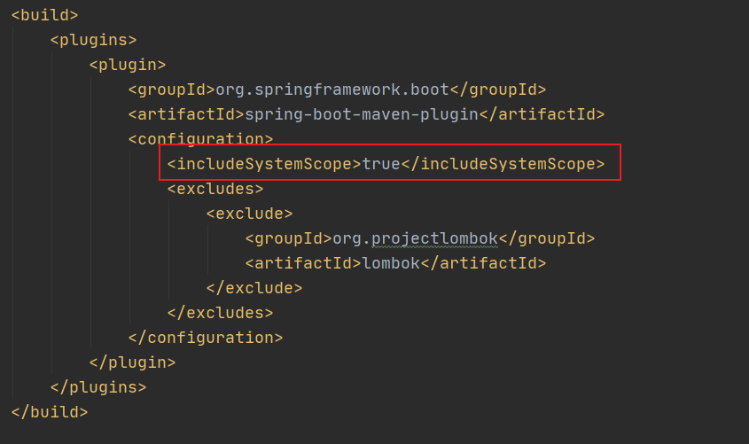
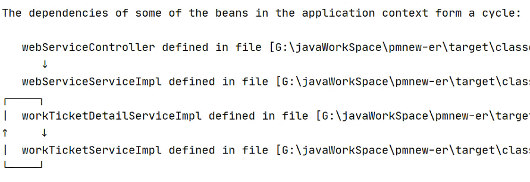
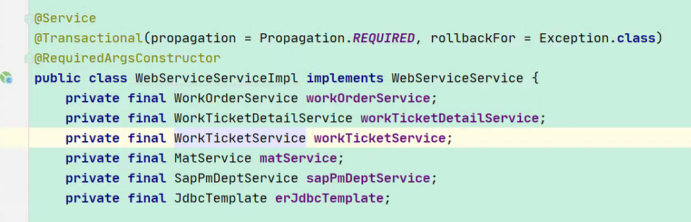
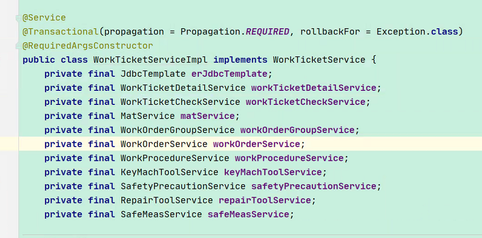
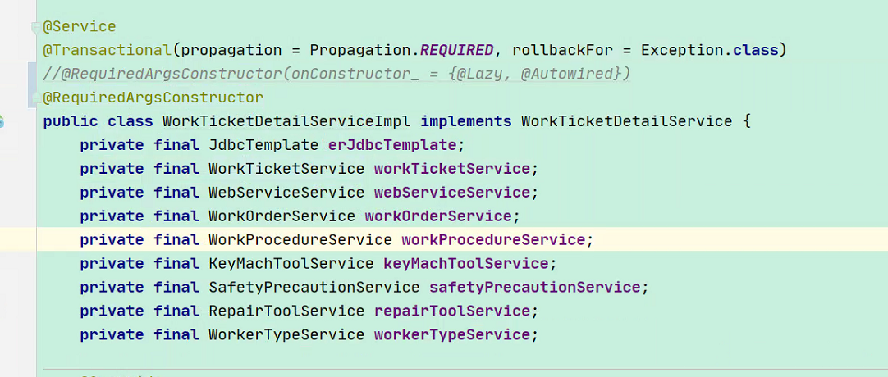

## springBoot设置启动样式

将自己的启动样式文件banner.txt放入默认路径resources下。  
如果自定义文件位置&文件名的话 需要修改yml配置：

```yaml
spring:
  banner:
    location: static/public/banner.txt
```

## springBoot设置时区

```yaml
spring:
  jackson:
    date-format: yyyy/MM/dd HH:mm:ss
    time-zone: GMT+8
```

## 多个配置文件

用于切换生产环境与测试环境配置，或者将较长的配置分离出去。

```yaml
spring:
  profiles:
    active: druid
    #切换配置文件
  #    spring.profiles.include: druid,ddd
```

## 文件上传限制

```yaml
spring:
  servlet:
    multipart:
      enabled: true
      max-file-size: 10MB
      max-request-size: 20MB
```

## 跨域配置

### 方式一

```java
/**
 * 跨域配置
 *
 * @author: TangLiang
 * @date: 2021/1/2 10:12
 * @since: 1.0
 */
@Configuration
public class CorsConfig implements WebMvcConfigurer {
    static final String ORIGINS[] = new String[]{"GET", "POST", "PUT", "DELETE"};

    @Override
    public void addCorsMappings(CorsRegistry registry) {
        registry.addMapping("/**")
                .allowedOrigins("*")
                .allowCredentials(true)
                .allowedMethods(ORIGINS)
                .maxAge(3600);
    }
}
```

### 方式二

```java
/**
 * 全局跨域配置
 *
 * @author: TangLiang
 * @date: 2021/1/14 17:16
 * @since: 1.0
 */
@Configuration
public class GlobalCorsConfig {

    /**
     * 允许跨域调用的过滤器
     */
    @Bean
    public CorsFilter corsFilter() {
        CorsConfiguration config = new CorsConfiguration();
        //允许所有域名进行跨域调用
        config.addAllowedOrigin("*");
        //允许跨越发送cookie
        config.setAllowCredentials(true);
        //放行全部原始头信息
        config.addAllowedHeader("*");
        //允许所有请求方法跨域调用
        config.addAllowedMethod("*");
        UrlBasedCorsConfigurationSource source = new UrlBasedCorsConfigurationSource();
        source.registerCorsConfiguration("/**", config);
        return new CorsFilter(source);
    }
}
```

### 注意
!> SpringBoot升级2.4.0所出现的问题：When allowCredentials is true, allowedOrigins cannot contain the specia

解决方式如下：

将.allowedOrigins替换成.allowedOriginPatterns即可。

方式一改动:
```java
//.allowedOrigins("*")
.allowedOriginPatterns("*")
```
方式二改动:
```java
//config.addAllowedOrigin("*");
config.addAllowedOriginPattern("*");
```

## 批量下载文件并放到压缩包

```java

@RestController
@RequiredArgsConstructor
public class RiderController {
    private final RiderService riderService;

    /**
     * 附件批量下载
     */
    @GetMapping(value = "downloadRiderList")
    @Log(title = "附件管理", operateType = "附件批量下载")
    public void downloadRiderList(String V_PERCODE, @RequestParam(value = "V_GUID_LIST") List<String> V_GUID_LIST, @RequestParam(value = "I_ID_LIST") List<Integer> I_ID_LIST, String mark, HttpServletRequest request, HttpServletResponse response) throws IOException, SQLException {
//目前批量下载各个文件并不大，所有可以走串行，如果以后有大文件的话，则需要异步下载，此代码暂时注释，以后如需异步时再用
//        List<CompletableFuture<Map<String, Object>>> list = new ArrayList<>();
//        for (int i = 0, length = V_GUID_LIST.size(); i < length; i++) {
//            CompletableFuture<Map<String, Object>> future = riderService.selectRiderBlobAsync(BaseUtils.getIp(request), V_PERCODE, V_GUID_LIST.get(i), I_ID_LIST.get(i));
//            list.add(future);
//        }
//        CompletableFuture<Map<String, Object>>[] completableFutures = list.toArray(new CompletableFuture[list.size()]);
//        CompletableFuture.allOf(completableFutures).join();
        try {
            String zipName = "【批量下载】" + mark + "等.zip";
            response.reset();
            response.setCharacterEncoding("UTF-8");
            response.setContentType("application/x-msdownload");
            response.setHeader("Content-Disposition", "attachment;filename=" + BaseUtils.getFormatString(request, zipName));

            ZipOutputStream zos = new ZipOutputStream(response.getOutputStream());
            for (int i = 0, length = V_GUID_LIST.size(); i < length; i++) {
                Map<String, Object> rider = riderService.selectRiderBlob(BaseUtils.getIp(request), V_PERCODE, V_GUID_LIST.get(i), I_ID_LIST.get(i));
                String fileName = (String) rider.get("V_FILENAME");
                Blob blob = (Blob) rider.get("result");
                if (blob != null) {
                    @Cleanup InputStream inputStream = blob.getBinaryStream();
                    //创建输入流读取文件
                    @Cleanup BufferedInputStream bis = new BufferedInputStream(inputStream);
                    //将文件写入zip内，即将文件进行打包
                    zos.putNextEntry(new ZipEntry(fileName));
                    //写入文件的方法，同上
                    int size = 0;
                    byte[] buffer = new byte[4096];
                    //设置读取数据缓存大小
                    while ((size = bis.read(buffer)) > 0) {
                        zos.write(buffer, 0, size);
                    }
                    //关闭输入输出流
                    zos.closeEntry();
                }
            }
            zos.close();
        } catch (IOException | SQLException e) {
            e.printStackTrace();
            response.setContentType("text/html;charset=utf-8");
            @Cleanup PrintWriter out = null;
            try {
                out = response.getWriter();
            } catch (IOException ex) {
                ex.printStackTrace();
            }
            out.print("<span style=\"display:block;text-align: center;margin:0 auto;min-width: 150px;\">" + e.getMessage() + "</span><br/>");
            out.print("<br/><button autocomplete=\"off\" onclick=\"javascript:window.history.back(-1);return false;\" autofocus=\"true\"\n" +
                    "            style=\"display:block;margin:0 auto;min-width: 150px;background-color:rgb(0, 138, 203);color: rgb(255, 255, 255);\">\n" +
                    "        返回上一个页面\n" +
                    "    </button>");
            out.flush();
        }
    }
}
```

## 引入本地jar包打包部署

当有的jar无法通过maven获取时，通过以下方式可以打包项目进行部署运行

1、在resources下面新建lib文件夹，并把jar包文件放到这个目录下



2、在pom文件定义几个依赖指向刚才引入的文件

```xml

<dependency>
    <groupId>com.microsoft.sqlserver</groupId>
    <artifactId>sqljdbc4</artifactId>
    <version>4.0</version>
    <scope>system</scope>
    <systemPath>${project.basedir}/src/main/resources/lib/sqljdbc4-4.0.jar</systemPath>
</dependency>
```

3. 在maven的pom里给springboot的打包插件引入一下参数

```xml

<includeSystemScope>true</includeSystemScope>
```



## jvm优化

web服务可以使用G1收集器，G1推荐在内存大于4G的机器上启用

```shell script
-XX:+UseG1GC
-XX:+UseStringDeduplication
-XX:StringDeduplicationAgeThreshold=3
-XX:MaxGCPauseMillis=200
-XX:+DisableExplicitGC
-XX:MetaspaceSize=256m
-XX:MaxMetaspaceSize=256m
-Xmx1g
-Xms1g
```

非G1收集器参考
```shell script
-Xms1200M
-Xmx1200M 
-Xmn450M 
-XX:MetaspaceSize=256m
-Xss300K 
-XX:+DisableExplicitGC 
-XX:SurvivorRatio=4 
-XX:+UseParNewGC 
-XX:+UseConcMarkSweepGC 
-XX:CMSInitiatingOccupancyFraction=70 
-XX:+CMSParallelRemarkEnabled 
-XX:LargePageSizeInBytes=128M 
-XX:+UseFastAccessorMethods 
-XX:+UseCMSInitiatingOccupancyOnly 
-XX:+PrintGCDetails 
-XX:+PrintGCTimeStamps 
-XX:+PrintHeapAtGC
```

* UseG1GC 启用G1收集器
* UseStringDeduplication JVM消除重复自负参数 仅适用于G1 GC算法且功能仅受Java 8 update 20中支持
* StringDeduplicationAgeThreshold 默认情况下，如果字符串在3次GC运行中幸存，则符合重复数据删除的条件。可以通过传递'-XX：StringDeduplicationAgeThreshold'
  来更改3次这个参数
* MaxGCPauseMillis 每次GC最大的停顿毫秒数
* Xmx和Xms大小设置相同，减少内存交换 Xmx调整为峰值*2至3即可
* -Xss300K：设置每个线程的堆栈大小。JDK5.0以后每个线程堆栈大小为1M，以前每个线程堆栈大小为256K。更具应用的线程所需内存大小进行调整。在相同物理内存下，减小这个值能生成更多的线程。但是操作系统对一个进程内的线程数还是有限制的，不能无限生成，经验值在3000~5000左右
* -Xmn450M：设置年轻代大小为350M。整个JVM内存大小=年轻代大小 + 年老代大小 + 持久代大小。持久代一般固定大小为64m，所以增大年轻代后，将会减小年老代大小。此值对系统性能影响较大，Sun官方推荐配置为整个堆的3/8。

## jvm查看命令
查看java默认jvm参数
```shell script
java -XX:+PrintCommandLineFlags
```

查看java默认jvm参数(带条件)  
查看元空间相关属性
```shell script
java -XX:+PrintFlagsFinal | grep Meta
```
查看堆空间相关属性
```shell script
java -XX:+PrintFlagsFinal | grep HeapSize
```

查看指定程序jvm参数
```shell script
jinfo -flags <PID>
```
```shell script
jinfo -flag MaxHeapSize <PID>
```

### jmap 
生成堆快照和对象的统计信息

通过可查看堆内存的配置情况及使用情况
```shell script
jmap -heap pid
```
统计对象的创建数量
```shell script
jmap -histo pid
```
生成dump文件与jhat配合使用
```shell script
jmap -dump:format=b,file=heapDump pid
```

### jps 
类似Linux的ps，但jps只列出Java的进程。可方便查看Java进程的启动类、传入参数和JVM参数。直接运行，不加参数，列出Java程序的进程ID及Main函数名称

查看进程pid及main方法参数
```shell script
jps -m
```

查看pid及JVM参数
```shell script
jps -v
```

查看pid及程序所在包名
```shell script
jps -l
``` 

### jstat
观察Java应用程序运行时信息的工具，详细查看堆使用情况以及GC情况  
垃圾回收统计
```shell script
jstat -gc <pid> 
```
```markdown
- S0C：第一个幸存区的大小
- S1C：第二个幸存区的大小
- S0U：第一个幸存区的使用大小
- S1U：第二个幸存区的使用大小
- EC：伊甸园区的大小
- EU：伊甸园区的使用大小
- OC：老年代大小
- OU：老年代使用大小
- MC：方法区大小
- MU：方法区使用大小
- CCSC:压缩类空间大小
- CCSU:压缩类空间使用大小
- YGC：年轻代垃圾回收次数
- YGCT：年轻代垃圾回收消耗时间
- FGC：老年代垃圾回收次数
- FGCT：老年代垃圾回收消耗时间
- GCT：垃圾回收消耗总时间
```

总结垃圾回收统计  
```shell script
stat -gcutil <pid>
```
```markdown
S0：幸存1区当前使用比例
S1：幸存2区当前使用比例
E：伊甸园区使用比例
O：老年代使用比例
M：元数据区使用比例
CCS：压缩使用比例
YGC：年轻代垃圾回收次数
FGC：老年代垃圾回收次数
FGCT：老年代垃圾回收消耗时间
GCT：垃圾回收消耗总时间
```

新生代垃圾回收统计
```shell script
jstat -gcnew <pid>
```
```markdown
- S0C：第一个幸存区大小
- S1C：第二个幸存区的大小
- S0U：第一个幸存区的使用大小
- S1U：第二个幸存区的使用大小
- TT:对象在新生代存活的次数
- MTT:对象在新生代存活的最大次数
- DSS:期望的幸存区大小
- EC：伊甸园区的大小
- EU：伊甸园区的使用大小
- YGC：年轻代垃圾回收次数
- YGCT：年轻代垃圾回收消耗时间
```

堆内存统计
```shell script
jstat -gccapacity <pid>
```
```markdown
NGCMN：新生代最小容量
NGCMX：新生代最大容量
NGC：当前新生代容量
S0C：第一个幸存区大小
S1C：第二个幸存区的大小
EC：伊甸园区的大小
OGCMN：老年代最小容量
OGCMX：老年代最大容量
OGC：当前老年代大小
OC:当前老年代大小
MCMN:最小元数据容量
MCMX：最大元数据容量
MC：当前元数据空间大小
CCSMN：最小压缩类空间大小
CCSMX：最大压缩类空间大小
CCSC：当前压缩类空间大小
YGC：年轻代gc次数
FGC：老年代GC次数
```

元数据空间统计
```shell script
jstat -gcmetacapacity <pid>
```
```markdown
   MCMN:最小元数据容量
   MCMX：最大元数据容量
   MC：当前元数据空间大小
   CCSMN：最小压缩类空间大小
   CCSMX：最大压缩类空间大小
   CCSC：当前压缩类空间大小
   YGC：年轻代垃圾回收次数
   FGC：老年代垃圾回收次数
   FGCT：老年代垃圾回收消耗时间
   GCT：垃圾回收消耗总时间
```

新生代内存空间统计
```shell script
jstat -gcnewcapacity <pid>
```
```markdown
NGCMN：新生代最小容量
NGCMX：新生代最大容量
NGC：当前新生代容量
S0CMX：最大幸存1区大小
S0C：当前幸存1区大小
S1CMX：最大幸存2区大小
S1C：当前幸存2区大小
ECMX：最大伊甸园区大小
EC：当前伊甸园区大小
YGC：年轻代垃圾回收次数
FGC：老年代回收次数
```

老年代内存空间统计
```shell script
jstat -gcoldcapacity <pid>
```
```markdown
OGCMN：老年代最小容量
OGCMX：老年代最大容量
OGC：当前老年代大小
OC：老年代大小
YGC：年轻代垃圾回收次数
FGC：老年代垃圾回收次数
FGCT：老年代垃圾回收消耗时间
GCT：垃圾回收消耗总时间
```

### jstack 
导出Java应用程序的线程堆栈,jstack可以检测死锁

```shell script
jstack -l <pid>
```

## 循环依赖

循环依赖就是多个bean之间相互依赖，形成了一个闭环。

比如：A依赖于B、B依赖于C、C依赖于A。

**解决方案**

* 生成代理对象产生的循环依赖 这类循环依赖问题解决方法很多，主要有：

1. 使用@Lazy注解，延迟加载
2. 使用@DependsOn注解，指定加载先后关系
3. 修改文件名称，改变循环依赖类的加载顺序

* 使用@DependsOn产生的循环依赖  
  这类循环依赖问题要找到@DependsOn注解循环依赖的地方，迫使它不循环依赖就可以解决问题。

* 多例循环依赖  
  这类循环依赖问题可以通过把bean改成单例的解决。

* 构造器循环依赖  
  这类循环依赖问题可以通过使用@Lazy注解解决。

### 构造器注入解决循环依赖






* webServiceServiceImpl 依赖于 workTicketDetailServiceImpl和workTicketServiceImpl 
* workTicketDetailServiceImpl 依赖于 workTicketServiceImpl和webServiceServiceImpl
* workTicketServiceImpl 依赖于 workTicketDetailServiceImpl

在workTicketDetailServiceImpl类上修改为

```java
@RequiredArgsConstructor(onConstructor_ = {@Lazy, @Autowired})
```

## git操作

强制从远程pull并覆盖当前仓库所有的改动
```shell script
git fetch --all
git reset --hard origin/master
git pull
```

开发分支（dev）上的代码达到上线的标准后，要合并到 master 分支
```shell script
git checkout dev
git pull
git checkout master
git merge dev
git push -u origin master
```

下载指定分支代码
```shell script
git clone -b v2.8.1 https://git.oschina.net/oschina/android-app.git
git clone -b 分支名 仓库地址
```

git切到历史版本并push
```shell script
查看版本号列表
git reflog
使用reset方法
git reset 版本号
之后执行push HEAD
git push origin HEAD --force
```

git远程仓库回滚代码
```shell script
用命令行打开git项目路径，输入git log命令查看commit记录，如下：
git log
找到需要回滚的commit，输入git reset --hard {commitId}，将本地文件回滚： 
git reset --hard  d580ea7dab097d8ea6d658adbc7e9d57ef22669a
3、此时本地文件已经回滚到刚刚commit d580ea7dab097d8ea6d658adbc7e9d57ef22669a之后的状态，但是服务器仍然没有改变，需要继续远程回滚：
git push -f
```

git上传出现rejected
```shell script
git push --all project_name -f
```

修改git提交日志  
[参考](https://www.cnblogs.com/libra13179/p/11429302.html ':target=_blank')

## @Scope("prototype")的正确用法
value分为4类：
* ConfigurableBeanFactory.SCOPE_PROTOTYPE，即"prototype"
* ConfigurableBeanFactory.SCOPE_SINGLETON，即"singleton"
* WebApplicationContext.SCOPE_REQUEST，即"request"
* WebApplicationContext.SCOPE_SESSION，即"session"

singleton和prototype分别代表单例和多例；  
request表示请求，即在一次http请求中，被注解的Bean都是同一个Bean，不同的请求是不同的Bean；  
session表示会话，即在同一个会话中，被注解的Bean都是使用的同一个Bean，不同的会话使用不同的Bean。

使用session和request产生了一个新问题，生成controller的时候需要service作为controller的成员，但是service只在收到请求（可能是request也可能是session）时才会被实例化，controller拿不到service实例。为了解决这个问题，@Scope注解添加了一个proxyMode的属性，有两个值ScopedProxyMode.INTERFACES和ScopedProxyMode.TARGET_CLASS，前一个表示表示Service是一个接口，后一个表示Service是一个类。

<details>
  <summary>示例：@Scope("prototype")的正确用法</summary>

**1、使用实现ApplicationContextAware接口的实现类调用多例bean**

```java
@RestController
@RequestMapping(value = "/testScope")
public class TestScope {

  private String name;

  //分别发送请求http://localhost:8080/learn/testScope/aaa和http://localhost:8080/learn/testScope/bbb
  @RequestMapping(value = "/{username}", method = RequestMethod.GET)
  public void userProfile(@PathVariable("username") String username) {
    name = username;
    Order order = SpringContextUtils.getBean(Order.class);
    order.setOrderNum(name);
    try {
      for (int i = 0; i < 100; i++) {
        System.out.println(
                Thread.currentThread().getId()
                        + "name:" + name
                        + "--order:"
                        + order.getOrderNum());
        Thread.sleep(2000);
      }
    } catch (Exception e) {
      e.printStackTrace();
    }
    return;
  }
}
```
```java
@Service
@Scope("prototype")
public class Order {
    private String orderNum;

    public String getOrderNum() {
        return orderNum;
    }

    public void setOrderNum(String orderNum) {
        this.orderNum = orderNum;
    }

    @Override
    public String toString() {
        return "Order{" +
                "orderNum='" + orderNum + '\'' +
                '}';
    }
}
```
```java
@Component
public class SpringContextUtils implements ApplicationContextAware {

    private static ApplicationContext applicationContext;

    @Override
    public void setApplicationContext(ApplicationContext applicationContext)
            throws BeansException {
        SpringContextUtils.applicationContext = applicationContext;
    }

    public static Object getBean(String name) {
        return applicationContext.getBean(name);
    }

    public static <T> T getBean(Class<T> requiredType) {
        return applicationContext.getBean(requiredType);
    }

    public static <T> T getBean(String name, Class<T> requiredType) {
        return applicationContext.getBean(name, requiredType);
    }

    public static boolean containsBean(String name) {
        return applicationContext.containsBean(name);
    }

    public static boolean isSingleton(String name) {
        return applicationContext.isSingleton(name);
    }

    public static Class<? extends Object> getType(String name) {
        return applicationContext.getType(name);
    }
}
```

**2、修改scope注解属性（Spring给出的解决问题的办法）**

```java
@RestController
@RequestMapping(value = "/testScope")
public class TestScope {

    private String name;
    @Autowired
    private Order order;

    //分别发送请求http://localhost:8080/learn/testScope/aaa和http://localhost:8080/learn/testScope/bbb
    @RequestMapping(value = "/{username}", method = RequestMethod.GET)
    public void userProfile(@PathVariable("username") String username) {
        name = username;
        order.setOrderNum(name);
        try {
            for (int i = 0; i < 100; i++) {
                System.out.println(
                        Thread.currentThread().getId()
                                + "name:" + name
                                + "--order:"
                                + order.getOrderNum());
                Thread.sleep(2000);
            }
        } catch (Exception e) {
            e.printStackTrace();
        }
        return;
    }
}
```
```java
@Service
@Scope(value = WebApplicationContext.SCOPE_REQUEST, proxyMode = ScopedProxyMode.TARGET_CLASS)
//@Scope("prototype")
public class Order {
  ...
}
```

proxyMode属性注入的是接口可以用INTERFACES，方法用TARGET_CLASS

</details>


