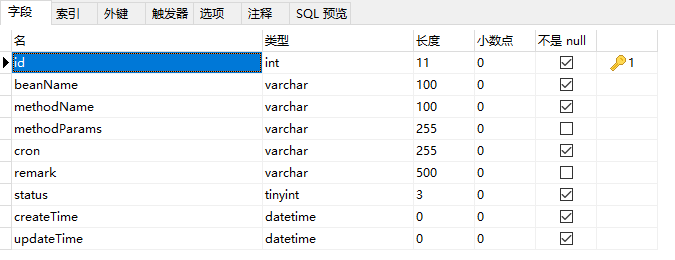

>task是Spring 内置的一个定时器，他可以不想Quartz那样麻烦的配置；Scheduled task有三种使用的方式，<br/>一种是在注解上直接使用task定时任务，</br><br/>第二种是可以进行更改定时任务的时间，</br><br/>第三种是可以进行手动启动定时任务和停止定时任务以及更改定时任务的时间；</br>

?> 启动类新增 @EnableScheduling注解来支持Task;

## 在注解上直接使用task定时任务

测试用例:
```java
@Slf4j
@Component
@Async
public class ScheduledService {
    //https://cron.qqe2.com/ cron生成网址

    /*
    fixedRate：定义一个按一定频率执行的定时任务
    上一次开始执行时间点之后多长时间再执行

    fixedRateString fixedRate 意思相同，只是使用字符串的形式。唯一不同的是支持占位符。

    fixedDelay：定义一个按一定频率执行的定时任务，与上面不同的是，改属性可以配合initialDelay，
    上一次执行完毕时间点之后多长时间再执行

    fixedDelayString 与 3. fixedDelay 意思相同，只是使用字符串的形式。唯一不同的是支持占位符。如：
    @Scheduled(fixedDelayString = "5000") //上一次执行完毕时间点之后5秒再执行
    占位符的使用(配置文件中有配置：time.fixedDelay=5000)：
     @Scheduled(fixedDelayString = "${time.fixedDelay}")

     initialDelay第一次延迟多长时间后再执行 如：
     @Scheduled(initialDelay=1000, fixedRate=5000) //第一次延迟1秒后执行，之后按fixedRate的规则每5秒执行一次
      initialDelayString 与initialDelay 意思相同，只是使用字符串的形式。唯一不同的是支持占位符。
     */

    //cron：通过表达式来配置任务执行时间
    @Scheduled(cron = "0/5 * * * * *")
    public void scheduled() {
        log.info("=====>>>>>使用cron  {}", System.currentTimeMillis());
    }

    @Scheduled(fixedRate = 5000)
    public void scheduled1() {
        log.info("=====>>>>>使用fixedRate{}", System.currentTimeMillis());
    }

    @Scheduled(fixedDelay = 5000)
    public void scheduled2() {
        log.info("=====>>>>>fixedDelay{}", System.currentTimeMillis());
    }

}
```

!> 使用Scheduled Task的弊端就是不适用于分布式集群的操作，Scheduled Task是一种轻量级的任务定时调度器，相比于Quartz,减少了很多的配置信息，但是Scheduled Task不适用于服务器集群，引文在服务器集群下会出现任务被多次调度执行的情况，因为集群的节点之间是不会共享任务信息的，每个节点的定时任务都会定时执行

?> 由于Task是单线程的，所以实战中可以配置定时任务线程池或者通过spring的注解@Async异步调用

## 可更改的简单定时任务

```java

import java.util.Date;
 
import org.apache.log4j.Logger;
import org.springframework.scheduling.Trigger;
import org.springframework.scheduling.TriggerContext;
import org.springframework.scheduling.annotation.EnableScheduling;
import org.springframework.scheduling.annotation.SchedulingConfigurer;
import org.springframework.scheduling.config.ScheduledTaskRegistrar;
import org.springframework.scheduling.support.CronTrigger;
import org.springframework.web.bind.annotation.RequestMapping;
import org.springframework.web.bind.annotation.RequestParam;
import org.springframework.web.bind.annotation.RestController;
 
@RestController
@EnableScheduling
@RequestMapping("/task")
public class TaskController implements SchedulingConfigurer {
 
    private Logger logger = Logger.getLogger(TaskController.class);
 
    /**
     * 定时任务的定时器表达式： 秒 分 时 日期 月 星期
     * 注意：有的地方说定时正则表达式可以有year，即7个元素，但是，在spring-boot里面，只能是6个元素，没有年。
     */
    private String cronExpression = "1/5 * * * * *";
 
    /**
     * 通过REST API请求对参数进行修改，定时规则进行调整
     * @param exp
     * @return
     */
    @RequestMapping("/change")
    public String change(@RequestParam("exp") String exp) {
        cronExpression = exp;
        logger.info("new cron expression: " + exp);
        return cronExpression;
    }
 
    /**
     * 定时任务要执行的方法
     * @return
     */
    private Runnable getTask() {
        Runnable task = new Runnable() {
            @Override
            public void run() {
            	logger.info("==定时任务==开始: " + new Date());
            	
            	//业务处理，忽视所有异常
                try {
                	//do something
                	
				} catch (Exception e) {
					e.printStackTrace();
				}
                
                logger.info("==定时任务==结束: " + new Date());
            }
        };
        return task;
    }
 
    /**
     * 调度实现的时间控制
     * @param scheduledTaskRegistrar
     */
    @Override
    public void configureTasks(ScheduledTaskRegistrar scheduledTaskRegistrar) {
        Trigger trigger=new Trigger() {
            @Override
            public Date nextExecutionTime(TriggerContext triggerContext) {
                CronTrigger cronTrigger=new CronTrigger(cronExpression);
                return cronTrigger.nextExecutionTime(triggerContext);
            }
        };
        scheduledTaskRegistrar.addTriggerTask(getTask(), trigger);
    }
}
```

!> 这种方式控制不强，没有持久化，不随时启动停止，且只能对已有的定时任务进行修改，无法新增或删除定时任务。

## 动态增删定时任务

添加执行定时任务的线程池配置类
```java
/**
 * 执行定时任务的线程池配置类
 *
 * @author: TangLiang
 * @date: 2021/1/3 17:44
 * @since: 1.0
 */
@Configuration
public class SchedulingConfig {
    @Bean
    public TaskScheduler taskScheduler() {
        ThreadPoolTaskScheduler taskScheduler = new ThreadPoolTaskScheduler();
        // 定时任务执行线程池核心线程数
        taskScheduler.setPoolSize(10);
        taskScheduler.setRemoveOnCancelPolicy(true);
        taskScheduler.setThreadNamePrefix("task-");
        return taskScheduler;
    }
}
```

添加ScheduledFuture的包装类。ScheduledFuture是ScheduledExecutorService定时任务线程池的执行结果。
```java
/**
 * ScheduledFuture是ScheduledExecutorService定时任务线程池的执行结果。
 *
 * @author: TangLiang
 * @date: 2021/1/3 17:46
 * @since: 1.0
 */
public final class ScheduledTask {

    volatile ScheduledFuture<?> future;

    /**
     * 取消定时任务
     */
    public void cancel() {
        ScheduledFuture<?> future = this.future;
        if (future != null) {
            future.cancel(true);
        }
    }
}
```

添加Runnable接口实现类，被定时任务线程池调用，用来执行指定bean里面的方法。重写equals()和hashCode()防止出现同一定时器下cron一样的定时任务
```java
/**
 * 添加Runnable接口实现类，被定时任务线程池调用，用来执行指定bean里面的方法
 *
 * @author: TangLiang
 * @date: 2021/1/3 17:47
 * @since: 1.0
 */
@Slf4j
public class SchedulingRunnable implements Runnable {

    private String beanName;

    private String methodName;

    private String params;

    public SchedulingRunnable(String beanName, String methodName) {
        this(beanName, methodName, null);
    }

    public SchedulingRunnable(String beanName, String methodName, String params) {
        this.beanName = beanName;
        this.methodName = methodName;
        this.params = params;
    }

    @Override
    public void run() {
        log.info("定时任务开始执行 - bean：{}，方法：{}，参数：{}", beanName, methodName, params);
        long startTime = System.currentTimeMillis();

        try {
            Object target = SpringContextUtils.getBean(beanName);

            Method method = null;
            if (StringUtils.isNotEmpty(params)) {
                method = target.getClass().getDeclaredMethod(methodName, String.class);
            } else {
                method = target.getClass().getDeclaredMethod(methodName);
            }

            ReflectionUtils.makeAccessible(method);
            if (StringUtils.isNotEmpty(params)) {
                method.invoke(target, params);
            } else {
                method.invoke(target);
            }
        } catch (Exception ex) {
            log.error(String.format("定时任务执行异常 - bean：%s，方法：%s，参数：%s ", beanName, methodName, params), ex);
        }

        long times = System.currentTimeMillis() - startTime;
        log.info("定时任务执行结束 - bean：{}，方法：{}，参数：{}，耗时：{} 毫秒", beanName, methodName, params, times);
    }

    @Override
    public boolean equals(Object o) {
        if (this == o) return true;
        if (o == null || getClass() != o.getClass()) return false;
        SchedulingRunnable that = (SchedulingRunnable) o;
        if (params == null) {
            return beanName.equals(that.beanName) &&
                    methodName.equals(that.methodName) &&
                    that.params == null;
        }

        return beanName.equals(that.beanName) &&
                methodName.equals(that.methodName) &&
                params.equals(that.params);
    }

    @Override
    public int hashCode() {
        if (params == null) {
            return Objects.hash(beanName, methodName);
        }

        return Objects.hash(beanName, methodName, params);
    }
}
```

工具类SpringContextUtils，用来从spring容器里获取bean
```java
/**
 * 工具类SpringContextUtils，用来从spring容器里获取bean
 *
 * @author: TangLiang
 * @date: 2021/1/3 17:54
 * @since: 1.0
 */
@Component
public class SpringContextUtils implements ApplicationContextAware {

    private static ApplicationContext applicationContext;

    @Override
    public void setApplicationContext(ApplicationContext applicationContext)
            throws BeansException {
        SpringContextUtils.applicationContext = applicationContext;
    }

    public static Object getBean(String name) {
        return applicationContext.getBean(name);
    }

    public static <T> T getBean(Class<T> requiredType) {
        return applicationContext.getBean(requiredType);
    }

    public static <T> T getBean(String name, Class<T> requiredType) {
        return applicationContext.getBean(name, requiredType);
    }

    public static boolean containsBean(String name) {
        return applicationContext.containsBean(name);
    }

    public static boolean isSingleton(String name) {
        return applicationContext.isSingleton(name);
    }

    public static Class<? extends Object> getType(String name) {
        return applicationContext.getType(name);
    }
}
```

添加定时任务注册类，用来增加、删除定时任务。
```java
/**
 * 添加定时任务注册类，用来增加、删除定时任务
 *
 * @author: TangLiang
 * @date: 2021/1/3 17:50
 * @since: 1.0
 */
@Component
public class CronTaskRegistrar implements DisposableBean {

    private final Map<Runnable, ScheduledTask> scheduledTasks = new ConcurrentHashMap<>(16);

    @Autowired
    private TaskScheduler taskScheduler;

    public TaskScheduler getScheduler() {
        return this.taskScheduler;
    }

    public void addCronTask(Runnable task, String cronExpression) {
        addCronTask(new CronTask(task, cronExpression));
    }

    public void addCronTask(CronTask cronTask) {
        if (cronTask != null) {
            Runnable task = cronTask.getRunnable();
            if (this.scheduledTasks.containsKey(task)) {
                removeCronTask(task);
            }

            this.scheduledTasks.put(task, scheduleCronTask(cronTask));
        }
    }

    public void removeCronTask(Runnable task) {
        ScheduledTask scheduledTask = this.scheduledTasks.remove(task);
        if (scheduledTask != null)
            scheduledTask.cancel();
    }

    public ScheduledTask scheduleCronTask(CronTask cronTask) {
        ScheduledTask scheduledTask = new ScheduledTask();
        scheduledTask.future = this.taskScheduler.schedule(cronTask.getRunnable(), cronTask.getTrigger());

        return scheduledTask;
    }

    @Override
    public void destroy() {
        for (ScheduledTask task : this.scheduledTasks.values()) {
            task.cancel();
        }

        this.scheduledTasks.clear();
    }
}
```

添加定时任务示例类
```java
/**
 * @author: TangLiang
 * @date: 2021/1/3 17:52
 * @since: 1.0
 */
@Component("demoTask")
public class DemoTask {
    public void taskWithParams(String params) {
        System.out.println("执行有参示例任务：" + params);
    }

    public void taskNoParams() {
        System.out.println("执行无参示例任务");
    }
}
```

测试用例
```java
/**
 * 定时任务管理
 *
 * @author: TangLiang
 * @date: 2021/1/3 18:06
 * @since: 1.0
 */
@RestController
@RequestMapping("/task")
public class TaskController {

    @Autowired
    private CronTaskRegistrar cronTaskRegistrar;

    //无参定时任务
    @PostMapping("/taskNoParams")
    public Map task1() {
        Map<String, Object> result = new HashMap<>();
        SchedulingRunnable task = new SchedulingRunnable("demoTask", "taskNoParams", null);
        cronTaskRegistrar.addCronTask(task, "0/10 * * * * ?");
        return result;
    }

    //有参定时任务
    @PostMapping("/taskWithParams")
    public Map task2() {
        Map<String, Object> result = new HashMap<>();
        SchedulingRunnable task = new SchedulingRunnable("demoTask", "taskWithParams", "Hello Task");
        cronTaskRegistrar.addCronTask(task, "0/10 * * * * ?");
        return result;
    }
}
```
!> 这种方式是用CronTaskRegistrar类维护的List存放定时任务，没有持久化，

> 修改上述代码，运用mysql来持久化

**表schedule_task设计**



```sql
/*
Navicat MySQL Data Transfer

Source Server         : 梦里不知身客
Source Server Version : 50724
Source Host           : 
Source Database       : mydb

Target Server Type    : MYSQL
Target Server Version : 50724
File Encoding         : 65001

Date: 2021-01-16 10:38:49
*/

SET FOREIGN_KEY_CHECKS=0;

-- ----------------------------
-- Table structure for schedule_task
-- ----------------------------
DROP TABLE IF EXISTS `schedule_task`;
CREATE TABLE `schedule_task` (
  `id` int(11) NOT NULL AUTO_INCREMENT COMMENT '任务id',
  `beanName` varchar(100) NOT NULL COMMENT 'bean名称',
  `methodName` varchar(100) NOT NULL COMMENT '方法名称',
  `methodParams` varchar(255) DEFAULT NULL COMMENT '方法参数',
  `cron` varchar(255) NOT NULL COMMENT 'cron表达式',
  `remark` varchar(500) DEFAULT NULL COMMENT '备注',
  `status` tinyint(3) NOT NULL COMMENT '状态 1正常，0暂停',
  `createTime` datetime NOT NULL DEFAULT CURRENT_TIMESTAMP ON UPDATE CURRENT_TIMESTAMP COMMENT '创建时间',
  `updateTime` datetime NOT NULL ON UPDATE CURRENT_TIMESTAMP COMMENT '修改时间',
  PRIMARY KEY (`id`)
) ENGINE=InnoDB AUTO_INCREMENT=2 DEFAULT CHARSET=utf8mb4;
```

## 定时任务持久化
> 根据该表写基础增删改查方法

### 新增定时任务

```markdown
boolean success = 新增方法;
if (!success)
    return 失败回调;
else {
    if (新增数据的status.equals(1)) { //即在运行中
        SchedulingRunnable task = new SchedulingRunnable(新增数据的beanName, 新增数据的methodName, 新增数据的methodParams);
        cronTaskRegistrar.addCronTask(task, 新增数据的cron);
    }
}

return 成功回调;
```

### 修改定时任务

先移除原来的任务，再启动新任务
```markdown
boolean success = 修改方法;
if (!success)
    return 失败回调;
else {
    //先移除再添加
    if (当前数据的status.equals(1)) { //即在运行中
        SchedulingRunnable task = new SchedulingRunnable(当前数据的beanName, 当前数据的methodName, 当前数据的methodParams);
        cronTaskRegistrar.removeCronTask(task);
    }

    if (修改后数据的status.equals(1)) {
        SchedulingRunnable task = new SchedulingRunnable(修改后数据的beanName, 修改后数据的methodName, 修改后数据的methodParams);
        cronTaskRegistrar.addCronTask(task, 修改后数据的cron);
    }
}

return 成功回调;
```

### 删除定时任务

```markdown
boolean success = 删除方法;
if (!success)
    return 失败回调;
else{
    if (当前数据的status.equals(1)) { //即在运行中
        SchedulingRunnable task = new SchedulingRunnable(当前数据的beanName, 当前数据的methodName, 当前数据的methodParams);
        cronTaskRegistrar.removeCronTask(task);
    }
}

return 成功回调;
```

### 定时任务启动/停止状态切换

```markdown
修改当前数据的status
if (修改后的status.equals(1)) { //即启动
    SchedulingRunnable task = new SchedulingRunnable(当前数据的beanName, 当前数据的methodName, 当前数据的methodParams);
    cronTaskRegistrar.addCronTask(task, 当前数据的cron);
} else { //停止
    SchedulingRunnable task = new SchedulingRunnable(当前数据的beanName, 当前数据的methodName, 当前数据的methodParams);
    cronTaskRegistrar.removeCronTask(task);
}
```

### 定时任务随项目启动

添加实现了CommandLineRunner接口的类，当spring boot项目启动完成后，加载数据库里状态为正常的定时任务。
```java
@Service
public class TaskInitRunner implements CommandLineRunner {

    private static final Logger logger = LoggerFactory.getLogger(SysJobRunner.class);

    @Autowired
    private ISysJobRepository sysJobRepository; //表的增删改查方法类

    @Autowired
    private CronTaskRegistrar cronTaskRegistrar;

    @Override
    public void run(String... args) {
        // 初始加载数据库里状态为正常的定时任务
        List<SysJobPO> jobList = sysJobRepository.getSysJobListByStatus(1);
        if (CollectionUtils.isNotEmpty(jobList)) { //list不为空
            for (SysJobPO job : jobList) {
                SchedulingRunnable task = new SchedulingRunnable(job.getBeanName(), job.getMethodName(), job.getMethodParams());
                cronTaskRegistrar.addCronTask(task, job.getCronExpression());
            }

            logger.info("定时任务已加载完毕...");
        }
    }
}
```

> Task的运用到这里就结束了，springTask定时任务相比较quartz更轻量，如果单机部署的话建议使用springTask，分布式的话建议使用quartz，powerjob等框架,或者将项目中的定时任务抽取出来成一个项目，在使用springTask。


