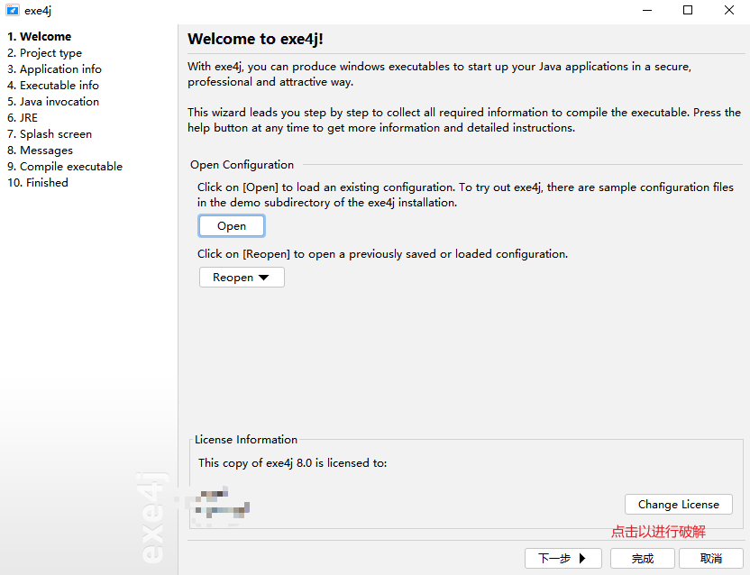
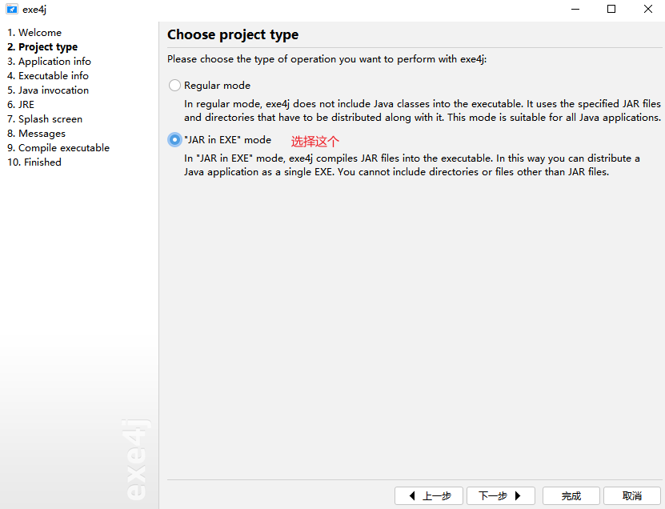
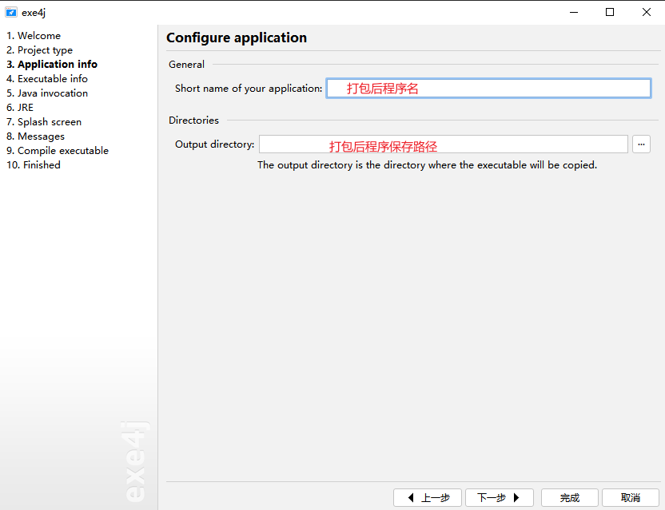
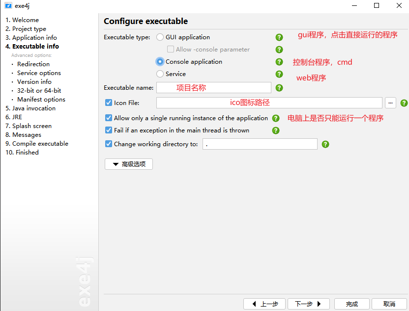
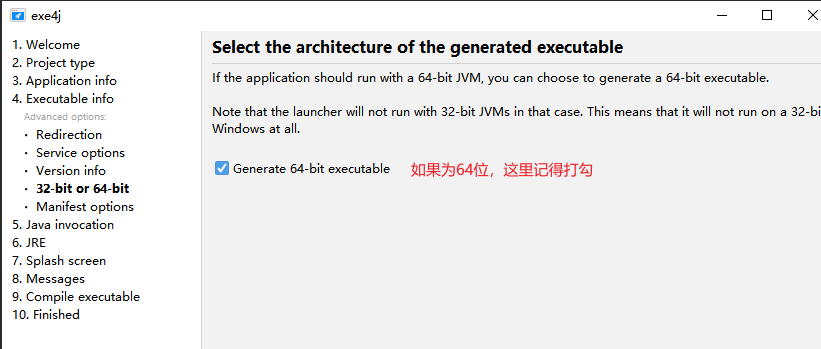
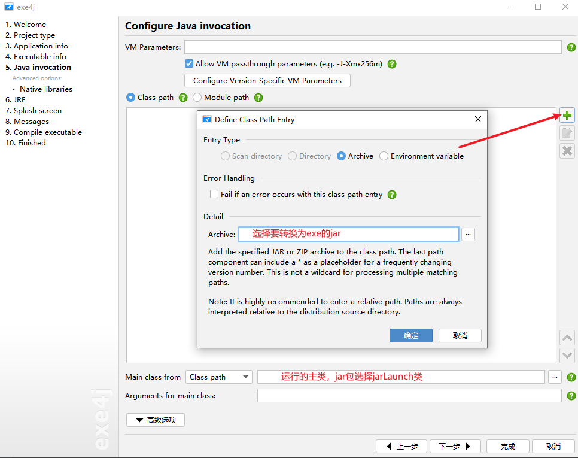
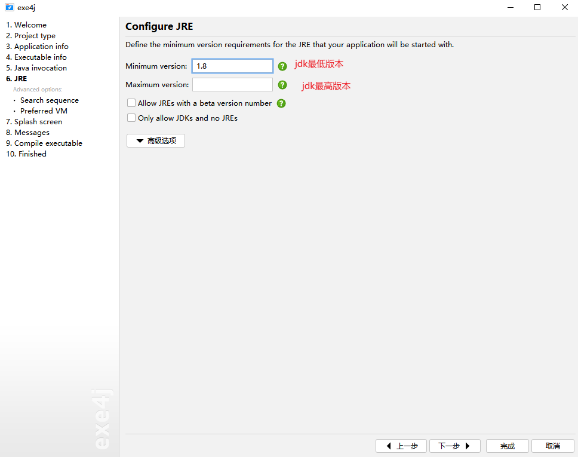
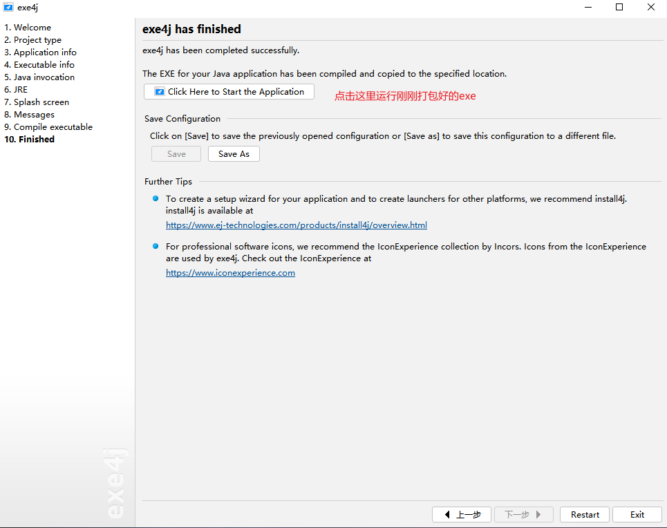

> jar打包成.exe程序需要exe4j工具

## 下载exe4j
[官方下载地址](https://www.ej-technologies.com/download/exe4j/files ':target=_blank')  
安装步骤就不说了，按照提示一步一步进行即可  
这里使用的jar包是maven项目打包出来的jar

## 打包成exe程序

1、打开exe4j  
  
密钥：
```markdown
A-XVK275016F-15wjjcbn4tpj
```
2、如图选好点击下一步  
  
3、打包配置



4、打包文件配置  



5、java文件配置  


6、jre配置  


如果需要在无jdk环境运行则需要将jre也打包  
点Advanced Options选择Search sequence，如果不使用系统环境的jre就把默认的删掉（保留会优先使用系统环境的），点绿色“+”选择导出目录路径下的jre。(exe和jre整个父文件夹全部复制到其他电脑就可以运行)->Next

弹窗选择Directory Directory上填.\jre  
Client hotspot VM->Next

7、一直到Finished  
在Splash screen的show splash screen可选择png图片作为启动图片


