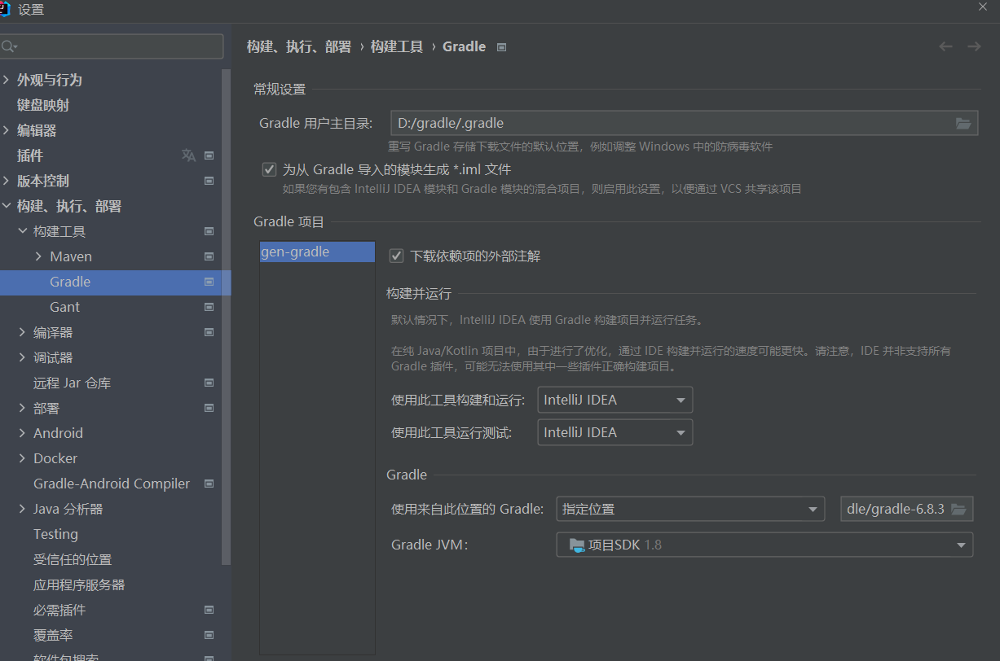

> Gradle是一个基于JVM的构建工具，是一款通用灵活的构建工具，支持maven， Ivy仓库，支持传递性依赖管理，而不需要远程仓库或者是pom.xml和ivy.xml配置文件，基于Groovy，build脚本使用Groovy编写。

当前文档基于Gradle6.8.3版本,IDEA版本为2021.2.3

下载页面 [https://gradle.org/releases/](https://gradle.org/releases/ ':target=_blank')  
提供了两种下载方式，Binary-only是只下载二进制源码，Complete, with docs and sources是下载源码和文档。如果有阅读文档的需求可以下载第二个，没有需要的下载Binary-only即可。

推荐下载6.8.3版本，6.7及以下版本在springBoot2.5.1版本以上会编译失败

## 安装Gradle
1、新建变量 GRADLE_HOME

变量名：GRADLE_HOME  
变量值：解压到的目录（如：D:\gradle\gradle-6.8.3）

2、新建变量 GRADLE_USER_HOME

变量名：GRADLE_USER_HOME  
变量值：自定义Gradle仓库目录或者Maven的仓库目录（如：D:\gradle\repository）

3、修改环境变量Path，添加：%GRADLE_HOME%bin

变量名：Path  
变量值：%GRADLE_HOME%bin

## 配置Gradle仓库源
在Gradle安装目录下的 init.d 文件夹下，新建一个 init.gradle 文件，里面填写以下配置。

```groovy
allprojects {
    repositories {
        maven { url 'file:///D:/gradle Files/repository'}
        mavenLocal()
        maven { name "Alibaba" ; url "https://maven.aliyun.com/repository/public" }
        maven { name "Bstek" ; url "http://nexus.bsdn.org/content/groups/public/" }
        mavenCentral()
    }

    buildscript { 
        repositories { 
            maven { name "Alibaba" ; url 'https://maven.aliyun.com/repository/public' }
            maven { name "Bstek" ; url 'http://nexus.bsdn.org/content/groups/public/' }
            maven { name "M2" ; url 'https://plugins.gradle.org/m2/' }
        }
    }
}
```

repositories 中写的是获取 jar 包的顺序。先是本地的 Maven 仓库路径；  
接着的 mavenLocal() 是获取 Maven 本地仓库的路径，应该是和第一条一样，但是不冲突；  
第三条和第四条是从国内和国外的网络上仓库获取；  
最后的 mavenCentral() 是从Apache提供的中央仓库获取 jar 包。

## idea 配置使用 gradle
Generate *.iml files for modules imported from Gradle 建议勾选，由于IntelliJ IDEA首先读取.iml文件，然后开始导入过程，因此打开项目时可以更快地访问它。

由于idea缺少gradle的全局配置，因此建议新增gradle项目时首先停止idea的自动构建，待配置好gradle后再构建项目,具体配置项可参照以下图片

