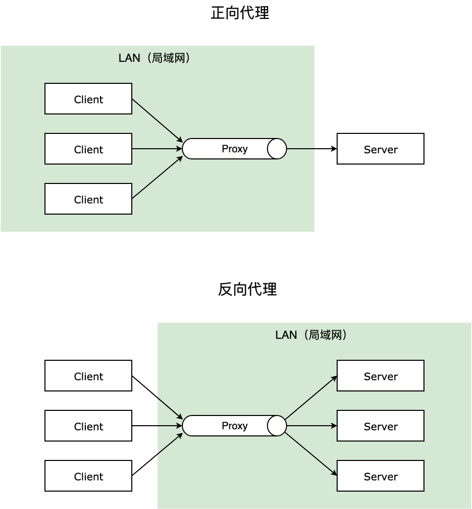
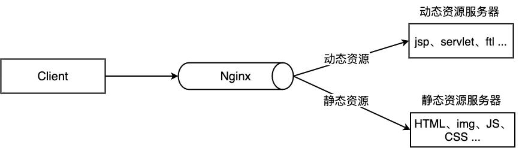
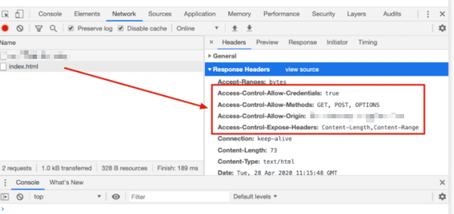
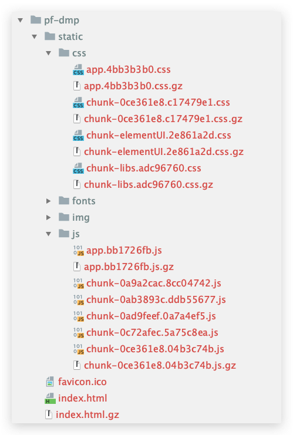

## Nginx 介绍
传统的 Web 服务器，每个客户端连接作为一个单独的进程或线程处理，
需在切换任务时将 CPU 切换到新的任务并创建一个新的运行时上下文，
消耗额外的内存和 CPU 时间，当并发请求增加时，服务器响应变慢，从而对性能产生负面影响。

Nginx 是开源、高性能、高可靠的 Web 和反向代理服务器，而且支持热部署，几乎可以做到 7 * 24 小时不间断运行，
即使运行几个月也不需要重新启动，还能在不间断服务的情况下对软件版本进行热更新。性能是 Nginx 最重要的考量，
其占用内存少、并发能力强、能支持高达 5w 个并发连接数，最重要的是，Nginx 是免费的并可以商业化，配置使用也比较简单。

Nginx 的最重要的几个使用场景：

1. 静态资源服务，通过本地文件系统提供服务；
2. 反向代理服务，延伸出包括缓存、负载均衡等；
3. API 服务，OpenResty ；

对于前端来说 Node.js 不陌生了，Nginx 和 Node.js 的很多理念类似，HTTP 服务器、事件驱动、异步非阻塞等，
且 Nginx 的大部分功能使用 Node.js 也可以实现，但 Nginx 和 Node.js 并不冲突，
都有自己擅长的领域。Nginx 擅长于底层服务器端资源的处理（静态资源处理转发、反向代理，负载均衡等），
Node.js 更擅长上层具体业务逻辑的处理，两者可以完美组合，共同助力前端开发。

## windows下常用命令

启动： 双击nginx.exe即可  
重启：  
`nginx.exe -s reload`

从容停止服务: 这种方法较stop相比就比较温和一些了，需要进程完成当前工作后再停止。  
`nginx.exe -s quit`

立即停止服务: 这种方法比较强硬，无论进程是否在工作，都直接停止进程。  
`nginx.exe -s stop`

## 正向代理和反向代理

反向代理（Reverse Proxy）对应的是正向代理（Forward Proxy），他们的区别：

**正向代理**： 一般的访问流程是客户端直接向目标服务器发送请求并获取内容，使用正向代理后，
客户端改为向代理服务器发送请求，并指定目标服务器（原始服务器），然后由代理服务器和原始服务器通信，
转交请求并获得的内容，再返回给客户端。正向代理隐藏了真实的客户端，为客户端收发请求，使真实客户端对服务器不可见；

举个具体的例子 🌰，你的浏览器无法直接访问谷哥，这时候可以通过一个代理服务器来帮助你访问谷哥，那么这个服务器就叫正向代理。

反向代理： 与一般访问流程相比，使用反向代理后，直接收到请求的服务器是代理服务器，然后将请求转发给内部网络上真正进行处理的服务器，得到的结果返回给客户端。反向代理隐藏了真实的服务器，为服务器收发请求，使真实服务器对客户端不可见。一般在处理跨域请求的时候比较常用。现在基本上所有的大型网站都设置了反向代理。

举个具体的例子 🌰，去饭店吃饭，可以点川菜、粤菜、江浙菜，饭店也分别有三个菜系的厨师 👨‍🍳，但是你作为顾客不用管哪个厨师给你做的菜，只用点菜即可，小二将你菜单中的菜分配给不同的厨师来具体处理，那么这个小二就是反向代理服务器。

简单的说，一般给客户端做代理的都是正向代理，给服务器做代理的就是反向代理。

正向代理和反向代理主要的原理区别可以参见下图：



### 配置反向代理

```
server {
  listen 80;
  server_name www.test.com;

  location ~ /edu/ {
    proxy_pass http://127.0.0.1:8080;
  }
  
  location ~ /vod/ {
    proxy_pass http://127.0.0.1:8081;
  }
}
```

反向代理还有一些其他的指令，可以了解一下：

1. proxy_set_header：在将客户端请求发送给后端服务器之前，更改来自客户端的请求头信息；
2. proxy_connect_timeout：配置 Nginx 与后端代理服务器尝试建立连接的超时时间；
3. proxy_read_timeout：配置 Nginx 向后端服务器组发出 read 请求后，等待相应的超时时间；
4. proxy_send_timeout：配置 Nginx 向后端服务器组发出 write 请求后，等待相应的超时时间；
5. proxy_redirect：用于修改后端服务器返回的响应头中的 Location 和 Refresh。

## location uri正则表达式

```
. ： 匹配除换行符以外的任意字符
? ： 重复0次或1次
+ ： 重复1次或更多次
* ： 重复0次或更多次
\d ：匹配数字
^ ： 匹配字符串的开始
$ ： 匹配字符串的结束
{n} ： 重复n次
{n,} ： 重复n次或更多次
[c] ： 匹配单个字符c
[a-z] ： 匹配a-z小写字母的任意一个
(a|b|c) : 属线表示匹配任意一种情况，每种情况使用竖线分隔，一般使用小括号括括住，匹配符合a字符 或是b字符 或是c字符的字符串
\ 反斜杠：用于转义特殊字符

小括号()之间匹配的内容，可以在后面通过$1来引用，$2表示的是前面第二个()里的内容。正则里面容易让人困惑的是\转义特殊字符。
```

## location优先级

当一个路径匹配多个location时究竟哪个location能匹配到时有优先级顺序的，而优先级的顺序于location值的表达式类型有关，
和在配置文件中的先后顺序无关。相同类型的表达式，字符串长的会优先匹配。

以下是按优先级排列说明：
1. 等号类型（=）的优先级最高。一旦匹配成功，则不再查找其他匹配项，停止搜索。
2. ^~类型表达式，不属于正则表达式。一旦匹配成功，则不再查找其他匹配项，停止搜索。
3. 正则表达式类型（~ ~*）的优先级次之。如果有多个location的正则能匹配的话，则使用正则表达式最长的那个。
4. 常规字符串匹配类型。按前缀匹配。
5. / 通用匹配，如果没有匹配到，就匹配通用的

优先级搜索问题：不同类型的location映射决定是否继续向下搜索
* 等号类型、^~类型：一旦匹配上就停止搜索了，不会再匹配其他location了
* 正则表达式类型(~ ~*）,常规字符串匹配类型/xxx/ : 匹配到之后，还会继续搜索其他其它location，
直到找到优先级最高的，或者找到第一种情况而停止搜索

> location优先级从高到底：  
> (location =) > (location 完整路径) > (location ^~ 路径) > (location ~,~* 正则顺序) > (location 部分起始路径) > (/)

```
location = / {
    # 精确匹配/，主机名后面不能带任何字符串 /
    [ configuration A ]
}
location / {
    # 匹配所有以 / 开头的请求。
    # 但是如果有更长的同类型的表达式，则选择更长的表达式。
    # 如果有正则表达式可以匹配，则优先匹配正则表达式。
    [ configuration B ]
}
location /documents/ {
    # 匹配所有以 /documents/ 开头的请求，匹配符合以后，还要继续往下搜索。
    # 但是如果有更长的同类型的表达式，则选择更长的表达式。
    # 如果有正则表达式可以匹配，则优先匹配正则表达式。
    [ configuration C ]
}
location ^~ /images/ {
    # 匹配所有以 /images/ 开头的表达式，如果匹配成功，则停止匹配查找，停止搜索。
    # 所以，即便有符合的正则表达式location，也不会被使用
    [ configuration D ]
}

location ~* \.(gif|jpg|jpeg)$ {
    # 匹配所有以 gif jpg jpeg结尾的请求。
    # 但是 以 /images/开头的请求，将使用 Configuration D，D具有更高的优先级
    [ configuration E ]
}

location /images/ {
    # 字符匹配到 /images/，还会继续往下搜索
    [ configuration F ]
}


location = /test.htm {
    root   /usr/local/var/www/htm;
    index  index.htm;
}

注意：location的优先级与location配置的位置无关
```

## 负载均衡

负载均衡也是Nginx常用的一个功能，负载均衡其意思就是分摊到多个操作单元上进行执行，例如Web服务器、FTP服务器、
企业关键应用服务器和其它关键任务服务器等，从而共同完成工作任务。简单而言就是当有2台或以上服务器时，
根据规则随机的将请求分发到指定的服务器上处理，负载均衡配置一般都需要同时配置反向代理，通过反向代理跳转到负载均衡。
而Nginx目前支持自带3种负载均衡策略，还有2种常用的第三方策略。


负载均衡通过upstream指令来实现。

1.RR(round robin :轮询 默认)

每个请求按时间顺序逐一分配到不同的后端服务器，也就是说第一次请求分配到第一台服务器上，第二次请求分配到第二台服务器上，
如果只有两台服务器，第三次请求继续分配到第一台上，这样循环轮询下去，也就是服务器接收请求的比例是 1:1， 
如果后端服务器down掉，能自动剔除。轮询是默认配置，不需要太多的配置

同一个项目分别使用8081和8082端口启动项目

```
upstream web_servers {  
   server localhost:8081;  
   server localhost:8082;  
}

server {
    listen       80;
    server_name  localhost;
    #access_log  logs/host.access.log  main;

    location / {
        proxy_pass http://web_servers;
        # 必须指定Header Host
        proxy_set_header Host $host:$server_port;
    }
 }
```

2.权重

指定轮询几率，weight和访问比率成正比, 也就是服务器接收请求的比例就是各自配置的weight的比例，
用于后端服务器性能不均的情况,比如服务器性能差点就少接收点请求，服务器性能好点就多处理点请求。

```
upstream test {
    server localhost:8081 weight=1;
    server localhost:8082 weight=3;
    server localhost:8083 weight=4 backup;
}
```

示例是4次请求只有一次被分配到8081上，其他3次分配到8082上。backup是指热备，只有当8081和8082都宕机的情况下才走8083

3.ip_hash

上面的2种方式都有一个问题，那就是下一个请求来的时候请求可能分发到另外一个服务器，当我们的程序不是无状态的时候(采用了session保存数据)，
这时候就有一个很大的很问题了，比如把登录信息保存到了session中，
那么跳转到另外一台服务器的时候就需要重新登录了，所以很多时候我们需要一个客户只访问一个服务器，
那么就需要用iphash了，iphash的每个请求按访问ip的hash结果分配，这样每个访客固定访问一个后端服务器，
可以解决session的问题。

```
upstream test {
    ip_hash;
    server localhost:8080;
    server localhost:8081;
}
```

4.fair(第三方)

按后端服务器的响应时间来分配请求，响应时间短的优先分配。这个配置是为了更快的给用户响应

```
upstream backend {
    fair;
    server localhost:8080;
    server localhost:8081;
}
```

5.url_hash(第三方)

按访问url的hash结果来分配请求，使每个url定向到同一个后端服务器，后端服务器为缓存时比较有效。 
在upstream中加入hash语句，server语句中不能写入weight等其他的参数，hash_method是使用的hash算法

```
upstream backend {
    hash $request_uri;
    hash_method crc32;
    server localhost:8080;
    server localhost:8081;
}
```

## 动静分离

动静分离是让动态网站里的动态网页根据一定规则把不变的资源和经常变的资源区分开来，动静资源做好了拆分以后，
我们就可以根据静态资源的特点将其做缓存操作，这就是网站静态化处理的核心思路。



```
upstream web_servers {  
       server localhost:8081;  
       server localhost:8082;  
}

server {
    listen       80;
    server_name  localhost;

    set $doc_root /usr/local/var/www;

    location ~* \.(gif|jpg|jpeg|png|bmp|ico|swf|css|js)$ {
       root $doc_root/img;
    }

    location / {
        proxy_pass http://web_servers;
        # 必须指定Header Host
        proxy_set_header Host $host:$server_port;
    }

    error_page 500 502 503 504  /50x.html;  
    location = /50x.html {  
        root $doc_root;
    }

 }
```

## 其他

1.return指令

返回http状态码 和 可选的第二个参数可以是重定向的URL

```
location /permanently/moved/url {
    return 301 http://www.example.com/moved/here;
}
```

2.rewrite指令

重写URI请求 rewrite，通过使用rewrite指令在请求处理期间多次修改请求URI，该指令具有一个可选参数和两个必需参数。 
第一个(必需)参数是请求URI必须匹配的正则表达式。 第二个参数是用于替换匹配URI的URI。 
可选的第三个参数是可以停止进一步重写指令的处理或发送重定向(代码301或302)的标志

```
location /users/ {
    rewrite ^/users/(.*)$ /show?user=$1 break;
}
```

3.error_page指令

使用error_page指令，您可以配置NGINX返回自定义页面以及错误代码，替换响应中的其他错误代码，或将浏览器重定向到其他URI。
 在以下示例中，error_page指令指定要返回404页面错误代码的页面(/404.html)。
 
 ```
error_page 404 /404.html;
```

4.日志

访问日志：需要开启压缩 gzip on; 否则不生成日志文件，打开log_format、access_log注释

```
log_format  main  '$remote_addr - $remote_user [$time_local] "$request" '
                      '$status $body_bytes_sent "$http_referer" '
                      '"$http_user_agent" "$http_x_forwarded_for"';

access_log  /usr/local/etc/nginx/logs/host.access.log  main;

gzip  on;
```

5.deny 指令

```
# 禁止访问某个目录
location ~* \.(txt|doc)${
    root $doc_root;
    deny all;
}
```

6.内置变量

- $args ： #这个变量等于请求行中的参数，同$query_string
- $content_length ： 请求头中的Content-length字段。
- $content_type ： 请求头中的Content-Type字段。
- $document_root ： 当前请求在root指令中指定的值。
- $host ： 请求主机头字段，否则为服务器名称。
- $http_user_agent ： 客户端agent信息
- $http_cookie ： 客户端cookie信息
- $limit_rate ： 这个变量可以限制连接速率。
- $request_method ： 客户端请求的动作，通常为GET或POST。
- $remote_addr ： 客户端的IP地址。
- $remote_port ： 客户端的端口。
- $remote_user ： 已经经过Auth Basic Module验证的用户名。
- $request_filename ： 当前请求的文件路径，由root或alias指令与URI请求生成。
- $scheme ： HTTP方法（如http，https）。
- $server_protocol ： 请求使用的协议，通常是HTTP/1.0或HTTP/1.1。
- $server_addr ： 服务器地址，在完成一次系统调用后可以确定这个值。
- $server_name ： 服务器名称。
- $server_port ： 请求到达服务器的端口号。
- $request_uri ： 包含请求参数的原始URI，不包含主机名，如：”/foo/bar.php?arg=baz”。
- $uri ： 不带请求参数的当前URI，$uri不包含主机名，如”/foo/bar.html”。
- $document_uri ： 与$uri相同

##  跨域 CORS 配置

### 使用反向代理解决跨域

在前端服务地址为 fe.test.com 的页面请求 be.test.com 的后端服务导致的跨域，可以这样配置：

```
server {
  listen 9001;
  server_name fe.test.com ;

  location / {
    proxy_pass be.test.com ;
  }
}
```

这样就将对前一个域名 fe.test.com 的请求全都代理到了 be.test.com，
前端的请求都被我们用服务器代理到了后端地址下，绕过了跨域。

这里对静态文件的请求和后端服务的请求都以 fe.test.com 开始，不易区分，所以为了实现对后端服务请求的统一转发，
通常我们会约定对后端服务的请求加上 /apis/ 前缀或者其他的 path 来和对静态资源的请求加以区分，此时我们可以这样配置：

```
# 请求跨域，约定代理后端服务请求path以/apis/开头
location ^~/apis/ {
    # 这里重写了请求，将正则匹配中的第一个分组的path拼接到真正的请求后面，并用break停止后续匹配
    rewrite ^/apis/(.*)$ /$1break;
    proxy_pass be.test.com;
  
    # 两个域名之间cookie的传递与回写
    proxy_cookie_domain be.test.com fe.test.com;
}
```

这样，静态资源我们使用 fe.test.com/xx.html，动态资源我们使用 fe.test.com/apis/getAwo，
浏览器页面看起来仍然访问的前端服务器，绕过了浏览器的同源策略，毕竟我们看起来并没有跨域。

也可以统一一点，直接把前后端服务器地址直接都转发到另一个 server.test.com，
只通过在后面添加的 path 来区分请求的是静态资源还是后端服务，看需求了。

###  配置 header 解决跨域

当浏览器在访问跨源的服务器时，也可以在跨域的服务器上直接设置 Nginx，从而前端就可以无感地开发，不用把实际上访问后端的地址改成前端服务的地址，这样可适性更高。

比如前端站点是 fe.test.com，这个地址下的前端页面请求 be.test.com 下的资源，比如前者的 fe.test.com/index.html 内容是这样的：

```html
<html lang="en">
<body>
    <h1>welcome fe.test.com!!<h1>
    <script type='text/javascript'>
    var xmlhttp = new XMLHttpRequest()
    xmlhttp.open("GET", "http://be.test.com/index.html", true);
    xmlhttp.send();
    </script>
</body>
</html>
```

nginx配置如下

```
server {
  listen       80;
  server_name  be.test.com;
  
	add_header 'Access-Control-Allow-Origin'$http_origin;   # 全局变量获得当前请求origin，带cookie的请求不支持*
	add_header 'Access-Control-Allow-Credentials''true';    # 为 true 可带上 cookie
	add_header 'Access-Control-Allow-Methods''GET, POST, OPTIONS';  # 允许请求方法
	add_header 'Access-Control-Allow-Headers'$http_access_control_request_headers;  # 允许请求的 header，可以为 *
	add_header 'Access-Control-Expose-Headers''Content-Length,Content-Range';
	
  if ($request_method = 'OPTIONS') {
		add_header 'Access-Control-Max-Age' 1728000;   # OPTIONS 请求的有效期，在有效期内不用发出另一条预检请求
		add_header 'Content-Type''text/plain; charset=utf-8';
		add_header 'Content-Length' 0;
    
		return 204;                  # 200 也可以
	}
  
	location / {
		root  /usr/share/nginx/html/be;
		index index.html;
	}
}
```



## 开启 gzip 压缩

gzip 是一种常用的网页压缩技术，传输的网页经过 gzip 压缩之后大小通常可以变为原来的一半甚至更小（官网原话），
更小的网页体积也就意味着带宽的节约和传输速度的提升，特别是对于访问量巨大大型网站来说，每一个静态资源体积的减小，
都会带来可观的流量与带宽的节省。

百度可以找到很多检测站点来查看目标网页有没有开启 gzip 压缩，在下随便找了一个 <网页GZIP压缩检测> 输入掘金 juejin.im 来偷窥下掘金有没有开启 gzip。

### Nginx 配置 gzip

使用 gzip 不仅需要 Nginx 配置，浏览器端也需要配合，需要在请求消息头中包含 Accept-Encoding: gzip（IE5 之后所有的浏览器都支持了，是现代浏览器的默认设置）。
一般在请求 html 和 css 等静态资源的时候，支持的浏览器在 request 请求静态资源的时候，会加上 Accept-Encoding: gzip 这个 header，
表示自己支持 gzip 的压缩方式，Nginx 在拿到这个请求的时候，如果有相应配置，就会返回经过 gzip 压缩过的文件给浏览器，
并在 response 相应的时候加上 content-encoding: gzip 来告诉浏览器自己采用的压缩方式（因为浏览器在传给服务器的时候一般还告诉服务器自己支持好几种压缩方式），
浏览器拿到压缩的文件后，根据自己的解压方式进行解析。

```
gzip on; # 默认off，是否开启gzip
gzip_types text/plain text/css application/json application/x-javascript text/xml application/xml application/xml+rss text/javascript;

# 上面两个开启基本就能跑起了，下面的愿意折腾就了解一下
gzip_static on;
gzip_proxied any;
gzip_vary on;
gzip_comp_level 6;
gzip_buffers 16 8k;
# gzip_min_length 1k;
gzip_http_version 1.1;
```

1. gzip_types：要采用 gzip 压缩的 MIME 文件类型，其中 text/html 被系统强制启用；
2. gzip_static：默认 off，该模块启用后，Nginx 首先检查是否存在请求静态文件的 gz 结尾的文件，如果有则直接返回该 .gz 文件内容；
3. gzip_proxied：默认 off，nginx做为反向代理时启用，用于设置启用或禁用从代理服务器上收到相应内容 gzip 压缩；
4. gzip_vary：用于在响应消息头中添加 Vary：Accept-Encoding，使代理服务器根据请求头中的 Accept-Encoding 识别是否启用 gzip 压缩；
5. gzip_comp_level：gzip 压缩比，压缩级别是 1-9，1 压缩级别最低，9 最高，级别越高压缩率越大，压缩时间越长，建议 4-6；
6. gzip_buffers：获取多少内存用于缓存压缩结果，16 8k 表示以 8k*16 为单位获得；
7. gzip_min_length：允许压缩的页面最小字节数，页面字节数从header头中的 Content-Length 中进行获取。默认值是 0，不管页面多大都压缩。建议设置成大于 1k 的字节数，小于 1k 可能会越压越大；
8. gzip_http_version：默认 1.1，启用 gzip 所需的 HTTP 最低版本；

由于文件太小，gzip 压缩之后得到了 -48% 的体积优化，压缩之后体积还比压缩之前体积大了，所以最好设置低于 1kb 的文件就不要 gzip 压缩了

### Webpack 的 gzip 配置

当前端项目使用 Webpack 进行打包的时候，也可以开启 gzip 压缩：

```vue
// vue-cli3 的 vue.config.js 文件
const CompressionWebpackPlugin = require('compression-webpack-plugin')

module.exports = {
  // gzip 配置
  configureWebpack: config => {
    if (process.env.NODE_ENV === 'production') {
      // 生产环境
      return {
        plugins: [new CompressionWebpackPlugin({
          test: /\.js$|\.html$|\.css/,    // 匹配文件名
          threshold: 10240,               // 文件压缩阈值，对超过10k的进行压缩
          deleteOriginalAssets: false// 是否删除源文件
        })]
      }
    }
  },
  ...
}
```

由此打包出来的文件如下图：



这里可以看到某些打包之后的文件下面有一个对应的 .gz 经过 gzip 压缩之后的文件，这是因为这个文件超过了 10kb，有的文件没有超过 10kb 就没有进行 gzip 打包，
如果你期望压缩文件的体积阈值小一点，可以在 compression-webpack-plugin 这个插件的配置里进行对应配置。

那么为啥这里 Nginx 已经有了 gzip 压缩，Webpack 这里又整了个 gzip 呢，因为如果全都是使用 Nginx 来压缩文件，会耗费服务器的计算资源，
如果服务器的 gzip_comp_level 配置的比较高，就更增加服务器的开销，相应增加客户端的请求时间，得不偿失。

如果压缩的动作在前端打包的时候就做了，把打包之后的高压缩等级文件作为静态资源放在服务器上，Nginx 会优先查找这些压缩之后的文件返回给客户端，
相当于把压缩文件的动作从 Nginx 提前给 Webpack 打包的时候完成，节约了服务器资源，所以一般推介在生产环境应用 Webpack 配置 gzip 压缩。

## 配置 HTTPS

具体配置过程网上挺多的了，也可以使用你购买的某某云，一般都会有免费申请的服务器证书，安装直接看所在云的操作指南即可。

我购买的腾讯云提供的亚洲诚信机构颁发的免费证书只能一个域名使用，二级域名什么的需要另外申请，但是申请审批比较快，一般几分钟就能成功，
然后下载证书的压缩文件，里面有个 nginx 文件夹，把 xxx.crt 和 xxx.key 文件拷贝到服务器目录，再配置下：

```
server {
  listen 443 ssl http2 default_server;   # SSL 访问端口号为 443
  server_name sherlocked93.club;         # 填写绑定证书的域名

  ssl_certificate /etc/nginx/https/xxx.test.crt;   # 证书文件地址
  ssl_certificate_key /etc/nginx/https/xxx.test.key;      # 私钥文件地址
  ssl_session_timeout 10m;

  ssl_protocols TLSv1 TLSv1.1 TLSv1.2;      #请按照以下协议配置
  ssl_ciphers ECDHE-RSA-AES128-GCM-SHA256:HIGH:!aNULL:!MD5:!RC4:!DHE;
  ssl_prefer_server_ciphers on;
  
  location / {
    root         /usr/share/nginx/html;
    index        index.html index.htm;
  }
}
```

一般还可以加上几个增强安全性的命令：

```
add_header X-Frame-Options DENY;           # 减少点击劫持
add_header X-Content-Type-Options nosniff; # 禁止服务器自动解析资源类型
add_header X-Xss-Protection 1;             # 防XSS攻击
```

## 一些常用技巧

### 静态服务

```
server {
  listen       80;
  server_name  static.test.com;
  charset utf-8;    # 防止中文文件名乱码

  location /download {
    alias	          /usr/share/nginx/html/static;  # 静态资源目录
    
    autoindex               on;    # 开启静态资源列目录
    autoindex_exact_size    off;   # on(默认)显示文件的确切大小，单位是byte；off显示文件大概大小，单位KB、MB、GB
    autoindex_localtime     off;   # off(默认)时显示的文件时间为GMT时间；on显示的文件时间为服务器时间
  }
}
```

### 图片防盗链

```
server {
  listen       80;
  server_name  *.test.com;
  
  # 图片防盗链
  location ~* \.(gif|jpg|jpeg|png|bmp|swf)$ {
    valid_referers none blocked 192.168.0.2;  # 只允许本机 IP 外链引用
    if ($invalid_referer){
      return 403;
    }
  }
}
```

### 请求过滤

```
# 非指定请求全返回 403
if ( $request_method !~ ^(GET|POST|HEAD)$ ) {
  return 403;
}

location / {
  # IP访问限制（只允许IP是 192.168.0.2 机器访问）
  allow 192.168.0.2;
  deny all;
  
  root   html;
  index  index.html index.htm;
}
```

### 配置图片、字体等静态文件缓存

由于图片、字体、音频、视频等静态文件在打包的时候通常会增加了 hash，所以缓存可以设置的长一点，先设置强制缓存，再设置协商缓存；
如果存在没有 hash 值的静态文件，建议不设置强制缓存，仅通过协商缓存判断是否需要使用缓存。

```
# 图片缓存时间设置
location ~ .*\.(css|js|jpg|png|gif|swf|woff|woff2|eot|svg|ttf|otf|mp3|m4a|aac|txt)$ {
	expires 10d;
}

# 如果不希望缓存
expires -1;
```

### 单页面项目 history 路由配置

```
server {
  listen       80;
  server_name  fe.sherlocked93.club;
  
  location / {
    root       /usr/share/nginx/html/dist;  # vue 打包后的文件夹
    index      index.html index.htm;
    try_files  $uri$uri/ /index.html @rewrites;
    
    expires -1;                          # 首页一般没有强制缓存
    add_header Cache-Control no-cache;
  }
  
  # 接口转发，如果需要的话
  #location ~ ^/api {
  #  proxy_pass http://be.sherlocked93.club;
  #}
  
  location @rewrites {
    rewrite ^(.+)$ /index.html break;
  }
}
```

### HTTP 请求转发到 HTTPS

配置完 HTTPS 后，浏览器还是可以访问 HTTP 的地址 http://test.com/ 的，可以做一个 301 跳转，把对应域名的 HTTP 请求重定向到 HTTPS 上

```
server {
    listen      80;
    server_name www.test.com;

    # 单域名重定向
    if ($host = 'www.test.com'){
        return 301 https://www.test.com$request_uri;
    }
    # 全局非 https 协议时重定向
    if ($scheme != 'https') {
        return 301 https://$server_name$request_uri;
    }

    # 或者全部重定向
    return 301 https://$server_name$request_uri;

    # 以上配置选择自己需要的即可，不用全部加
}
```

### 泛域名路径分离

这是一个非常实用的技能，经常有时候我们可能需要配置一些二级或者三级域名，希望通过 Nginx 自动指向对应目录，比如：

1. test1.doc.test.com 自动指向 /usr/share/nginx/html/doc/test1 服务器地址；
2. test2.doc.test.com 自动指向 /usr/share/nginx/html/doc/test2 服务器地址；

```
server {
    listen       80;
    server_name  ~^([\w-]+)\.doc\.test\.com;

    root /usr/share/nginx/html/doc/$1;
}
```

### 泛域名转发

和之前的功能类似，有时候我们希望把二级或者三级域名链接重写到我们希望的路径，让后端就可以根据路由解析不同的规则：

1. test1.serv.test.com/api?name=a 自动转发到 127.0.0.1:8080/test1/api?name=a ；
2. test2.serv.test.com/api?name=a 自动转发到 127.0.0.1:8080/test2/api?name=a ；

```
server {
    listen       80;
    server_name ~^([\w-]+)\.serv\.test\.com;

    location / {
        proxy_set_header        X-Real-IP $remote_addr;
        proxy_set_header        X-Forwarded-For $proxy_add_x_forwarded_for;
        proxy_set_header        Host $http_host;
        proxy_set_header        X-NginX-Proxy true;
        proxy_pass              http://127.0.0.1:8080/$1$request_uri;
    }
}
```

## Linux环境下Nginx配置例子

```
# For more information on configuration, see:
#   * Official English Documentation: http://nginx.org/en/docs/
#   * Official Russian Documentation: http://nginx.org/ru/docs/

user nginx;
worker_processes auto;
error_log /var/log/nginx/error.log;
pid /run/nginx.pid;

# Load dynamic modules. See /usr/share/doc/nginx/README.dynamic.
include /usr/share/nginx/modules/*.conf;

events {
    worker_connections 1024;
}

http {
    log_format  main  '$remote_addr - $remote_user [$time_local] "$request" '
                      '$status $body_bytes_sent "$http_referer" '
                      '"$http_user_agent" "$http_x_forwarded_for"';

    access_log  /var/log/nginx/access.log  main;

    sendfile            on;
    tcp_nopush          on;
    tcp_nodelay         on;
    keepalive_timeout   65;
    types_hash_max_size 2048;

    gzip on;
    gzip_buffers 16 8k;
    gzip_comp_level 6;
    gzip_min_length 20;
    gzip_http_version 1.1;
    gzip_types application/javascript application/x-javascript text/css text/xml text/plain application/css application/xml text/javascript application/json;
    gzip_disable "MSIE [1-6]\."; #配置禁用gzip条件，支持正则。此处表示ie6及以下不启用gzip（因为ie低版本不支持）
    gzip_vary on;
   
    include             /etc/nginx/mime.types;
    default_type        application/octet-stream;

    # Load modular configuration files from the /etc/nginx/conf.d directory.
    # See http://nginx.org/en/docs/ngx_core_module.html#include
    # for more information.
    include /etc/nginx/conf.d/*.conf;

    server {
        listen       80 default_server;
        listen       [::]:80 default_server;
        server_name  _;
        #return 403;
        root         /usr/share/nginx/html;

        # Load configuration files for the default server block.
        include /etc/nginx/default.d/*.conf;

        location / {
        }

        error_page 404 /404.html;
        location = /404.html {
        }

        error_page 500 502 503 504 /50x.html;
        location = /50x.html {
        }
    }

   server {
      listen  80;
      server_name  minio.tlcsdm.com;
      location / {
      proxy_redirect off;
      proxy_set_header Host $host;
      proxy_set_header X-Real-IP $remote_addr;
      proxy_set_header X-Forwarded-For $proxy_add_x_forwarded_for;
      proxy_buffers           32 4k;
      proxy_pass http://127.0.0.1:9000/;
      }

     include /etc/nginx/default.d/*.conf;
        error_page 404 /404.html;
        location = /404.html {
        }

        error_page 500 502 503 504 /50x.html;
        location = /50x.html {
        }  
   }

  server {
      listen  80;
      server_name  tlcsdm.com;
      location / {
      proxy_redirect off;
      proxy_set_header Host $host;
      proxy_set_header X-Real-IP $remote_addr;
      proxy_set_header X-Forwarded-For $proxy_add_x_forwarded_for;
      proxy_buffers           32 4k;
      proxy_pass http://127.0.0.1/;
      }

     include /etc/nginx/default.d/*.conf;
        error_page 404 /404.html;
        location = /404.html {
        }

        error_page 500 502 503 504 /50x.html;
        location = /50x.html {
        }  
   }

  server {
      listen  80;
      server_name www.tlcsdm.com;
      location / {
        alias /usr/local/document/docs/;
        index  index.html;
        #add_header Cache-Control "no-cache, no-store";
      #proxy_redirect off;
      #proxy_set_header Host $host;
      #proxy_set_header X-Real-IP $remote_addr;
      #proxy_set_header X-Forwarded-For $proxy_add_x_forwarded_for;
      #proxy_buffers           32 4k;
      #proxy_pass http://127.0.0.1:3000/;
      }

     include /etc/nginx/default.d/*.conf;
        error_page 404 /404.html;
        location = /404.html {
        }

        error_page 500 502 503 504 /50x.html;
        location = /50x.html {
        }
   }

  server {
      listen  80;
      server_name  cx.tlcsdm.com;
      location / {
      proxy_redirect off;
      proxy_set_header Host $host;
      proxy_set_header X-Real-IP $remote_addr;
      proxy_set_header X-Forwarded-For $proxy_add_x_forwarded_for;
      proxy_buffers           32 4k;
      proxy_pass http://127.0.0.1:2368/;
      }

     include /etc/nginx/default.d/*.conf;
        error_page 404 /404.html;
        location = /404.html {
        }

        error_page 500 502 503 504 /50x.html;
        location = /50x.html {
        }
   }
   
  server {
      listen  80;
      server_name  rabbit.tlcsdm.com;
      location / {
      proxy_redirect off;
      proxy_set_header Host $host;
      proxy_set_header X-Real-IP $remote_addr;
      proxy_set_header X-Forwarded-For $proxy_add_x_forwarded_for;
      proxy_buffers           32 4k;
      proxy_pass http://127.0.0.1:15672/;
      }

     include /etc/nginx/default.d/*.conf;
        error_page 404 /404.html;
        location = /404.html {
        }

        error_page 500 502 503 504 /50x.html;
        location = /50x.html {
        }  
   }
   
# Settings for a TLS enabled server.

    server {
        listen       443 ssl http2 default_server;
        listen       [::]:443 ssl http2 default_server;
        server_name  tlcsdm.com;
        root         /usr/share/nginx/html;

        ssl_certificate "/etc/nginx/server.crt";
        ssl_certificate_key "/etc/nginx/server.key";
        ssl_session_cache shared:SSL:1m;
        ssl_session_timeout  10m;
        ssl_ciphers ECDHE-RSA-AES128-GCM-SHA256:HIGH:!aNULL:!MD5:!RC4:!DHE;#按照这个套件配置
        ssl_protocols TLSv1 TLSv1.1 TLSv1.2; #按照这个协议配置
        ssl_prefer_server_ciphers on;

        # Load configuration files for the default server block.
        include /etc/nginx/default.d/*.conf;

        location / {
        }

        error_page 404 /404.html;
        location = /404.html {
        }

        error_page 500 502 503 504 /50x.html;
        location = /50x.html {
        }
    }
	
	server {
        listen       443;
        listen       [::]:443;
        server_name  www.tlcsdm.com;
        root         /usr/share/nginx/html;

        ssl_certificate "/etc/nginx/server.crt";
        ssl_certificate_key "/etc/nginx/server.key";
        ssl_session_cache shared:SSL:1m;
        ssl_session_timeout  10m;
        ssl_ciphers ECDHE-RSA-AES128-GCM-SHA256:HIGH:!aNULL:!MD5:!RC4:!DHE;#按照这个套件配置
        ssl_protocols TLSv1 TLSv1.1 TLSv1.2; #按照这个协议配置
        ssl_prefer_server_ciphers on;

        # Load configuration files for the default server block.
        include /etc/nginx/default.d/*.conf;

        location / {
            alias /usr/local/document/docs/;
            index  index.html;
            #add_header Cache-Control "no-cache, no-store";
        }

        error_page 404 /404.html;
        location = /404.html {
        }

        error_page 500 502 503 504 /50x.html;
        location = /50x.html {
        }
    }

  server {
        listen       443;
        listen       [::]:443;
        server_name   minio.tlcsdm.com;
        root         /usr/share/nginx/html;

        ssl_certificate "/etc/nginx/minio.crt";
        ssl_certificate_key "/etc/nginx/minio.key";
        ssl_session_cache shared:SSL:1m;
        ssl_session_timeout  10m;
        ssl_ciphers ECDHE-RSA-AES128-GCM-SHA256:HIGH:!aNULL:!MD5:!RC4:!DHE;#?????è?¸ªå?»¶???½®
        ssl_protocols TLSv1 TLSv1.1 TLSv1.2; #?????è?¸ª??????½®
        ssl_prefer_server_ciphers on;

        # Load configuration files for the default server block.
        include /etc/nginx/default.d/*.conf;

        location / {
         proxy_redirect off;
         proxy_set_header Host $host;
         proxy_set_header X-Real-IP $remote_addr;
         proxy_set_header X-Forwarded-For $proxy_add_x_forwarded_for;
         proxy_buffers           32 4k;
         proxy_pass http://127.0.0.1:9000/;
        }

        error_page 404 /404.html;
        location = /404.html {
        }

        error_page 500 502 503 504 /50x.html;
        location = /50x.html {
        }
    }
	
	  server {
        listen       443;
        listen       [::]:443;
        server_name   cx.tlcsdm.com;
        root         /usr/share/nginx/html;

        ssl_certificate "/etc/nginx/cx.crt";
        ssl_certificate_key "/etc/nginx/cx.key";
        ssl_session_cache shared:SSL:1m;
        ssl_session_timeout  10m;
        ssl_ciphers ECDHE-RSA-AES128-GCM-SHA256:HIGH:!aNULL:!MD5:!RC4:!DHE;#?????è?¸ªå?»¶???½®
        ssl_protocols TLSv1 TLSv1.1 TLSv1.2; #?????è?¸ª??????½®
        ssl_prefer_server_ciphers on;

        # Load configuration files for the default server block.
        include /etc/nginx/default.d/*.conf;

        location / {
        proxy_redirect off;
        proxy_set_header Host $host;
        proxy_set_header X-Real-IP $remote_addr;
        proxy_set_header X-Forwarded-For $proxy_add_x_forwarded_for;
        proxy_buffers           32 4k;
        proxy_pass http://127.0.0.1:2368/;
        }

        error_page 404 /404.html;
        location = /404.html {
        }

        error_page 500 502 503 504 /50x.html;
        location = /50x.html {
        }
    }

}
```

## Windows下Nginx配置例子

```
#user  nobody;
worker_processes  1;

#error_log  logs/error.log;
#error_log  logs/error.log  notice;
#error_log  logs/error.log  info;

#pid        logs/nginx.pid;

events {
    worker_connections  1024;
}

http {
    include       mime.types;
    default_type  application/octet-stream;

    #log_format  main  '$remote_addr - $remote_user [$time_local] "$request" '
    #                  '$status $body_bytes_sent "$http_referer" '
    #                  '"$http_user_agent" "$http_x_forwarded_for"';

    #access_log  logs/access.log  main;

    sendfile        on;
	tcp_nopush      on;   # 减少网络报文段的数量
    tcp_nodelay     on;
    #tcp_nopush     on;

    #keepalive_timeout  0;
    keepalive_timeout   65;
	types_hash_max_size 2048;

    #gzip  on;
	gzip on;
	gzip_buffers 16 8k;
	gzip_comp_level 6;
    gzip_min_length 20;
	gzip_http_version 1.1;
	gzip_types application/javascript application/x-javascript text/css text/xml text/plain application/css application/xml text/javascript application/json;
    gzip_disable "MSIE [1-6]\."; #配置禁用gzip条件，支持正则。此处表示ie6及以下不启用gzip（因为ie低版本不支持）
    gzip_vary on;
 
    #服务器集群
    upstream name{
        #server 127.0.0.1:8080;
        server 127.0.0.1:8081;#可以在这里加权重
		server 10.18.26.107:8081 backup; #热备
    }
	
	upstream  qmname{
	    server 10.18.26.27:8091;
	}
	
    server {
        listen       80;
        #server_name  localhost;
		server_name    2794037nv1.51vip.biz;
		
        #charset koi8-r;

        #access_log  logs/host.access.log  main;

        # 默认rotables项目
		location / {
            proxy_redirect       off;
            proxy_set_header     Host $host;
            proxy_set_header     X-Real-IP $remote_addr;
            proxy_set_header     X-Forwarded-For $proxy_add_x_forwarded_for;
            proxy_buffers        32 4k;
            proxy_pass           http://name/rotables;
        }

        # rotables项目
        location /rotables/ {
            proxy_pass           http://name; #name要和upstream的name 一致
			proxy_set_header     Host $host;
			proxy_set_header     X-Real-IP  $remote_addr;
            proxy_set_header     X-Forwarded-For $proxy_add_x_forwarded_for;
            proxy_redirect       off;
			proxy_buffers        32 4k;
			#proxy_redirect http://10.18.26.201/ http://10.18.26.201:8080/;
        }

		# qmSystem项目
		location /qmSystem/ {
			proxy_set_header     Host $host;
			proxy_set_header     X-Real-IP  $remote_addr;
            proxy_set_header     X-Forwarded-For $proxy_add_x_forwarded_for;
            proxy_redirect       off;
			proxy_buffers        32 4k;
			proxy_pass           http://qmname;
        }
		
		location /server-status {
            stub_status          on;
            access_log           off;
            allow                127.0.0.1;
            deny                 all;
        }

        #rotables项目静态文件
		location /rotables/public  {
            alias                G:/rotables/src/main/resources/static/public;
			autoindex            on;
			autoindex_exact_size off;
            autoindex_localtime  off;
            expires              30d;
        }

        #error_page  404              /404.html;

        # redirect server error pages to the static page /50x.html
        #
        error_page   500 502 503 504  /50x.html;
        location = /50x.html {
            root   html;
        }
		
		error_page  404          /404.html;
		location = /404.html {
            root   html;
        }
    }

}
```
