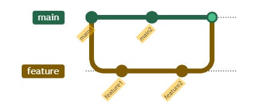
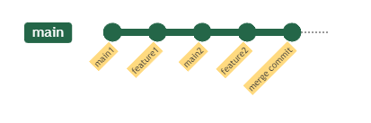
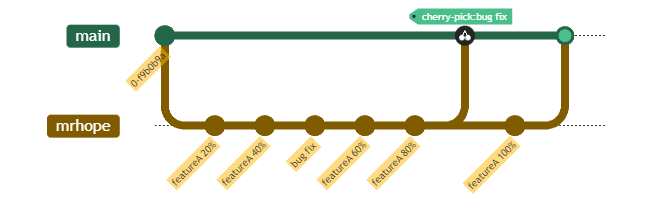
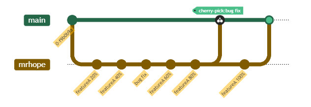
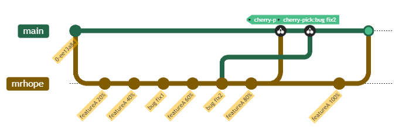

> Git 是一个开源的分布式版本控制系统，用于敏捷高效地处理任何或小或大的项目。在开发中分布式文件管理系统，可以便于多人协作开发。

## 去除历史大文件
> Git与大部分版本控制系统的差别是很大的，比如Subversion、CVS、Perforce、Mercurial 等等，使用的是“增量文件系统” （Delta Storage systems）, 
> 就是说它们存储每次提交(commit)之间的差异。Git正好与之相反，它会把你的每次提交的文件的全部内容（snapshot）都会记录下来。
> 这会是在使用Git时的一个很重要的理念。

如果将一个大文件误提交了，那么即使后面把它删除了，但是，实际上在.git中，这个文件还是存在的，虽然我们可能再也不需要他了，但是他还在那里默默的存在着。

1.查看历史提交文件
```shell
git rev-list --objects --all
```

2.重写commit，删除大文件
```shell
git filter-branch --force --index-filter 'git rm -rf --cached --ignore-unmatch 文件路径名' --prune-empty --tag-name-filter cat -- --all
```
如果你要删除的目标不是文件，而是文件夹，那么请在 `git rm --cached' 命令后面添加 -r 命令，表示递归的删除（子）文件夹和文件夹下的文件，类似于 `rm -rf` 命令。

3.推送修改后的repo
```shell
git push origin master --force
```

4.清理和回收空间
```shell
git reflog expire --expire=now --all
git gc --prune=now
```

## Rebase
多人在同一个分支上协作时，很容易出现冲突。即使没有冲突，后 push 的童鞋不得不先 pull，在本地合并，然后才能 push 成功。  
rebase 操作可以把本地未 push 的分叉提交历史整理成直线；  
rebase 的目的是使得我们在查看历史提交的变化时更容易，因为分叉的提交需要三方对比。

每次合并再 push 后，分支变成了这样:
```shell
git log --graph --pretty=oneline --abbrev-commit
* d1be385 (HEAD -> master, origin/master) init hello
*   e5e69f1 Merge branch 'dev'
|\
| *   57c53ab (origin/dev, dev) fix env conflict
| |\
| | * 7a5e5dd add env
| * | 7bd91f1 add new env
| |/
* |   12a631b merged bug fix 101
|\ \
| * | 4c805e2 fix bug 101
|/ /
* |   e1e9c68 merge with no-ff
|\ \
| |/
| * f52c633 add merge
|/
*   cf810e4 conflict fixed
```

为什么 Git 的提交历史不能是一条干净的直线? 其实是可以做到的!

Git 有一种称为 rebase 的操作，有人把它翻译成“变基”。

git pull 之后执行git rebase

Git 把我们本地的提交“挪动”了位置，放到了 git pull拉取的提交 之后，这样，
整个提交历史就成了一条直线。rebase 操作前后，最终的提交内容是一致的，但是，我们本地的 commit 修改内容已经变化了，
它们的修改不再基于 之前的commit，而是基于 pull拉取的提交，但最后的提交内容是一致的。

这就是 rebase 操作的特点: 把分叉的提交历史“整理”成一条直线，看上去更直观。缺点是本地的分叉提交已经被修改过了。

## gitmodule(Git子模块)
子模块允许你将一个 Git 仓库作为另一个 Git 仓库的子目录。 它能让你将另一个仓库克隆到自己的项目中，同时还保持提交的独立。

### 子模块的添加
```shell
git submodule add <url> <path>
```
* url为子模块的路径
* path为该子模块存储的目录路径。注意：路径不能以 / 结尾（会造成修改不生效）、不能是现有工程已有的目录（不能順利 Clone）

### .gitmodules配置
```shell
[submodule "subA"]
	path = subA
	url = /cygdrive/e/submodule/repo/subA.git
[submodule "subB"]
	path = subB
	url = /cygdrive/e/submodule/repo/subB.git
```

### 下载的工程带有submodule
当使用git clone下来的工程中带有submodule时，初始的时候，submodule的内容并不会自动下载下来的，此时，只需执行如下命令：
```shell
git submodule update --init --recursive
```

### 子模块的更新
先pull父项目，然后执行`git submodule update`

### 删除子模块
```shell
git rm --cached moduleA
rm -rf moduleA
rm .gitmodules
vim .git/config
```
删除submodule相关的内容，例如下面的内容
```shell
[submodule "moduleA"]
      url = /Users/nick/dev/nick-doc/testGitSubmodule/moduleA.git
```
然后提交到远程服务器
```shell
git add .
git commit -m "remove submodule"
```

或者使用如下方式:
```shell
git rm moduleA
git status
git commit -m "remove submodule"
git push origin master
```
这种方式在.git/config，仍会记录submodule信息，但是本地使用也没发现有什么影响，如果重新从服务器克隆则.git/config中不会有submodule信息。

## 服务器搭建
远程仓库实际上和本地仓库没啥不同，纯粹为了 7x24 小时开机并交换大家的修改。

GitHub 就是一个免费托管代码的远程仓库。但是对于某些视源代码如生命的商业公司来说，不想将源代码提交给任何第三方，这种情况下，就需要搭建 Git 服务器。

搭建 Git 服务器需要准备一台运行 Linux 的机器，强烈推荐用 Ubuntu 或 Debian，这样，通过几条简单的 apt 命令就可以完成安装。

### Ubuntu 或 Debian
假设您已经有 sudo 权限的用户账号，下面，正式开始安装。  
**1.安装 git**
```shell
sudo apt-get install git
```
**2.创建一个 git 用户，用来运行 git 服务**  
```shell
sudo adduser git
```
**3.创建证书登录**  
收集所有需要登录的用户的公钥，就是他们自己的 `id_rsa.pub` 文件，把所有公钥导入到 `/home/git/.ssh/authorized_keys` 文件里，一行一个。

**4.初始化 Git 仓库**  
先选定一个目录作为 Git 仓库，假定是 `/srv/sample.git`，在 /srv 目录下输入命令:

Git 就会创建一个裸仓库，裸仓库没有工作区，因为服务器上的 Git 仓库纯粹是为了共享，所以不让用户直接登录到服务器上去改工作区，并且服务器上的 Git 仓库通常都以 .git 结尾。然后，把 owner 改为 git:
```shell
sudo chown -R git:git sample.git
```

**5.禁用 shell 登录**  
出于安全考虑，第二步创建的 git 用户不允许登录 shell，这可以通过编辑 /etc/passwd 文件完成。找到类似下面的一行:
```shell
git:x:1001:1001:,,,:/home/git:/bin/bash
```
改为:
```shell
git:x:1001:1001:,,,:/home/git:/usr/bin/git-shell
```
这样，git 用户可以正常通过 ssh 使用 git，但无法登录 shell，因为我们为 git 用户指定的 git-shell 每次一登录就自动退出。

**6.克隆远程仓库**  
现在，可以通过 git clone 命令克隆远程仓库了，在各自的电脑上运行:
```shell
git clone git@ip:/srv/sample.git
```

### Centos
**1.安装 Git**  
```shell
yum install curl-devel expat-devel gettext-devel openssl-devel zlib-devel perl-devel
yum install git
```
接下来创建一个 git 用户组和用户，用来运行 git 服务:
```shell
groupadd git
useradd git -g git
```

**2.创建证书登录**  
收集所有需要登录的用户的公钥，公钥位于 id_rsa.pub 文件中，将公钥导入到 `/home/git/.ssh/authorized_keys` 文件里，一行一个。

如果没有该文件创建它:
```shell
cd /home/git/
mkdir .ssh
chmod 755 .ssh
touch .ssh/authorized_keys
chmod 644 .ssh/authorized_keys
```

**3.初始化 Git 仓库**  
首先我们选定一个目录作为 Git 仓库，假定是 /home/gitrepo/test.git，在 /home/gitrepo 目录下输入命令:
```shell
cd /home
mkdir gitrepo
chown git:git gitrepo/
cd gitrepo

git init --bare test.git
Initialized empty Git repository in /home/gitrepo/runoob.git/
```
以上命令 Git 创建一个空仓库，服务器上的 Git 仓库通常都以 .git 结尾。然后，把仓库所属用户改为 git:
```shell
chown -R git:git runoob.git
```

**4.克隆仓库**  
```shell
git clone git@192.168.45.4:/home/gitrepo/runoob.git
```
这样我们的 Git 服务器安装就完成。

## Squash merge
通过使用 --squash 选项，你可以在合并中将多个 commit 合并为一个。也就是对于以下的例子  
  
`git merge feature` 得到的结果为:  
  
而如果 feature 分支意在实现一个完成的特性，两个 commit 只是工作进度实际上并不重要的时候，我们可以通过 `git merge --squash feature` 得到:  
  

## Cherry pick
有些时候，我们可能需要提取其他分支的某个 commit，这个时候我们可以用 cherry pick 进行操作。  
  
在这种情况下，我们可以回到 main 分支，执行 `git cherry-pick <commit id>` 来挑拣某个提交，当然，你可以一并在命令中提交挑拣多个 commit。  
  
* `git cherry-pick <commit id 1> <commit id 2>` 表示挑拣 commit id 1 和 commit id 2
* `git cherry-pick <commit id 1>...<commit id 2>` 表示挑拣 commit id 1 与 commit id 2 之间 (包括两者) 的所有提交
* `git cherry-pick <branch>` 表示挑拣该分支最新的提交

## Git Large File Storage
Git 大文件存储 (LFS) 在 Git 中用文本指针替换音频样本、视频、数据集和图形等大文件，同时将文件内容存储在 GitHub.com 或 GitHub Enterprise 等远程服务器上

1.下载并安装 Git 命令行扩展。 下载并安装后，通过运行以下命令设置 Git LFS 及其各自的挂钩：
```shell
git lfs install
```
您需要在您的存储库目录中运行它，每个存储库一次。

2.选择您希望 Git LFS 管理的文件类型（或直接编辑您的 .gitattributes）。您可以随时配置文件扩展名。
```shell
git lfs track "*.psd"
```
确保跟踪 .gitattributes
```shell
git add .gitattributes
```
