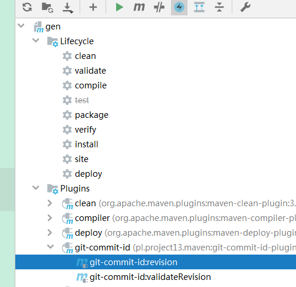

> git-commit-id-plugin 是一个类似于 buildnumber-maven-plugin 的插件，由于buildnumber-maven-plugin插件仅支持 CVS 和 SVN，所以作者就开发了一个支持Git版。这个插件主要有以下几个功能：
* 明确部署的版本
* 校验属性是否符合预期值

## 官网文档

[官网文档](https://github.com/git-commit-id/git-commit-id-maven-plugin/blob/master/docs/using-the-plugin.md ':target=_blank')

## 使用

**1、添加git-commit-id-plugin插件，该插件用来产生git的版本信息**

```xml
            <plugin>
                <groupId>pl.project13.maven</groupId>
                <artifactId>git-commit-id-plugin</artifactId>
                <configuration>
                    <!--日期格式;默认值:dd.MM.yyyy '@' HH:mm:ss z;-->
                    <dateFormat>yyyyMMddHHmmss</dateFormat>
                    <!--,构建过程中,是否打印详细信息;默认值:false;-->
                    <verbose>true</verbose>
                    <!-- ".git"文件路径;默认值:${project.basedir}/.git; -->
                    <dotGitDirectory>${project.basedir}/.git</dotGitDirectory>
                    <!--若项目打包类型为pom,是否取消构建;默认值:true;-->
                    <skipPoms>false</skipPoms>
                    <!--是否生成"git.properties"文件;默认值:false;-->
                    <generateGitPropertiesFile>true</generateGitPropertiesFile>
                    <!--指定"git.properties"文件的存放路径(相对于${project.basedir}的一个路径);-->
                    <generateGitPropertiesFilename>${project.build.outputDirectory}/git.properties</generateGitPropertiesFilename>
                    <!--".git"文件夹未找到时,构建是否失败;若设置true,则构建失败;若设置false,则跳过执行该目标;默认值:true;-->
                    <failOnNoGitDirectory>true</failOnNoGitDirectory>
                    <format>json</format>
                    <!--git描述配置,可选;由JGit提供实现;-->
                    <gitDescribe>
                        <!--是否生成描述属性-->
                        <skip>false</skip>
                        <!--提交操作未发现tag时,仅打印提交操作ID,-->
                        <always>false</always>
                        <!--提交操作ID显式字符长度,最大值为:40;默认值:7;
                            0代表特殊意义;后面有解释;
                        -->
                        <abbrev>7</abbrev>
                        <!--构建触发时,代码有修改时(即"dirty state"),添加指定后缀;默认值:"";-->
                        <dirty>-dirty</dirty>
                        <!--always print using the "tag-commits_from_tag-g_commit_id-maybe_dirty" format, even if "on" a tag.
                            The distance will always be 0 if you're "on" the tag.
                        -->
                        <forceLongFormat>false</forceLongFormat>
                    </gitDescribe>
                </configuration>
            </plugin>
```

2、在完成了上面的配置之后，执行git-commit-id-plugin插件



运行完成后，在target/classes目录下，我们可以发现产生了一个git.properties配置信息。

3、添加接口获取git提交信息

```java
@RestController
@RequiredArgsConstructor
public class GitInfoController {
    private final ObjectMapper objectMapper;

    /**
     * 获取git信息
     */
    @GetMapping("getGitInfo")
    public Map<String, Object> getGitInfo() throws IOException {
        Resource resource = new ClassPathResource("git.properties");
        if (!resource.exists()) {
            throw new FileNotFoundException("git.properties文件未找到");
        }
        String versionJson = BaseUtils.inputStreamToString(resource.getInputStream());
        Map<String, Object> map = objectMapper.readValue(versionJson, new TypeReference<Map<String, Object>>() {
        });
        return BaseUtils.success(map);
    }

}
```

## 测试

启动项目，在编译后的classes目录下可以看到git.properties文件：

```properties
{
  "git.branch" : "master",
  "git.build.host" : "localhost",
  "git.build.time" : "2019-08-28 17:05:33",
  "git.build.user.email" : "xxx@163.com",
  "git.build.user.name" : "xxx",
  "git.build.version" : "1.0-SNAPSHOT",
  "git.closest.tag.commit.count" : "",
  "git.closest.tag.name" : "",
  "git.commit.id" : "437e26172c51cab8fc88ea585145797df222fbb2",
  "git.commit.id.abbrev" : "437e261",
  "git.commit.id.describe" : "437e261-dirty",
  "git.commit.id.describe-short" : "437e261-dirty",
  "git.commit.message.full" : "获取版本信息",
  "git.commit.message.short" : "获取版本信息",
  "git.commit.time" : "2019-08-27 19:07:03",
  "git.commit.user.email" : "xxx@163.com",
  "git.commit.user.name" : "xxx",
  "git.dirty" : "true",
  "git.remote.origin.url" : "http://git.xxx.cn/gitlab/git/xxx.git",
  "git.tags" : "",
  "git.total.commit.count" : "3324"
}
```

**配置打包名称**

默认打包文件名格式为：<artifactId>-<version>.jar（没有通过<finalName>标签指定），由于version不是都需要改动，所以需要额外参数来控制版本

获取git最后一次提交版本号，拼接在version后，属性：git.commit.id.abbrev

示例
```xml
<groupId>com.demo</groupId>
<artifactId>myproject</artifactId>
<!-- 拼接最后一次git提交的版本号，默认7位 -->
<version>1.0.0-${git.commit.id.abbrev}</version>
```