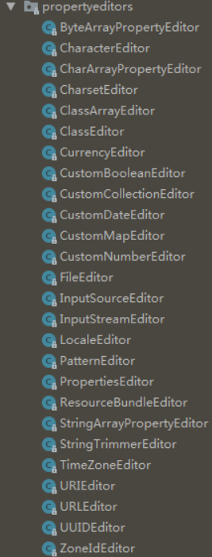

> @InitBinder用于在控制器(Controller)中标注于方法上，表示为当前控制器注册一个属性编辑器，只对当前的Controller有效。@InitBinder标注的方法必须有一个参数WebDataBinder。webDataBinder是用于表单到方法的数据绑定的。所谓的属性编辑器可以理解就是帮助我们完成参数绑定。 
@InitBinder只在@Controller中注解方法来为这个控制器注册一个绑定器初始化方法，方法只对本控制器有效

引入依赖

```xml
        <dependency>
            <groupId>org.springframework.boot</groupId>
            <artifactId>spring-boot-starter-web</artifactId>
        </dependency>
```

## 对数据绑定进行设置

WebDataBinder中有很多方法可以对数据绑定进行具体的设置：比如我们设置name属性为非绑定属性（也可以设置绑定值setAllowedFields）：

```markdown
    @InitBinder
    public void initBinder(WebDataBinder binder) {
        binder.setDisallowedFields("name");
    }
```

name值就没有绑定成功！

该使用场景应该并不多，大家可以灵活运用。

## 注册已有封装好的编辑器

> WebDataBinder是用来绑定请求参数到指定的属性编辑器。由于前台传到controller里的值是String类型的，当往Model里Set这个值的时候，如果set的这个属性是个对象，Spring就会去找到对应的editor进行转换，然后再set进去！Spring自己提供了大量的实现类（如下图所示的在org.springframwork.beans.propertyEditors下的所有editor），诸如CustomDateEditor ，CustomBooleanEditor，CustomNumberEditor等许多，基本上够用。  在平时使用SpringMVC时，会碰到javabean中有Date类型参数，表单中传来代表日期的字符串转化为日期类型，SpringMVC默认不支持这种类型的转换。我们就需要手动设置时间格式并在webDateBinder上注册这个编辑器！



```markdown
    @ResponseBody
    @RequestMapping(value = "/test")
    public String test(@RequestParam String name,@RequestParam Date date) throws Exception {
        System.out.println(name);
        System.out.println(date);
        return name;
    }

    @InitBinder
    public void initBinder(WebDataBinder binder){
        binder.registerCustomEditor(String.class,
                new StringTrimmerEditor(true));

        binder.registerCustomEditor(Date.class,
                new CustomDateEditor(new SimpleDateFormat("yyyy-MM-dd"), false));
    }
```

上面例子中，@InitBinder方法会帮助我们把String类型的参数先trim再绑定，而对于Date类型的参数会先格式化在绑定。例如当请求是/test?name=zero&date=2018-05-22时，会把zero绑定到name，再把时间串格式化为Date类型，再绑定到date。

## 全局设置属性编辑器

这里的@InitBinder方法只对当前Controller生效，要想全局生效，可以使用@ControllerAdvice。通过@ControllerAdvice可以将对于控制器的全局配置放置在同一个位置，注解了@ControllerAdvice的类的方法可以使用@ExceptionHandler，@InitBinder，@ModelAttribute注解到方法上，这对所有注解了@RequestMapping的控制器内的方法有效。

### 1、通过@ControllerAdvice设置

```java
@ControllerAdvice
public class GlobalControllerAdvice {

    @InitBinder
    public void initBinder(WebDataBinder binder) {
        binder.registerCustomEditor(String.class,
                new StringTrimmerEditor(true));

        binder.registerCustomEditor(Date.class,
                new CustomDateEditor(new SimpleDateFormat("yyyy-MM-dd"), false));

    }
}
```

### 2、使用RequestMappingHandlerAdapter

```markdown
    @Bean
    public RequestMappingHandlerAdapter webBindingInitializer() {
        RequestMappingHandlerAdapter adapter = new RequestMappingHandlerAdapter();
        adapter.setWebBindingInitializer(new WebBindingInitializer() {

            @Override
            public void initBinder(WebDataBinder binder, WebRequest request) {
                binder.registerCustomEditor(Date.class, new CustomDateEditor(new SimpleDateFormat("yyyy-MM-dd"), false));

            }
        });
        return adapter;
    }
```

### 3、集成类

写个BaseController，让其他controller继承该类。

## 注册自定义编辑器

使用自定义编辑器就是在第二个的基础上添加个自定义编辑器就行了，自定义的编辑器类需要继承  
> org.springframework.beans.propertyeditors.PropertiesEditor;

并重写其setAsText和getAsText两个方法就行了！

例子：

```java
public class BaseController {

    @InitBinder
    protected void initBinder(WebDataBinder binder) {
        binder.registerCustomEditor(Date.class, new MyDateEditor());
        binder.registerCustomEditor(Double.class, new DoubleEditor()); 
        binder.registerCustomEditor(Integer.class, new IntegerEditor());
    }

    private class MyDateEditor extends PropertyEditorSupport {
        @Override
        public void setAsText(String text) throws IllegalArgumentException {
            SimpleDateFormat format = new SimpleDateFormat("yyyy-MM-dd HH:mm:ss");
            Date date = null;
            try {
                date = format.parse(text);
            } catch (ParseException e) {
                format = new SimpleDateFormat("yyyy-MM-dd");
                try {
                    date = format.parse(text);
                } catch (ParseException e1) {
                }
            }
            setValue(date);
        }
    }
    
    public class DoubleEditor extends PropertiesEditor  {    
        @Override    
        public void setAsText(String text) throws IllegalArgumentException {    
            if (text == null || text.equals("")) {    
                text = "0";    
            }    
            setValue(Double.parseDouble(text));    
        }    
        
        @Override    
        public String getAsText() {    
            return getValue().toString();    
        }    
    }  
    
    public class IntegerEditor extends PropertiesEditor {    
        @Override    
        public void setAsText(String text) throws IllegalArgumentException {    
            if (text == null || text.equals("")) {    
                text = "0";    
            }    
            setValue(Integer.parseInt(text));    
        }    
        
        @Override    
        public String getAsText() {    
            return getValue().toString();    
        }    
    }  

}
```