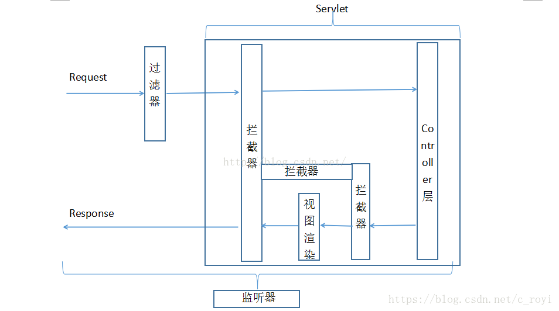
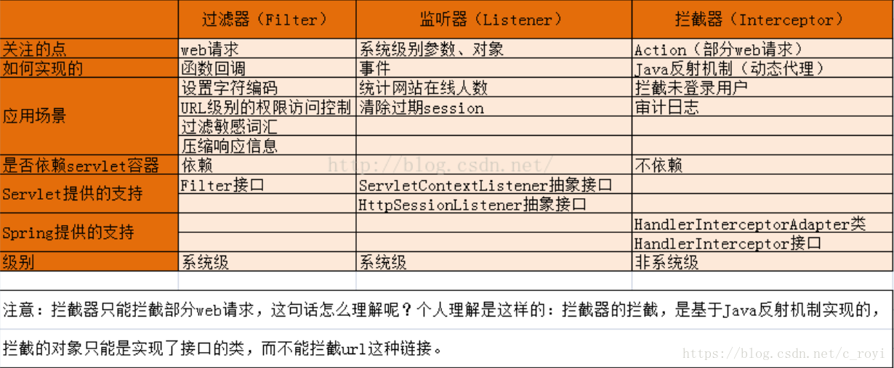

> 使用过滤器、监听器以及拦截器需要先引入依赖:

```xml
        <dependency>
            <groupId>org.springframework.boot</groupId>
            <artifactId>spring-boot-starter-web</artifactId>
        </dependency>
```

## 过滤器

> 过滤器Filter，是Servlet的的一个实用技术了。可以通过过滤器，对请求进行拦截处理。

过滤器应用场景:

- 禁用浏览器的缓存（缓存的处理）
- 解决中文乱码问题
- 登录鉴权及权限管理
- 用户授权，负责检查用户的请求，根据请求过滤用户非法请求
- 日志记录，详细记录某些特殊的用户请求
- 其他场景

### 过滤器配置一

1. 编写普通Java类实现接口Filter。
2. 使用注解@WebFilter标注过滤器类，并配置过滤url。
3. 在启动类加入@ServletComponentScan注解
  使用@ServletComponentScan注解后，Servlet、Filter、Listener可以直接通过@WebServlet、@WebFilter、@WebListener注解自动注册。

**示例:**

启动类:
```java
@SpringBootApplication
@ServletComponentScan(basePackages = {"com.tangl.demo.filter", "com.tangl.demo.listener"})
public class SpringBootDemoApplication {

    public static void main(String[] args) {
        SpringApplication.run(SpringBootDemoApplication.class, args);
    }

}
```

过滤器:
```java
/**
 * @author: TangLiang
 * @date: 2020/6/29 14:10
 * @since: 1.0
 */
@WebFilter(filterName = "myFilter1", urlPatterns = "/hello")
public class MyFilter1 implements Filter {

    @Override
    public void init(FilterConfig filterConfig) throws ServletException {
        System.out.println(filterConfig.getFilterName() + " init");
    }

    @Override
    public void doFilter(ServletRequest servletRequest, ServletResponse servletResponse, FilterChain filterChain) throws IOException, ServletException {
        HttpServletRequest request = (HttpServletRequest) servletRequest;
        HttpServletResponse response = (HttpServletResponse) servletResponse;
        HttpSession session = request.getSession();
        System.out.println("业务方法执行");
        filterChain.doFilter(servletRequest, servletResponse);
    }

    @Override
    public void destroy() {
        System.out.println("myFilter1 destroy");
    }
}
```

### 过滤器配置二

1. 修改Filter的实现（去除注解@WebFilter即可，其他代码无需改动）
2. 编写一个config配置类，利用FilterRegistrationBean实现注册过滤器。
  FilterRegistrationBean是SpringBoot提供的用于注册和解决Filter执行顺序问题的类。注意在类上使用注解@Configuration，在方法上使用注解@Bean。

过滤器配置:
```java
/**
 * 配置过滤器
 *
 * @author: TangLiang
 * @date: 2020/6/29 14:19
 * @since: 1.0
 */
@Configuration
public class WebFilterConfig {

    @Bean
    public FilterRegistrationBean testFilterRegistration() {
        FilterRegistrationBean registration = new FilterRegistrationBean(new MyFilter2());
        registration.addUrlPatterns("/hello");
        registration.setName("myFilter2");
        return registration;
    }
}
```

过滤器
```java
/**
 * @author: TangLiang
 * @date: 2020/6/29 14:20
 * @since: 1.0
 */
public class MyFilter2 implements Filter {
    @Override
    public void init(FilterConfig filterConfig) throws ServletException {
        System.out.println(filterConfig.getFilterName() + " init");
    }

    @Override
    public void doFilter(ServletRequest request, ServletResponse response, FilterChain chain) {
        System.out.println("myFilter2 begin");
        try {
            System.out.println("业务方法执行");
            chain.doFilter(request, response);
        } catch (Exception e) {
            System.out.println("myFilter2 error");
        }
        System.out.println("myFilter2 end");
    }

    @Override
    public void destroy() {
    }
}
```

### 过滤器应用之xss过滤器

新增工具类依赖：
```xml
        <dependency>
            <groupId>org.apache.commons</groupId>
            <artifactId>commons-lang3</artifactId>
        </dependency>
```

springBoot yml配置xss过滤器参数:
```yaml
xss:
  # 过滤开关
  enabled: true
  # 排除链接（多个用逗号分隔）
  excludes: /druid/*,/js/*,/css/*
  # 匹配链接
  urlPatterns: /*
```

XSS过滤器:
```java
/**
 * 防止XSS攻击的过滤器
 *
 * @author: TangLiang
 * @date: 2020/6/30 14:40
 * @since: 1.0
 */
public class XssFilter implements Filter {
    /**
     * 排除链接
     */
    public List<String> excludes = new ArrayList<>();

    /**
     * xss过滤开关
     */
    public boolean enabled = false;

    @Override
    public void init(FilterConfig filterConfig) throws ServletException {
        String tempExcludes = filterConfig.getInitParameter("excludes");
        String tempEnabled = filterConfig.getInitParameter("enabled");
        if (StringUtils.isNotEmpty(tempExcludes)) {
            String[] url = tempExcludes.split(",");
            for (int i = 0; url != null && i < url.length; i++) {
                excludes.add(url[i]);
            }
        }
        if (StringUtils.isNotEmpty(tempEnabled)) {
            enabled = Boolean.valueOf(tempEnabled);
        }
    }

    @Override
    public void doFilter(ServletRequest request, ServletResponse response, FilterChain chain)
            throws IOException, ServletException {
        HttpServletRequest req = (HttpServletRequest) request;
        HttpServletResponse resp = (HttpServletResponse) response;
        if (handleExcludeURL(req, resp)) {
            chain.doFilter(request, response);
            return;
        }
        XssHttpServletRequestWrapper xssRequest = new XssHttpServletRequestWrapper((HttpServletRequest) request);
        chain.doFilter(xssRequest, response);
    }

    private boolean handleExcludeURL(HttpServletRequest request, HttpServletResponse response) {
        if (!enabled) {
            return true;
        }
        if (excludes == null || excludes.isEmpty()) {
            return false;
        }
        String url = request.getServletPath();
       // System.out.println("url: " + url);
        for (String pattern : excludes) {
            Pattern p = Pattern.compile("^" + pattern);
            Matcher m = p.matcher(url);
            if (m.find()) {
                return true;
            }
        }
        return false;
    }

    @Override
    public void destroy() {

    }
}
```

XSS过滤处理:
```java
/**
 * XSS过滤处理
 *
 * @author: TangLiang
 * @date: 2020/6/30 14:48
 * @since: 1.0
 */
public class XssHttpServletRequestWrapper extends HttpServletRequestWrapper {
    /**
     * @param request
     */
    public XssHttpServletRequestWrapper(HttpServletRequest request) {
        super(request);
    }

    @Override
    public String[] getParameterValues(String name) {
        String[] values = super.getParameterValues(name);
        if (values != null) {
            int length = values.length;
            String[] escapseValues = new String[length];
            for (int i = 0; i < length; i++) {
                //System.out.println(values[i]);
                // 防xss攻击和过滤前后空格
                escapseValues[i] = EscapeUtil.clean(values[i]).trim();
                //System.out.println(escapseValues[i]);
            }
            return escapseValues;
        }
        return super.getParameterValues(name);
    }
}
```

?> 过滤器还有许多其他的应用，如权限校验，跨域处理等。

## 监听器

> listener是servlet规范中定义的一种特殊类。用于监听servletContext、HttpSession和servletRequest等域对象的创建和销毁事件。监听域对象的属性发生修改的事件。用于在事件发生前、发生后做一些必要的处理。其主要可用于以下方面：1、统计在线人数和在线用户2、系统启动时加载初始化信息3、统计网站访问量4、记录用户访问路径。

### 监听器配置

与过滤器配置一类似，启动类添加扫描注解，监听类注解换成@WebListener。

- ServletContext 相关的监听: ServletContextListener, ServletContextAttributeListener
```java
@WebListener
public class ContextListener implements ServletContextListener, ServletContextAttributeListener{

	public static final String INITIAL_CONTENT = "Content created in servlet Context";

	/**
	 * ServletContext创建
	 */
	@Override
	public void contextInitialized(ServletContextEvent sce) {
		System.out.println("===> context initialized");
		ServletContext servletContext = sce.getServletContext();
		servletContext.setAttribute("content", INITIAL_CONTENT);
	}

	/**
	 * ServletContext销毁
	 */
	@Override
	public void contextDestroyed(ServletContextEvent sce) {
		System.out.println("===> context destroyed");
	}

	/**
	 * context属性新增
	 */
	@Override
	public void attributeAdded(ServletContextAttributeEvent scae) {
		System.out.println("===> context attribute added");
	}

	/**
	 * context属性移除
	 */
	@Override
	public void attributeRemoved(ServletContextAttributeEvent scae) {
		System.out.println("===> context attribute removed");
	}

	/**
	 * context属性替换
	 */
	@Override
	public void attributeReplaced(ServletContextAttributeEvent scae) {
		System.out.println("===> context attribute replaced");
	}
}
```
- HttpSession 相关的监听: HttpSessionListener, HttpSessionIdListener, HttpSessionAttributeListener,HttpSessionActivationListener
```java
@WebListener
public class SessionListener implements HttpSessionListener, HttpSessionIdListener, HttpSessionAttributeListener,
		HttpSessionActivationListener {

	/**
	 * session被创建时
	 */
	@Override
	public void sessionCreated(HttpSessionEvent se) {
		System.out.println("===> session created");
	}

	/**
	 * session被销毁时
	 */
	@Override
	public void sessionDestroyed(HttpSessionEvent se) {
		System.out.println("===> session destroyed");
	}

	/**
	 * sessionId改变
	 */
	@Override
	public void sessionIdChanged(HttpSessionEvent se, String oldSessionId) {
		System.out.println("===> session id changed");
	}

	/**
	 * session属性新增
	 */
	@Override
	public void attributeAdded(HttpSessionBindingEvent se) {
		System.out.println("===> session attribute added");
	}

	/**
	 * session属性移除
	 */
	@Override
	public void attributeRemoved(HttpSessionBindingEvent se) {
		System.out.println("===> session attribute removed");
	}

	/**
	 * session属性替换
	 */
	@Override
	public void attributeReplaced(HttpSessionBindingEvent se) {
		System.out.println("===> session attribute replaced");
	}
	/**
	 * session的钝化，内存的数据写入到硬盘上的过程。
	 */
	@Override
	public void sessionWillPassivate(HttpSessionEvent se) {
		System.out.println("===> session will passivate");
	}
	/**
	 * session的活化，将硬盘的数据恢复到内存中。
	 */
	@Override
	public void sessionDidActivate(HttpSessionEvent se) {
		System.out.println("===> session did activate");
	}

}
```
- ServletRequest 相关的监听: ServletRequestListener,ServletRequestAttributeListener
```java
@WebListener
public class RequestListener implements ServletRequestListener,ServletRequestAttributeListener {
	/**
	 * 请求即将进入Web应用程序的范围/请求初始化时
	 */
	@Override
	public void requestInitialized(ServletRequestEvent sre) {
		System.out.println("===> request initialized");
	}
	/**
	 * 请求即将进入Web应用程序的范围/请求销毁时
	 */
	@Override
	public void requestDestroyed(ServletRequestEvent sre) {
		System.out.println("===> request destroyed");
	}
	/**
	 * request属性新增
	 */
	@Override
	public void attributeAdded(ServletRequestAttributeEvent srae) {
		System.out.println("===> request attribute added");
	}
	/**
	 * request属性移除
	 */
	@Override
	public void attributeRemoved(ServletRequestAttributeEvent srae) {
		System.out.println("===> request attribute removed");
	}
	/**
	 * request属性替换
	 */
	@Override
	public void attributeReplaced(ServletRequestAttributeEvent srae) {
		System.out.println("===> request attribute replaced");
	}
}
```

## 拦截器

> Interceptor 在AOP（Aspect-Oriented Programming）中用于在某个方法或字段被访问之前，进行拦截然后在之前或之后加入某些操作。比如日志，安全等。一般拦截器方法都是通过动态代理的方式实现。可以通过它来进行权限验证，或者判断用户是否登陆，或者是像12306 判断当前时间是否是购票时间。

### 拦截器配置

1. 编写普通类实现接口HandlerInterceptor。
2. 新增@Component注解
3. 新增拦截器配置

定义一个拦截器:
```java
@Component
public class TimeInterceptor implements HandlerInterceptor {
    @Override
    public boolean preHandle(HttpServletRequest httpServletRequest, HttpServletResponse httpServletResponse, Object o) throws Exception {
        System.out.println("处理拦截之前");
        httpServletRequest.setAttribute("startTime", new Date().getTime());
        System.out.println(((HandlerMethod) o).getBean().getClass().getName());
        System.out.println(((HandlerMethod) o).getMethod().getName());
        return true;
    }

    @Override
    public void postHandle(HttpServletRequest httpServletRequest, HttpServletResponse httpServletResponse, Object o, ModelAndView modelAndView) throws Exception {
        System.out.println("开始处理拦截");
        Long start = (Long) httpServletRequest.getAttribute("startTime");
        System.out.println("【拦截器】耗时 " + (new Date().getTime() - start));
    }

    @Override
    public void afterCompletion(HttpServletRequest httpServletRequest, HttpServletResponse httpServletResponse, Object o, Exception e) throws Exception {
        System.out.println("处理拦截之后");
        Long start = (Long) httpServletRequest.getAttribute("startTime");
        System.out.println("【拦截器】耗时 " + (new Date().getTime() - start));
        System.out.println("异常信息 " + e);
    }
}
```

TimeInterceptor实现了HandlerInterceptor接口的三个方法。  
preHandle方法在处理拦截之前执行，  
postHandle只有当被拦截的方法没有抛出异常成功时才会处理，  
afterCompletion方法无论被拦截的方法抛出异常与否都会执行。  
通过这三个方法的参数可以看到，相较于过滤器，拦截器多了Object和Exception对象，所以可以获取的信息比过滤器要多的多。但拦截器仍无法获取到方法的参数等信息，我们可以通过切面编程来实现这个目的。

新增拦截器配置:
```java
@Configuration
public class WebConfig extends WebMvcConfigurer {
    @Autowired
    private TimeInterceptor timeInterceptor;

    @Override
    public void addInterceptors(InterceptorRegistry registry) {
        registry.addInterceptor(timeInterceptor)
                .addPathPatterns("/**")
                .excludePathPatterns("/**/*.html", "/*.html", "/", "/js/**", "/favicon.ico", "/css/**");;
    }
}
```

addPathPatterns("/**") 表示拦截所有的请求，  
excludePathPatterns("/login", "/register") 表示除了登陆与注册之外，因为登陆注册不需要登陆也可以访问

### 拦截器应用之自定义防重复提交注解

**自定义注解防止表单重复提交**
```java
/**
 * 自定义注解防止表单重复提交
 *
 * @author ruoyi
 */
@Target(ElementType.METHOD)
@Retention(RetentionPolicy.RUNTIME)
@Documented
public @interface RepeatSubmit {

}
```

**防止重复提交拦截器抽象类**
```java
/**
 * 防止重复提交拦截器
 */
@Component
public abstract class RepeatSubmitInterceptor extends HandlerInterceptorAdapter {
    private static final ObjectMapper objectMapper = new ObjectMapper();
    private static final ObjectWriter objectWriter = objectMapper.writerWithDefaultPrettyPrinter();

    @Override
    public boolean preHandle(HttpServletRequest request, HttpServletResponse response, Object handler) throws Exception {
        Map result = new HashMap();
        if (handler instanceof HandlerMethod) {
            HandlerMethod handlerMethod = (HandlerMethod) handler;
            Method method = handlerMethod.getMethod();
            RepeatSubmit annotation = method.getAnnotation(RepeatSubmit.class);
            if (annotation != null) {
                if (this.isRepeatSubmit(request)) {
                    result.put("success", false);
                    result.put("message", "不允许重复提交，请稍后再试");
                    try {
                        response.setContentType("application/json");
                        response.setCharacterEncoding("utf-8");
                        response.getWriter().print(objectWriter.writeValueAsString(result));
                    } catch (IOException e) {
                        e.printStackTrace();
                    }
                    return false;
                }
            }
            return true;
        } else {
            return super.preHandle(request, response, handler);
        }
    }

    /**
     * 验证是否重复提交由子类实现具体的防重复提交的规则
     *
     * @param request
     * @return
     * @throws Exception
     */
    public abstract boolean isRepeatSubmit(HttpServletRequest request) throws Exception;
}
```

**子类实现重复提交拦截器抽象类的isRepeatSubmit方法**
```java
/**
 * 判断请求url和数据是否和上一次相同，
 * 如果和上次相同，则是重复提交表单。 有效时间为10秒内。
 */
@Component
public class SameUrlDataInterceptor extends RepeatSubmitInterceptor {
    private static final ObjectMapper objectMapper = new ObjectMapper();
    private static final ObjectWriter objectWriter = objectMapper.writerWithDefaultPrettyPrinter();
    public final String REPEAT_PARAMS = "repeatParams";

    public final String REPEAT_TIME = "repeatTime";

    public final String SESSION_REPEAT_KEY = "repeatData";

    /**
     * 间隔时间，单位:秒 默认10秒
     * <p>
     * 两次相同参数的请求，如果间隔时间大于该参数，系统不会认定为重复提交的数据
     */
    private int intervalTime = 10;

    public void setIntervalTime(int intervalTime) {
        this.intervalTime = intervalTime;
    }

    @SuppressWarnings("unchecked")
    @Override
    public boolean isRepeatSubmit(HttpServletRequest request) throws Exception {
        // 本次参数及系统时间
        String nowParams = objectWriter.writeValueAsString(request.getParameterMap());
        Map<String, Object> nowDataMap = new HashMap<String, Object>();
        nowDataMap.put(REPEAT_PARAMS, nowParams);
        nowDataMap.put(REPEAT_TIME, System.currentTimeMillis());

        // 请求地址（作为存放session的key值）
        String url = request.getRequestURI();

        HttpSession session = request.getSession();
        Object sessionObj = session.getAttribute(SESSION_REPEAT_KEY);
        if (sessionObj != null) {
            Map<String, Object> sessionMap = (Map<String, Object>) sessionObj;
            if (sessionMap.containsKey(url)) {
                Map<String, Object> preDataMap = (Map<String, Object>) sessionMap.get(url);
                if (compareParams(nowDataMap, preDataMap) && compareTime(nowDataMap, preDataMap)) {
                    return true;
                }
            }
        }
        Map<String, Object> sessionMap = new HashMap<String, Object>();
        sessionMap.put(url, nowDataMap);
        session.setAttribute(SESSION_REPEAT_KEY, sessionMap);
        return false;
    }

    /**
     * 判断参数是否相同
     */
    private boolean compareParams(Map<String, Object> nowMap, Map<String, Object> preMap) {
        String nowParams = (String) nowMap.get(REPEAT_PARAMS);
        String preParams = (String) preMap.get(REPEAT_PARAMS);
        return nowParams.equals(preParams);
    }

    /**
     * 判断两次间隔时间
     */
    private boolean compareTime(Map<String, Object> nowMap, Map<String, Object> preMap) {
        long time1 = (Long) nowMap.get(REPEAT_TIME);
        long time2 = (Long) preMap.get(REPEAT_TIME);
        if ((time1 - time2) < (this.intervalTime * 1000)) {
            return true;
        }
        return false;
    }
}
```

**拦截器配置**
```java
/**
 * @author: TangLiang
 * @date: 2020/8/19 9:09
 * @since: 1.0
 */
@Configuration
public class InterceptorConfig implements WebMvcConfigurer {
    @Autowired
    private SameUrlDataInterceptor sameUrlDataInterceptor;

    // 这个方法用来注册拦截器，我们自己写好的拦截器需要通过这里添加注册才能生效
    @Override
    public void addInterceptors(InterceptorRegistry registry) {
        registry.addInterceptor(sameUrlDataInterceptor)
                .addPathPatterns("/**")
                .excludePathPatterns("/**/*.html", "/*.html", "/", "/js/**", "/favicon.ico", "/css/**");
    }
}
```

## 过滤器，监听器和拦截器执行流程

**执行流程:**



**对比图**

